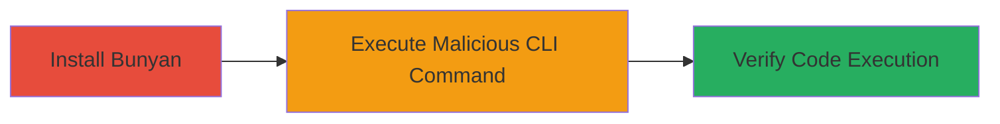

---
tags:
  - rce
  - command-injection
  - node.js
  - bunyan
type: attack_chain
tools:
  - '[[tools/npm]]'
  - '[[tools/bunyan]]'
tactics:
  - '[[Execution]]'
verified: false
platforms:
  - Node.js
  - Linux
submitted: true
complexity: medium
created_at: '2023-10-01T00:00:00Z'
procedures:
  - '[[procedures/Install-Bunyan-Module]]'
  - '[[procedures/Exploit-Bunyan-PID-Search-Injection]]'
  - '[[procedures/Verify-Bunyan-Exploitation]]'
step_count: 3
techniques:
  - '[[Unix Shell]]'
  - '[[Exploitation for Client Execution]]'
updated_at: '2025-12-14T17:23:36.200Z'
description: >-
  Multi-stage attack exploiting command injection in the bunyan Node.js logging
  module's CLI tool to achieve arbitrary remote code execution on the host
  system.
skill_level: intermediate
impact_level: high
id: 89d11504-d861-4d0e-b432-39bf7fede80d
validated: true
mitre_tactics:
  - '[[Execution]]'
mitre_techniques:
  - '[[Unix Shell]]'
  - '[[Exploitation for Client Execution]]'
---
# Remote Code Execution in Bunyan CLI via Command Injection in PID Search

Multi-stage attack chain demonstrating exploitation of a command injection vulnerability in the bunyan Node.js logging module's CLI tool, allowing arbitrary code execution on the host system running the tool.

## Chain Metrics Dashboard

| Metric | Value |
|--------|-------|
| Chain Status | Unverified |
| Total Steps | 3 |
| Execution Time | ~5 minutes |
| Skill Level | Intermediate |
| Complexity | Medium |
| Impact Level | High |

## Attack Flow Visualization



## Prerequisites & Requirements

### Required Tools

- [[tools/npm]]
- [[tools/bunyan]]

### Target Environment

- Node.js runtime environment
- Linux-based host system (for shell command execution)
- npm package manager access

### Initial Access Requirements

- Local or remote access to a system where bunyan can be installed and executed
- No specific credentials required beyond installation permissions
- Network access to npm registry for installation

## Detailed Attack Procedures

### Step 1: Install Bunyan Module
procedure: [[procedures/Install-Bunyan-Module]]

**Objective**: Set up the vulnerable bunyan module (version 1.8.12) to reproduce the command injection vulnerability.

**Instructions**: Use [[commands/npm-install-bunyan]] to install the affected version from the npm registry.

```bash
npm install bunyan@1.8.12
```

**Expected Output**: Installation logs confirming bunyan is added to node_modules, with the vulnerable CLI tool available at ./node_modules/bunyan/bin/bunyan.

**Success Indicators**:
- bunyan directory created in node_modules
- CLI binary executable and accessible

### Step 2: Exploit Bunyan PID Search Injection
procedure: [[procedures/Exploit-Bunyan-PID-Search-Injection]]

**Objective**: Inject arbitrary shell commands via the -p (PID search) option to achieve remote code execution, such as creating a file on the host system.

**Instructions**: Execute the bunyan CLI using [[commands/bunyan-pid-injection]] with a crafted payload that closes the grep string and injects a shell command.

```bash
./node_modules/bunyan/bin/bunyan -p "S'11;touch hacked ;'"
```

For debugging, enable self-tracing with [[commands/bunyan-trace-injection]] to observe the executed command.

```bash
BUNYAN_SELF_TRACE=1 ./node_modules/bunyan/bin/bunyan -p "S'11;touch hacked ;'"
```

**Expected Output**: Bunyan processes the input, executes the injected 'touch hacked' command, potentially with a PID search error, but the file is created.

**Success Indicators**:
- Injected command executes without halting the process
- Trace shows the formatted shell command with injection

### Step 3: Verify Bunyan Exploitation
procedure: [[procedures/Verify-Bunyan-Exploitation]]

**Objective**: Confirm the success of the code injection by checking for artifacts of the executed command on the filesystem.

**Instructions**: Inspect the current directory for the created 'hacked' file using standard filesystem commands.

```bash
ls -la hacked
```

**Expected Output**: The 'hacked' file exists, timestamped around the execution time, confirming arbitrary code execution.

**Success Indicators**:
- 'hacked' file present in the working directory
- File creation time matches exploitation attempt

## Attack Chain Summary

### Key Achievements

1. Successful installation of the vulnerable bunyan module
2. Arbitrary command injection via unsanitized PID input, leading to RCE
3. Verification of host system compromise through file creation

## Technique & Tactic Coverage

### MITRE ATT&CK Techniques

- [[Unix Shell]]
- [[Exploitation for Client Execution]]

### MITRE ATT&CK Tactics

- [[Execution]]

---

*Last updated: 2023-10-01T00:00:00Z*
