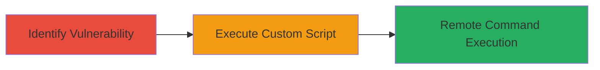

---
tags:
  - rce
  - apache-struts
  - code-injection
  - dod
  - web-vulnerability
  - cve-2017-5638
type: attack_chain
tools:
  - '[[tools/Custom-RCE-Demonstration-Script]]'
tactics:
  - '[[Execution]]'
verified: false
platforms:
  - Web
submitted: true
complexity: medium
created_at: '2023-10-01T00:00:00Z'
procedures:
  - '[[procedures/Identify-RCE-Vulnerability-in-DoD-Website]]'
  - '[[procedures/Demonstrate-RCE-with-Custom-Script]]'
step_count: 2
techniques:
  - '[[Exploit Public-Facing Application]]'
  - '[[Command-Line Interface]]'
updated_at: '2025-12-14T17:23:20.311Z'
description: >-
  Demonstration of RCE vulnerability in a U.S. Department of Defense website
  exploiting CVE-2017-5638 in Apache Struts, allowing remote command execution
  on the web server.
skill_level: intermediate
impact_level: high
id: 4f6871a2-9aff-415e-aa02-0e88ce9b35b9
validated: true
mitre_tactics:
  - '[[Execution]]'
mitre_techniques:
  - '[[Exploit Public-Facing Application]]'
  - '[[Command-Line Interface]]'
---
# Remote Code Execution in DoD Website via Apache Struts Code Injection

Multi-stage attack chain demonstrating the identification and exploitation of a remote code execution vulnerability in a U.S. Department of Defense website, stemming from a code injection weakness in Apache Struts associated with CVE-2017-5638.

## Chain Metrics Dashboard

| Metric | Value |
|--------|-------|
| Chain Status | Unverified |
| Total Steps | 2 |
| Execution Time | ~5 minutes |
| Skill Level | Intermediate |
| Complexity | Medium |
| Impact Level | High |

## Attack Flow Visualization



## Prerequisites & Requirements

### Required Tools

- [[tools/Custom-RCE-Demonstration-Script]]

### Target Environment

- Target OS/Platform: Web server (Apache Struts-based application)
- Required services/ports: HTTP/HTTPS on port 80/443
- Network access requirements: Internet access to the public-facing DoD website

### Initial Access Requirements

- Credential requirements: None (public-facing application)
- Network position: External remote access
- Prior access needed: None

## Detailed Attack Procedures

### Step 1: Identify RCE Vulnerability
procedure: [[procedures/Identify-RCE-Vulnerability-in-DoD-Website]]

**Objective**: Scan and analyze the DoD website to identify the code injection weakness enabling remote command execution.

**Instructions**: Review the website's technology stack for Apache Struts components vulnerable to CVE-2017-5638. Use vulnerability scanners or manual inspection to confirm the presence of the deserialization flaw in the Jakarta Multipart Parser.

**Expected Output**: Confirmation of the vulnerability through error messages or behavior indicating injectable code paths.

**Success Indicators**:
- Detection of Apache Struts version susceptible to CVE-2017-5638
- Identification of input points allowing code injection

### Step 2: Demonstrate RCE with Custom Script
procedure: [[procedures/Demonstrate-RCE-with-Custom-Script]]

**Objective**: Exploit the identified vulnerability to execute a benign command on the web server, proving remote code execution capability.

**Instructions**: Develop and run a custom script targeting the vulnerable endpoint. The script crafts a payload exploiting the code injection to trigger command execution, such as echoing a harmless message.

Use [[commands/execute-benign-rce-command]] within the script:

```bash
echo 'RCE demonstrated successfully' > /tmp/proof.txt
```

**Expected Output**: The web server executes the command, confirming RCE without causing harm.

**Success Indicators**:
- Benign command output visible in response or logs
- No unintended side effects on the server

## Attack Chain Summary

### Key Achievements

1. Identified a critical RCE vulnerability in a sensitive DoD website.
2. Demonstrated exploitation with a custom script executing a benign command.
3. Highlighted the risks of unpatched Apache Struts in public-facing applications.

## Technique & Tactic Coverage

### MITRE ATT&CK Techniques

- [[Exploit Public-Facing Application]]
- [[Command-Line Interface]]

### MITRE ATT&CK Tactics

- [[Execution]]

---

*Last updated: 2023-10-01T00:00:00Z*
