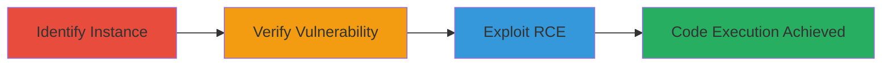

---
tags:
  - rce
  - github-enterprise
  - rails
  - vulnerability-exploitation
  - static-secret-key
type: attack_chain
tools: []
tactics:
  - '[[Initial Access]]'
  - '[[Execution]]'
verified: false
platforms:
  - Web
submitted: true
complexity: medium
created_at: '2023-10-01T00:00:00Z'
procedures:
  - '[[procedures/identify-github-enterprise-server-instance]]'
  - '[[procedures/verify-github-enterprise-version-and-vulnerability]]'
  - '[[procedures/exploit-rce-in-github-enterprise-using-poc]]'
step_count: 3
techniques:
  - '[[Exploit Public-Facing Application]]'
updated_at: '2025-12-14T17:24:08.743Z'
description: >-
  Multi-stage attack exploiting an unpatched Remote Code Execution vulnerability
  in GitHub Enterprise Server using a static Rails secret key, leading to
  arbitrary code execution on Imgur's development instance.
skill_level: intermediate
impact_level: high
id: 028e8229-169d-432e-aba9-8a24e52e1967
validated: true
mitre_tactics:
  - '[[Initial Access]]'
  - '[[Execution]]'
mitre_techniques:
  - '[[Exploit Public-Facing Application]]'
---
# Remote Code Execution in GitHub Enterprise Server via Static Rails Secret Key

Multi-stage attack chain demonstrating a complete attack workflow targeting an unpatched GitHub Enterprise Server instance, resulting in remote code execution and potential compromise of sensitive source code repositories.

## Chain Metrics Dashboard

| Metric | Value |
|--------|-------|
| Chain Status | Unverified |
| Total Steps | 3 |
| Execution Time | ~30 minutes |
| Skill Level | Intermediate |
| Complexity | Medium |
| Impact Level | High |

## Attack Flow Visualization

## Prerequisites & Requirements

### Required Tools

- Web browser for reconnaissance
- Access to vulnerability PoC resources

### Target Environment

- GitHub Enterprise Server (pre-2.8.7)
- Ruby on Rails application
- Publicly accessible web interface

### Initial Access Requirements

- Internet access to target URL
- No credentials required for initial identification and verification
- Knowledge of GitHub Enterprise version history

## Detailed Attack Procedures

### Step 1: Identify Target Instance
procedure: [[procedures/identify-github-enterprise-server-instance]]

**Objective**: Locate and confirm the target GitHub Enterprise Server instance hosting sensitive repositories.

**Instructions**: Search for development or staging instances associated with the target organization, such as Imgur. Use domain enumeration techniques to find URLs like git.imgur-dev.com. Verify ownership by inspecting SSL certificates and browsing public repositories for organization-specific code.

**Expected Output**: Confirmation of the instance URL and evidence of ownership, such as repository names containing Imgur source code.

**Success Indicators**:
- Valid GitHub Enterprise login or public repo access
- SSL certificate matching the organization

### Step 2: Verify Vulnerability
procedure: [[procedures/verify-github-enterprise-version-and-vulnerability]]

**Objective**: Determine if the instance is vulnerable by checking its version against known patches.

**Instructions**: Access the instance's version information, typically available via the admin panel or API endpoints. Compare against the patch release date of January 31, 2017, for version 2.8.7. Look for indicators of unpatched status, such as outdated UI elements or direct version disclosure.

**Expected Output**: Version number or evidence that the instance predates the patch, confirming susceptibility to the static Rails secret key RCE.

**Success Indicators**:
- Version confirmed as pre-2.8.7
- No signs of applied security updates

### Step 3: Exploit RCE
procedure: [[procedures/exploit-rce-in-github-enterprise-using-poc]]

**Objective**: Achieve remote code execution by leveraging the static secret key vulnerability.

**Instructions**: Follow the proof-of-concept from the referenced blog post (http://exablue.de/blog/2017-03-15-github-enterprise-remote-code-execution.html). Craft requests to inject code using the known static Rails secret key, targeting endpoints that process user input in the Rails application. Monitor responses for successful execution indicators, such as command output in web responses.

**Expected Output**: Evidence of code execution, such as server responses echoing injected commands or screenshots showing shell access.

**Success Indicators**:
- Arbitrary code runs on the server
- Access to underlying system resources

## Attack Chain Summary

### Key Achievements

1. Identified unpatched GitHub Enterprise dev instance
2. Verified vulnerability to static Rails secret key RCE
3. Demonstrated full remote code execution, compromising source code access

## Technique & Tactic Coverage

### MITRE ATT&CK Techniques

- [[Exploit Public-Facing Application]]

### MITRE ATT&CK Tactics

- [[Initial Access]]
- [[Execution]]

---
*Last updated: 2023-10-01T00:00:00Z*
