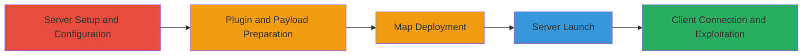

---
tags:
  - rce
  - buffer-overflow
  - goldsrc-engine
  - counter-strike
  - bsp-file
  - wad-file
type: attack_chain
tools:
  - '[[tools/AMX-Mod-X]]'
tactics:
  - '[[Initial Access]]'
  - '[[Execution]]'
verified: false
platforms:
  - Windows
submitted: true
complexity: medium
created_at: '2023-10-01T00:00:00Z'
procedures:
  - '[[procedures/Install-and-Configure-Counter-Strike-Dedicated-Server]]'
  - '[[procedures/Install-AMX-Mod-X-and-Exploit-Plugin]]'
  - '[[procedures/Prepare-Malicious-Executable-and-Initial-Map]]'
  - '[[procedures/Start-Server-and-Deploy-Secondary-Map]]'
  - '[[procedures/Install-Client-and-Trigger-Exploit]]'
step_count: 5
techniques:
  - '[[Exploitation for Client Execution]]'
  - '[[PowerShell]]'
updated_at: '2025-12-14T17:23:28.451Z'
description: >-
  Multi-stage attack exploiting a stack buffer overflow in the GoldSrc engine's
  TEX_InitFromWad function to achieve arbitrary code execution on a client's
  machine by serving malicious BSP map files from a Counter-Strike dedicated
  server.
skill_level: intermediate
impact_level: high
id: 4f5b1948-c023-4eff-a5f3-73baef6bee95
validated: true
mitre_tactics:
  - '[[Initial Access]]'
  - '[[Execution]]'
mitre_techniques:
  - '[[Exploitation for Client Execution]]'
  - '[[PowerShell]]'
---
# Remote Code Execution in GoldSrc Engine via Malicious BSP Map in Counter-Strike

Multi-stage attack chain demonstrating a complete workflow to exploit a stack buffer overflow vulnerability in the GoldSrc engine used by Counter-Strike. The attack involves setting up a malicious dedicated server that serves crafted BSP map files containing oversized WAD file names, triggering a buffer overflow in the client's TEX_InitFromWad function during map loading. This leads to arbitrary code execution on the victim's machine, enabling the download and execution of a remote payload such as pwn.ed.

## Chain Metrics Dashboard

| Metric | Value |
|--------|-------|
| Chain Status | Unverified |
| Total Steps | 5 |
| Execution Time | ~30 minutes |
| Skill Level | Intermediate |
| Complexity | Medium |
| Impact Level | High |

## Attack Flow Visualization

## Prerequisites & Requirements

### Required Tools

- [[tools/AMX-Mod-X]]

### Target Environment

- Windows OS
- Counter-Strike Dedicated Server software
- GoldSrc Engine
- Network access for server hosting and client connection (default port 27015 for Counter-Strike)

### Initial Access Requirements

- Administrative access to a Windows machine for server setup
- No prior credentials needed on target; relies on victim connecting to the malicious server
- Public IP or port forwarding for server accessibility

## Detailed Attack Procedures

### Step 1: Server Installation
procedure: [[procedures/Install-and-Configure-Counter-Strike-Dedicated-Server]]

**Objective**: Establish the base environment by installing the Counter-Strike dedicated server software.

**Instructions**: Download and install the Counter-Strike Dedicated Server (hlds.exe) from Steam or Valve archives into a directory named SERVER_DIR. Ensure the installation includes the cstrike mod.

**Expected Output**: Functional server directory structure with hlds.exe ready for launch.

**Success Indicators**:
- SERVER_DIR/cstrike folder exists
- hlds.exe runs without errors

### Step 2: Plugin Framework Setup
procedure: [[procedures/Install-AMX-Mod-X-and-Exploit-Plugin]]

**Objective**: Extend server functionality with AMX Mod X to support custom plugins that facilitate the exploit environment.

**Instructions**: Download and install AMX Mod X into the SERVER_DIR, then compile the exploit plugin source (F558348) using the AMX Mod X compiler. Add the compiled plugin to plugins.ini to enable it.

**Expected Output**: AMX Mod X modules loaded and plugin listed in plugins.ini.

**Success Indicators**:
- Plugins load on server start
- No compilation errors for F558348

### Step 3: Payload and Initial Map Preparation
procedure: [[procedures/Prepare-Malicious-Executable-and-Initial-Map]]

**Objective**: Place the malicious executable and deploy the first crafted BSP map to initiate the overflow setup.

**Instructions**: Copy a chosen executable (e.g., a trojan) to SERVER_DIR/cstrike/pwn.ed. Extract the malicious BSP file (F558346, named cs_pwn.bsp) into SERVER_DIR/cstrike/maps/.

**Expected Output**: pwn.ed in cstrike directory and cs_pwn.bsp in maps folder.

**Success Indicators**:
- File permissions allow download
- BSP file validates as loadable

### Step 4: Server Launch and Secondary Map
procedure: [[procedures/Start-Server-and-Deploy-Secondary-Map]]

**Objective**: Launch the server with the initial map and add the secondary malicious map post-load to complete the exploit chain.

**Instructions**: Start the server using hlds.exe -game cstrike +map cs_pwn +maxplayers 32. Once fully loaded, extract the second BSP file (F558347) into SERVER_DIR/cstrike/maps/.

**Expected Output**: Server running on cs_pwn map, accessible via IP:27015.

**Success Indicators**:
- Server console shows map loaded
- Secondary map file in place without crashing server

### Step 5: Client Exploitation
procedure: [[procedures/Install-Client-and-Trigger-Exploit]]

**Objective**: Simulate victim connection to trigger map load and buffer overflow on the client side.

**Instructions**: Install Counter-Strike client (hl.exe) on a test machine. Launch the client, add the server to favorites or connect directly via console command connect IP:27015. The client will load the malicious map, triggering the overflow in COM_FileBase during WAD processing.

**Expected Output**: Client crashes or executes pwn.ed, downloading and running the payload.

**Success Indicators**:
- Client connects successfully
- Arbitrary code executes (e.g., payload runs)

## Attack Chain Summary

### Key Achievements

1. Successful server setup with exploit-enabling plugins
2. Deployment of dual malicious BSP maps to chain the overflow
3. Remote code execution on client without authentication

## Technique & Tactic Coverage

### MITRE ATT&CK Techniques

- [[Exploitation for Client Execution]]
- [[PowerShell]]

### MITRE ATT&CK Tactics

- [[Initial Access]]
- [[Execution]]

---
*Last updated: 2023-10-01T00:00:00Z*
