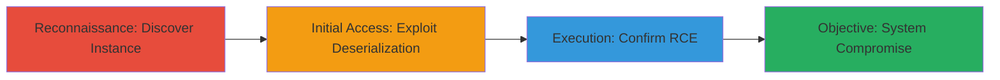

---
tags:
  - rce
  - jenkins
  - deserialization
  - java
type: attack_chain
tools: []
tactics:
  - '[[Reconnaissance]]'
  - '[[Initial Access]]'
  - '[[Execution]]'
commands:
  - '[[commands/curl-check-jenkins-url]]'
  - '[[commands/curl-send-deserialization-payload]]'
platforms:
  - Linux
  - Web
complexity: medium
procedures:
  - '[[procedures/Discover-Exposed-Jenkins-Instance]]'
  - '[[procedures/Exploit-Jenkins-Deserialization-Vulnerability]]'
  - '[[procedures/Confirm-RCE-with-Command-Execution]]'
step_count: 3
techniques:
  - '[[Gather Victim Host Information]]'
  - '[[Exploit Public-Facing Application]]'
  - '[[Unix Shell]]'
description: >-
  Multi-stage attack exploiting a publicly exposed Jenkins CI instance through
  unsafe Java deserialization to achieve arbitrary remote code execution,
  including OS identification and file reads.
skill_level: intermediate
impact_level: high
id: 82c1dce1-aec5-485a-ba2f-cca0c10790a4
created_at: '2025-12-14T17:23:28.149Z'
updated_at: '2025-12-14T17:23:28.149Z'
verified: false
validated: true
submitted: true
mitre_tactics:
  - '[[Reconnaissance]]'
  - '[[Initial Access]]'
  - '[[Execution]]'
mitre_techniques:
  - '[[Gather Victim Host Information]]'
  - '[[Exploit Public-Facing Application]]'
  - '[[Unix Shell]]'
---
# Remote Code Execution in Jenkins via Unsafe Deserialization

Multi-stage attack chain demonstrating the discovery and exploitation of a remote code execution vulnerability in a publicly accessible Jenkins instance through unsafe deserialization of configuration data using the Commons Collections library in Java. The attack begins with guessing the instance URL, proceeds to sending a malicious serialized payload via the CLI endpoint, and confirms success by executing system commands to reveal the OS and sensitive files.

## Chain Metrics Dashboard

| Metric | Value |
|--------|-------|
| Chain Status | Unverified |
| Total Steps | 3 |
| Execution Time | ~5 minutes |
| Skill Level | Intermediate |
| Complexity | Medium |
| Impact Level | High |

## Attack Flow Visualization



## Prerequisites & Requirements

### Required Tools

- None (uses standard HTTP clients like curl)

### Target Environment

- Linux-based OS (e.g., Debian 7)
- Jenkins CI service running on public IP
- Exposed ports for Jenkins web interface and CLI (default 8080 and 50000)
- No firewall or access restrictions

### Initial Access Requirements

- Internet access to the target domain
- Knowledge of common CI/CD naming conventions (e.g., ci.example.com)
- No credentials required due to public exposure

## Detailed Attack Procedures

### Step 1: Discover Exposed Jenkins Instance
procedure: [[procedures/Discover-Exposed-Jenkins-Instance]]

**Objective**: Identify the publicly accessible Jenkins instance by guessing predictable URLs based on domain naming conventions.

**Instructions**: Guess common CI URLs like ci.owncloud.com or ci.owncloud.org. Verify accessibility using [[commands/curl-check-jenkins-url]]:

```bash
curl -I http://ci.owncloud.com/
```

Check for Jenkins-specific headers or login page. Confirm exposure by noting the lack of firewall protection and public IP.

**Expected Output**: HTTP 200 response with Jenkins indicators (e.g., X-Jenkins header).

**Success Indicators**:
- URL responds with Jenkins interface
- No authentication or firewall blocks access

### Step 2: Exploit Deserialization Vulnerability for RCE
procedure: [[procedures/Exploit-Jenkins-Deserialization-Vulnerability]]

**Objective**: Send a malicious serialized payload to the Jenkins CLI endpoint to trigger unsafe deserialization and achieve remote code execution.

**Instructions**: Prepare a proof-of-concept serialized payload using Commons Collections gadget chains (e.g., from known exploit articles). Send it via HTTP POST to the CLI endpoint using [[commands/curl-send-deserialization-payload]]:

```bash
curl -X POST http://ci.owncloud.com/cli?remoting=false -H "Content-Type: application/x-java-serialized-object" --data-binary @malicious_payload.ser
```

The payload exploits the vulnerable Java deserialization in configuration handling.

**Expected Output**: Server processes the payload, leading to code execution without errors.

**Success Indicators**:
- No rejection of the serialized data
- Subsequent commands execute successfully

### Step 3: Confirm RCE by Executing Commands
procedure: [[procedures/Confirm-RCE-with-Command-Execution]]

**Objective**: Execute system commands via the established RCE to verify control, identify the OS, and read sensitive files.

**Instructions**: Use the RCE shell or follow-up payloads to run commands like uname for OS detection and cat for file reads. For example, embed in a follow-up payload or use the CLI to execute:

```bash
# Via RCE payload or CLI
uname -a
cat /etc/passwd
```

**Expected Output**: Output revealing Debian 7 as the OS and contents of /etc/passwd.

**Success Indicators**:
- OS identified as Linux (Debian 7)
- Sensitive file contents retrieved

## Attack Chain Summary

### Key Achievements

1. Discovered a publicly exposed Jenkins instance without protections
2. Achieved arbitrary RCE via deserialization gadget chain
3. Compromised the CI environment, reading system files and potentially accessing slaves

## Technique & Tactic Coverage

### MITRE ATT&CK Techniques

- [[Gather Victim Host Information]]
- [[Exploit Public-Facing Application]]
- [[Unix Shell]]

### MITRE ATT&CK Tactics

- [[Reconnaissance]]
- [[Initial Access]]
- [[Execution]]

---
*Last updated: 2023-10-01*
