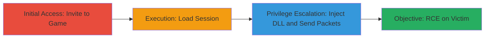

# Remote Code Execution in Portal 2 via Buffer Overflow in Voice Packets

Multi-stage attack chain demonstrating remote code execution through a buffer overflow in the game's voice packet handling during multiplayer sessions.

## Chain Metrics Dashboard

| Metric | Value |
|--------|-------|
| Chain Status | Unverified |
| Total Steps | 4 |
| Execution Time | ~5 minutes |
| Skill Level | Intermediate |
| Complexity | Medium |
| Impact Level | High |

## Attack Flow Visualization

## Prerequisites & Requirements

### Required Tools

- [[tools/Custom-Portal2-Voice-Exploit-DLL]]

### Target Environment

- Target OS/Platform: Windows with Portal 2 installed
- Required services/ports: Steam multiplayer networking (UDP ports for voice data)
- Network access requirements: Internet connection for Steam matchmaking

### Initial Access Requirements

- Credential requirements: Valid Steam accounts for both attacker and victim
- Network position: Attacker must be invited by victim to a multiplayer session
- Prior access needed: None, but victim must initiate the invite

## Detailed Attack Procedures

### Step 1: Establish Multiplayer Session
procedure: [[procedures/Establish-Multiplayer-Session-in-Portal-2]]

**Objective**: Set up a multiplayer environment where voice data can be exchanged between attacker and victim.

**Instructions**: Have the victim invite the attacker to a Portal 2 game session via Steam friends list or lobby. Confirm the invitation and join the session.

**Expected Output**: Both players are in the same multiplayer lobby, ready to start the game.

**Success Indicators**:
- Invitation accepted and lobby joined
- Voice chat functionality available in the session

### Step 2: Load Into Game Session
procedure: [[procedures/Load-Into-Game-Session-for-Voice-Processing]]

**Objective**: Ensure the game is fully loaded to enable voice packet processing on both clients.

**Instructions**: Start the game map or level, waiting for both clients to fully load. Verify that in-game voice communication is active.

**Expected Output**: Game environment loaded, with voice data exchange possible.

**Success Indicators**:
- Both players in the same in-game level
- No loading screens or errors

### Step 3: Inject Malicious DLL and Send Packets
procedure: [[procedures/Inject-Malicious-DLL-to-Send-Crafted-Voice-Packets]]

**Objective**: Inject the exploit DLL into the attacker's process to craft and send oversized voice packets that trigger the buffer overflow.

**Instructions**: Use a DLL injection tool to load the malicious DLL (ID: F630586) into the running Portal 2 process on the attacker's machine. The DLL will automatically send CLC_VoiceData messages with oversized payloads exceeding the 4096-byte buffer.

**Expected Output**: Malicious packets transmitted to the victim's client during voice simulation.

**Success Indicators**:
- DLL successfully injected without crashing the attacker's game
- Network traffic shows CLC_VoiceData packets with large lengths

### Step 4: Trigger and Observe Remote Code Execution
procedure: [[procedures/Trigger-and-Observe-Remote-Code-Execution]]

**Objective**: Confirm the buffer overflow leads to arbitrary code execution on the victim's machine.

**Instructions**: Activate the voice transmission in-game to send the crafted packets. Monitor the victim's system for signs of execution, such as the launch of calc.exe as demonstrated in the exploit.

**Expected Output**: Arbitrary code runs on the victim's client, e.g., calculator application opens.

**Success Indicators**:
- Victim's machine executes shellcode from the overflow
- Visual confirmation of payload execution (e.g., calc.exe launch)

## Attack Chain Summary

### Key Achievements

1. Established trusted multiplayer session for voice data exchange
2. Injected custom exploit DLL to craft malicious packets
3. Exploited buffer overflow in CGameClient::ProcessVoiceData for RCE
4. Achieved remote arbitrary code execution without authentication

## Technique & Tactic Coverage

### MITRE ATT&CK Techniques

- [[Exploitation for Client Execution]] Exploitation for Client Execution
- [[Dynamic-link Library Injection]] Dynamic-link Library Injection

### MITRE ATT&CK Tactics

- [[Execution]] Execution

---
*Last updated: 2023-10-01T00:00:00Z*
