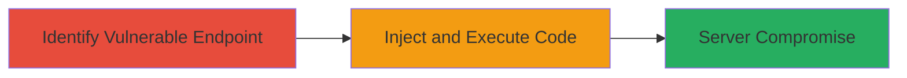

---
tags:
  - rce
  - ruby-on-rails
  - web
  - injection
type: attack_chain
tools: []
tactics:
  - '[[Execution]]'
verified: false
platforms:
  - Web
  - Ruby on Rails
submitted: true
complexity: medium
created_at: '2023-10-01T00:00:00Z'
procedures:
  - '[[procedures/Identify-Vulnerable-Render-Calls-in-Rails-Controllers]]'
  - '[[procedures/Exploit-Rails-Render-Vulnerability-with-Malicious-Parameters]]'
step_count: 2
techniques:
  - '[[Exploit Public-Facing Application]]'
  - '[[Command-Line Interface]]'
updated_at: '2025-12-14T17:23:24.901Z'
description: >-
  A multi-stage attack exploiting a vulnerability in Ruby on Rails Action Pack
  that allows remote code execution by injecting arbitrary Ruby code through
  unverified user input to the render method.
skill_level: intermediate
impact_level: high
id: eadc0937-73dd-4373-aa5f-b598bc21ce1b
validated: true
mitre_tactics:
  - '[[Execution]]'
mitre_techniques:
  - '[[Exploit Public-Facing Application]]'
  - '[[Command-Line Interface]]'
---
# Remote Code Execution in Ruby on Rails via Render Method Inline Injection

Multi-stage attack chain demonstrating a complete attack workflow exploiting CVE-2016-2098 in Ruby on Rails Action Pack, where unverified user input to the render method enables arbitrary Ruby code execution, potentially leading to full server compromise.

## Chain Metrics Dashboard

| Metric | Value |
|--------|-------|
| Chain Status | Unverified |
| Total Steps | 2 |
| Execution Time | ~5 minutes |
| Skill Level | Intermediate |
| Complexity | Medium |
| Impact Level | High |

## Attack Flow Visualization



## Prerequisites & Requirements

### Required Tools

- [[tools/Burp-Suite]]
- [[tools/curl]]

### Target Environment

- Ruby on Rails versions 3.2.x through 4.2.x
- Web application exposing controllers or views using the render method with user input
- Network access to the target web application

### Initial Access Requirements

- No credentials required; assumes public-facing web app
- Ability to send HTTP requests to the target
- Optional: Source code access for identification, or fuzzing tools for black-box testing

## Detailed Attack Procedures

### Step 1: Identify Vulnerable Endpoint
procedure: [[procedures/Identify-Vulnerable-Render-Calls-in-Rails-Controllers]]

**Objective**: Locate controllers or views that pass unverified user input directly to the render method, enabling potential code injection.

**Instructions**: Review the application's source code for patterns like `render params[:id]` without validation. If source access is unavailable, use fuzzing with tools like Burp Suite to probe endpoints that accept parameters for rendering (e.g., test routes like /controller/:id).

**Expected Output**: Identification of a vulnerable route, such as a controller action rendering based on a user-supplied ID.

**Success Indicators**:
- Code pattern found: `render params[:something]`
- Fuzzing reveals endpoints that process parameters in render calls

### Step 2: Exploit the Vulnerability
procedure: [[procedures/Exploit-Rails-Render-Vulnerability-with-Malicious-Parameters]]

**Objective**: Craft a malicious HTTP request to inject Ruby code via the :inline option in the render method, achieving remote code execution.

**Instructions**: Target the identified endpoint with a crafted parameter, such as setting `id` to `inline:"system(\\"ls\\")"`. Use [[commands/curl-send-malicious-request]] to send the request:

```bash
curl -X GET "http://target.com/vulnerable_controller?id=inline:%22system(%5c%22ls%5c%22)%22" -v
```

Monitor the response for signs of execution, such as command output in errors or logs.

**Expected Output**: Server executes the injected code, potentially returning output like directory listing or error messages indicating RCE.

**Success Indicators**:
- Arbitrary command output visible in response or server logs
- Server behavior changes (e.g., files created or system calls succeed)

## Attack Chain Summary

### Key Achievements

1. Identification of vulnerable render usage in Rails Action Pack
2. Successful injection and execution of arbitrary Ruby code remotely
3. Potential full server compromise via system commands

## Technique & Tactic Coverage

### MITRE ATT&CK Techniques

- [[Exploit Public-Facing Application]]
- [[Command-Line Interface]]

### MITRE ATT&CK Tactics

- [[Execution]]

---
*Last updated: 2023-10-01T00:00:00Z*
