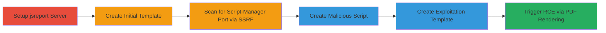

---
tags:
  - ssrf
  - rce
  - path-traversal
  - puppeteer
  - jsreport
type: attack_chain
tools:
  - '[[tools/docker]]'
  - '[[tools/nodejs]]'
  - '[[tools/request-npm]]'
tactics:
  - '[[Initial Access]]'
  - '[[Execution]]'
commands:
  - '[[commands/docker-run-jsreport-vulnerable]]'
  - '[[commands/node-portscanner-jsreport]]'
  - '[[commands/js-pwn-require-fs-readdir]]'
platforms:
  - Web
  - Linux
  - Node.js
  - Docker
complexity: medium
procedures:
  - '[[procedures/setup-jsreport-server-with-docker]]'
  - '[[procedures/create-initial-template-in-jsreport]]'
  - '[[procedures/discover-script-manager-port-via-ssrf]]'
  - '[[procedures/create-malicious-script-in-jsreport]]'
  - '[[procedures/create-exploitation-template-for-ssrf-post]]'
  - '[[procedures/trigger-exploitation-by-rendering-pdf]]'
step_count: 6
techniques:
  - '[[Exploit Public-Facing Application]]'
  - '[[Python]]'
  - '[[Network Service Scanning]]'
  - '[[File and Directory Discovery]]'
description: >-
  Multi-stage attack exploiting SSRF in jsreport's Puppeteer module to discover
  and target the script-manager port, chaining with path traversal for arbitrary
  JavaScript execution on the server.
skill_level: intermediate
impact_level: high
id: 73b1046e-abb5-45f4-848c-dfdecb44503e
created_at: '2025-12-14T17:23:25.008Z'
updated_at: '2025-12-14T17:23:25.008Z'
verified: false
validated: true
submitted: true
mitre_tactics:
  - '[[Initial Access]]'
  - '[[Execution]]'
mitre_techniques:
  - '[[Exploit Public-Facing Application]]'
  - '[[Python]]'
  - '[[Network Service Scanning]]'
  - '[[File and Directory Discovery]]'
---
# Remote Code Execution in jsreport via Chained SSRF and Path Traversal

## Overview

This attack chain demonstrates a remote code execution (RCE) vulnerability in jsreport version 2.5.0 by chaining two flaws: a server-side request forgery (SSRF) in the Puppeteer module for HTML-to-PDF rendering, and an unintended require vulnerability in the script-manager module. The SSRF allows port scanning to identify the randomly assigned port of the internal script-manager server. Once discovered, a malicious JavaScript file is created via the jsreport interface and triggered through a crafted SSRF POST request, enabling arbitrary code execution on the server, such as directory listing.

## Chain Metrics Dashboard

| Metric | Value |
|--------|-------|
| Chain Status | Unverified |
| Total Steps | 6 |
| Execution Time | ~15 minutes |
| Skill Level | Intermediate |
| Complexity | Medium |
| Impact Level | High |

## Attack Flow Visualization



## Prerequisites & Requirements

### Required Tools

- [[tools/docker]]
- [[tools/nodejs]]
- [[tools/request-npm]]

### Target Environment

- jsreport version 2.5.0 running on Node.js
- Docker for containerization
- Exposed web interface on port 80 (mapped to internal 5488)
- Internal script-manager on random high port (e.g., 1024-65535)

### Initial Access Requirements

- Network access to the jsreport web interface (http://localhost)
- No authentication required for template and script creation
- Local or remote access to run Docker and Node.js scripts

## Detailed Attack Procedures

### Step 1: Setup jsreport Server

procedure: [[procedures/setup-jsreport-server-with-docker]]

**Objective**: Deploy a vulnerable jsreport instance using Docker to simulate the target environment.

**Instructions**: Execute the Docker command to start the container:

```bash
sudo [[commands/docker-run-jsreport-vulnerable]]
```

**Expected Output**: jsreport server logs indicating startup, accessible at http://localhost.

**Success Indicators**:
- Container running without errors
- Web interface loads at http://localhost

### Step 2: Create Initial Template

procedure: [[procedures/create-initial-template-in-jsreport]]

**Objective**: Establish a baseline template for SSRF testing and port scanning.

**Instructions**: Use a web browser to navigate to the jsreport interface and create a simple HTML template named 'test1' with content like `<h1>hello world</h1>`.

**Expected Output**: Template saved successfully, visible in the interface.

**Success Indicators**:
- Template 'test1' appears in the list
- Rendering the template produces a PDF without errors

### Step 3: Discover Script-Manager Port

procedure: [[procedures/discover-script-manager-port-via-ssrf]]

**Objective**: Use SSRF in Puppeteer to scan internal ports and identify the script-manager server's random port.

**Instructions**: First, obtain the template ID from the interface (e.g., BJe2Pi2AgB). Then run the Node.js scanner:

```bash
node [[commands/node-portscanner-jsreport]] test1 BJe2Pi2AgB
```

The script sends POST requests to /api/report/test1 with HTML that attempts image loads on port ranges, detecting open ports via error logs.

**Expected Output**: Console output showing the discovered port, e.g., "Discovered port: 12354".

**Success Indicators**:
- Port number logged
- No connection refused errors for the target port

### Step 4: Create Malicious Script

procedure: [[procedures/create-malicious-script-in-jsreport]]

**Objective**: Upload a JavaScript payload to the server via the jsreport interface for later execution.

**Instructions**: In the jsreport web interface, create a new script named 'pwn.js' with the payload:

```javascript
console.log('PWNED');
var ls = require('fs').readdirSync('./');
console.log(ls);
```

Save the script.

**Expected Output**: Script saved to the filesystem under /jsreport/data/pwn.js/content.js.

**Success Indicators**:
- Script listed in the interface
- File exists on mounted volume

### Step 5: Create Exploitation Template

procedure: [[procedures/create-exploitation-template-for-ssrf-post]]

**Objective**: Craft an HTML template that uses a form to send a POST request via SSRF to the script-manager port, exploiting path traversal.

**Instructions**: Create template 'test2' with HTML including a form POSTing to http://localhost:{discovered_port}/ with payload {"test":1, "options": {"rid": 12, "execModulePath": "./../../../data/pwn.js/content.js"}}, using enctype='text/plain' and a script to auto-submit.

**Expected Output**: Template saved, ready for rendering.

**Success Indicators**:
- Template validates in the interface
- Form content parses correctly

### Step 6: Trigger Exploitation

procedure: [[procedures/trigger-exploitation-by-rendering-pdf]]

**Objective**: Render the exploitation template as PDF to trigger SSRF, causing the script-manager to require and execute the malicious script.

**Instructions**: Select 'test2', choose chrome-pdf recipe, and click Run. Puppeteer processes the HTML, sending the SSRF POST.

**Expected Output**: Server console logs 'PWNED' and directory listing, e.g., ['file1.js', 'file2.js'].

**Success Indicators**:
- Arbitrary code executed on server
- Directory contents revealed in logs

## Attack Chain Summary

### Key Achievements

1. Discovered internal script-manager port via SSRF port scanning
2. Uploaded and executed arbitrary JavaScript via path traversal
3. Achieved full RCE, demonstrating file system access

## Technique & Tactic Coverage

### MITRE ATT&CK Techniques

- [[Exploit Public-Facing Application]] Exploit Public-Facing Application
- [[Python]] JavaScript
- [[Network Service Scanning]] Network Service Scanning
- [[File and Directory Discovery]] File and Directory Discovery

### MITRE ATT&CK Tactics

- [[Initial Access]] Initial Access
- [[Execution]] Execution

---

*Last updated: 2023-10-01T00:00:00Z*
