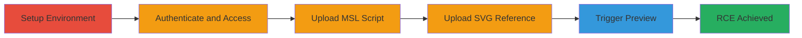

---
tags:
  - rce
  - owncloud
  - imagemagick
  - file-upload
  - msl
  - svg
type: attack_chain
tools:
  - '[[tools/Docker]]'
  - '[[tools/ImageMagick]]'
tactics:
  - '[[Initial Access]]'
  - '[[Execution]]'
verified: false
platforms:
  - Web
  - Linux
submitted: true
complexity: medium
created_at: '2023-10-01T00:00:00Z'
procedures:
  - '[[procedures/Set-Up-Vulnerable-ownCloud-Environment-with-ImageMagick]]'
  - '[[procedures/Exploit-RCE-by-Uploading-MSL-and-SVG-Files-in-ownCloud]]'
step_count: 6
techniques:
  - '[[Exploit Public-Facing Application]]'
  - '[[Command-Line Interface]]'
updated_at: '2025-12-14T17:23:24.616Z'
description: >-
  A multi-stage attack exploiting ImageMagick's insecure processing in ownCloud
  to achieve remote code execution by uploading malicious MSL scripts and SVG
  files that trigger arbitrary PHP code execution during preview generation.
skill_level: intermediate
impact_level: high
id: e2a92c3e-f229-4a42-8443-7e4c799ba0f6
validated: true
mitre_tactics:
  - '[[Initial Access]]'
  - '[[Execution]]'
mitre_techniques:
  - '[[Exploit Public-Facing Application]]'
  - '[[Command-Line Interface]]'
---
# Remote Code Execution in ownCloud via ImageMagick MSL and SVG File Exploitation

Multi-stage attack chain demonstrating a complete attack workflow exploiting ImageMagick's insecure handling of MSL and SVG files in ownCloud for remote code execution.

## Chain Metrics Dashboard

| Metric | Value |
|--------|-------|
| Chain Status | Unverified |
| Total Steps | 6 |
| Execution Time | ~10 minutes |
| Skill Level | Intermediate |
| Complexity | Medium |
| Impact Level | High |

## Attack Flow Visualization



## Prerequisites & Requirements

### Required Tools

- [[tools/Docker]]
- [[tools/ImageMagick]]

### Target Environment

- ownCloud version 10.11 or similar with ImageMagick installed
- Linux-based server (e.g., Ubuntu via Docker)
- Port 8080 exposed for web access
- Network access to upload files

### Initial Access Requirements

- Valid admin credentials (default: admin/admin)
- Ability to upload files to the ownCloud instance
- Local machine with Docker installed for environment setup

## Detailed Attack Procedures

### Step 1: Build Vulnerable Docker Image
procedure: [[procedures/Set-Up-Vulnerable-ownCloud-Environment-with-ImageMagick]]

**Objective**: Create a reproducible ownCloud environment with ImageMagick to simulate the vulnerable setup.

**Instructions**: Use [[commands/docker-build-owncloud-imagemagick]] to build the image from the provided Dockerfile, which extends owncloud/server:10.11 and installs ImageMagick via apt-get.

```bash
docker build . -t owncloud-imagemagick
```

**Expected Output**: Successfully built Docker image tagged as 'owncloud-imagemagick'.

**Success Indicators**:
- Docker image listed with `docker images`
- No build errors related to ImageMagick installation

### Step 2: Start the Docker Container
procedure: [[procedures/Set-Up-Vulnerable-ownCloud-Environment-with-ImageMagick]]

**Objective**: Launch the ownCloud instance in a container for testing the exploit.

**Instructions**: Execute [[commands/docker-run-owncloud-container]] to run the container in detached mode, mapping port 8080.

```bash
docker run --rm --name oc-eval -d -p8080:8080 owncloud-imagemagick:latest
```

**Expected Output**: Container ID output, and ownCloud accessible at http://localhost:8080.

**Success Indicators**:
- Container running with `docker ps`
- Web interface loads without errors

### Step 3: Access and Authenticate to ownCloud
procedure: [[procedures/Set-Up-Vulnerable-ownCloud-Environment-with-ImageMagick]]

**Objective**: Gain authenticated access to the ownCloud web interface to enable file uploads.

**Instructions**: Open a browser and navigate to http://localhost:8080, then login with username 'admin' and password 'admin'. No specific command needed; use the web UI.

**Expected Output**: Successful login to the ownCloud dashboard.

**Success Indicators**:
- Dashboard accessible
- File upload section visible

### Step 4: Upload Malicious MSL Script
procedure: [[procedures/Exploit-RCE-by-Uploading-MSL-and-SVG-Files-in-ownCloud]]

**Objective**: Upload the exploit.msl file containing the malicious MSL script to the server.

**Instructions**: In the ownCloud file manager, upload 'exploit.msl' to /mnt/data/files/admin/files/. The MSL script should include commands to overwrite index.php with PHP code like phpinfo() or system calls.

**Expected Output**: File uploaded successfully, visible in the file list.

**Success Indicators**:
- MSL file present in the uploaded directory
- No upload errors

### Step 5: Upload SVG File Referencing MSL
procedure: [[procedures/Exploit-RCE-by-Uploading-MSL-and-SVG-Files-in-ownCloud]]

**Objective**: Upload an SVG file that references the MSL script, setting up the exploit chain.

**Instructions**: Upload 'image.svg' (actually an SVG with <image xlink:href="msl:/path/to/exploit.msl" />) to the same directory. This will cause ImageMagick to process the reference during preview.

**Expected Output**: SVG file uploaded and listed.

**Success Indicators**:
- SVG file visible
- File metadata shows as image type

### Step 6: Reload Page to Trigger Preview Generation
procedure: [[procedures/Exploit-RCE-by-Uploading-MSL-and-SVG-Files-in-ownCloud]]

**Objective**: Force ownCloud to generate a preview, triggering ImageMagick to execute the MSL script for RCE.

**Instructions**: Refresh the file list page in ownCloud. The OC\Preview\Bitmap class will invoke ImageMagick without security policies, processing the SVG and executing the MSL to overwrite /var/www/owncloud/index.php with arbitrary PHP code.

**Expected Output**: Page reloads, and upon checking index.php (e.g., via container exec), it contains injected PHP like <?php phpinfo(); ?>.

**Success Indicators**:
- index.php modified with malicious code
- Executing the page shows phpinfo() output or system info

## Attack Chain Summary

### Key Achievements

1. Reproducible vulnerable environment setup using Docker.
2. Successful file upload of MSL and SVG payloads.
3. Remote code execution via preview generation, overwriting critical files.

## Technique & Tactic Coverage

### MITRE ATT&CK Techniques

- [[Exploit Public-Facing Application]]
- [[Command-Line Interface]]

### MITRE ATT&CK Tactics

- [[Initial Access]]
- [[Execution]]

---

*Last updated: 2023-10-01T00:00:00Z*
