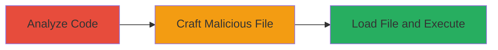

---
tags:
  - buffer-overflow
  - rce
  - csgo
  - source-engine
  - closed-captioning
type: attack_chain
tools: []
tactics:
  - '[[Execution]]'
verified: false
platforms:
  - Windows
  - Gaming
submitted: true
complexity: medium
created_at: '2024-10-01T00:00:00Z'
procedures:
  - '[[procedures/Analyze-Closed-Captioning-System-for-Vulnerabilities]]'
  - '[[procedures/Craft-Malicious-Closed-Captions-File-for-Buffer-Overflow]]'
  - '[[procedures/Trigger-Buffer-Overflow-by-Loading-Malicious-File]]'
step_count: 3
techniques:
  - '[[Exploitation for Client Execution]]'
  - '[[T1203.001]]'
updated_at: '2025-12-14T17:24:08.239Z'
description: >-
  A multi-stage attack exploiting a buffer overflow in the closed captioning
  system of CS:GO and other Source Engine games to achieve remote code execution
  by loading a malicious file.
skill_level: intermediate
impact_level: high
id: 55304681-5573-411a-a0e8-d5343b2b4ba1
validated: true
mitre_tactics:
  - '[[Execution]]'
mitre_techniques:
  - '[[Exploitation for Client Execution]]'
  - '[[T1203.001]]'
---
# Remote Code Execution via Buffer Overflow in CS:GO Closed Captioning System

Multi-stage attack chain demonstrating a complete attack workflow exploiting a buffer overflow vulnerability in the closed captioning system of CS:GO and other Source Engine games, leading to remote code execution.

## Chain Metrics Dashboard

| Metric | Value |
|--------|-------|
| Chain Status | Unverified |
| Total Steps | 3 |
| Execution Time | ~30 minutes |
| Skill Level | Intermediate |
| Complexity | Medium |
| Impact Level | High |

## Attack Flow Visualization

## Prerequisites & Requirements

### Required Tools

- Reverse engineering tools (e.g., IDA Pro or Ghidra for binary analysis)
- Text editor for crafting files

### Target Environment

- Target OS/Platform: Windows
- Required services/ports: None (client-side game application)
- Network access requirements: Ability to deliver the malicious file to the victim (e.g., via social engineering or shared resources)

### Initial Access Requirements

- Credential requirements: None
- Network position: Local or remote delivery of file
- Prior access needed: Victim must run CS:GO or compatible Source Engine game

## Detailed Attack Procedures

### Step 1: Analyze Closed Captioning System
procedure: [[procedures/Analyze-Closed-Captioning-System-for-Vulnerabilities]]

**Objective**: Identify the buffer overflow vulnerability in the closed captioning code through reverse engineering or source review.

**Instructions**: Use reverse engineering tools to disassemble the game's binaries and locate the CHudCloseCaption::SplitCommand and CHudCloseCaption::GetNoRepeatValue functions. Examine the while loops that copy data into fixed-size arrays cmd[256] and args[256] without bounds checking.

**Expected Output**: Identification of unsafe string copying operations that allow overflow.

**Success Indicators**:
- Vulnerable functions pinpointed
- Lack of boundary checks confirmed

### Step 2: Craft Malicious File
procedure: [[procedures/Craft-Malicious-Closed-Captions-File-for-Buffer-Overflow]]

**Objective**: Create a specially crafted closed captions file that triggers the buffer overflow by exceeding array limits.

**Instructions**: In a text editor, construct a file starting with a '<' character followed by a command string longer than 256 characters to overflow the cmd array. Optionally, include a long args string after a ':' to overflow the args array. Ensure no proper null-termination to exploit the while loops.

**Expected Output**: A .dat or compatible closed captions file ready for loading.

**Success Indicators**:
- File crafted with overflow payloads
- Payload length exceeds 256 characters

### Step 3: Load File and Execute
procedure: [[procedures/Trigger-Buffer-Overflow-by-Loading-Malicious-File]]

**Objective**: Trick the victim into loading the file, triggering the overflow and achieving code execution.

**Instructions**: Deliver the malicious file to the victim (e.g., via email or game mod sharing). Instruct or social-engineer the victim to load it through the game's closed captioning feature, such as via console commands or file replacement.

**Expected Output**: Stack overflow occurs, allowing control of execution flow for arbitrary code run.

**Success Indicators**:
- Game crashes or anomalous behavior observed
- Arbitrary code executed on victim's machine

## Attack Chain Summary

### Key Achievements

1. Vulnerability discovery via code analysis
2. Successful crafting of exploit file
3. Remote code execution on victim systems running the game

## Technique & Tactic Coverage

### MITRE ATT&CK Techniques

- [[Exploitation for Client Execution]] Exploitation for Client Execution
- [[T1203.001]] Exploitation for Client Execution

### MITRE ATT&CK Tactics

- [[Execution]] Execution

---
*Last updated: 2024-10-01T00:00:00Z*
