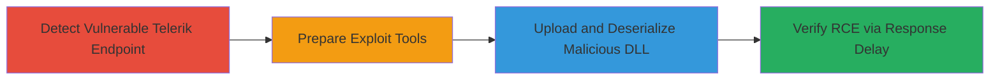

---
tags:
  - rce
  - telerik
  - deserialization
  - file-upload
  - cve-2017-11317
  - cve-2019-18935
type: attack_chain
tools:
  - '[[tools/pycryptodome]]'
  - '[[tools/telerik-deserialization-exploit]]'
tactics:
  - '[[Initial Access]]'
  - '[[Execution]]'
verified: false
platforms:
  - Web
  - Windows
submitted: true
complexity: medium
created_at: '2023-10-01T00:00:00Z'
procedures:
  - '[[procedures/Detect-Telerik-Version-Vulnerability]]'
  - '[[procedures/Prepare-Telerik-Deserialization-Exploit]]'
  - '[[procedures/Execute-Telerik-RCE-via-File-Upload-and-Deserialization]]'
  - '[[procedures/Verify-Telerik-RCE-Exploitation]]'
step_count: 4
techniques:
  - '[[Exploit Public-Facing Application]]'
  - '[[Remote File Copy]]'
  - '[[Exploitation for Client Execution]]'
updated_at: '2025-12-14T17:23:49.828Z'
description: >-
  Multi-stage attack exploiting outdated Telerik Web UI to achieve remote code
  execution on a Windows server through file upload and deserialization
  vulnerabilities.
skill_level: intermediate
impact_level: high
id: dd2fc272-c2c7-489d-b74d-ab809d5f800e
validated: true
mitre_tactics:
  - '[[Initial Access]]'
  - '[[Execution]]'
mitre_techniques:
  - '[[Exploit Public-Facing Application]]'
  - '[[Remote File Copy]]'
  - '[[Exploitation for Client Execution]]'
---
# Remote Code Execution via Chained Arbitrary File Upload and Insecure Deserialization in Telerik Web UI

Multi-stage attack chain demonstrating remote code execution on a U.S. Department of Defense Windows server using outdated Telerik Web UI components vulnerable to arbitrary file upload and insecure deserialization.

## Chain Metrics Dashboard

| Metric | Value |
|--------|-------|
| Chain Status | Unverified |
| Total Steps | 4 |
| Execution Time | ~5 minutes |
| Skill Level | Intermediate |
| Complexity | Medium |
| Impact Level | High |

## Attack Flow Visualization



## Prerequisites & Requirements

### Required Tools

- [[tools/pycryptodome]]
- [[tools/telerik-deserialization-exploit]]

### Target Environment

- Windows server hosting ASP.NET application with Telerik UI for ASP.NET AJAX (version 2016.2.607.40 or similar outdated)
- Exposed web endpoint: /Telerik.Web.UI.WebResource.axd?type=rau
- Network access to the target URL over HTTP/HTTPS

### Initial Access Requirements

- No credentials required (unauthenticated exploit)
- Direct internet access to the public-facing server
- Python 3 environment on attacker's machine

## Detailed Attack Procedures

### Step 1: Detect Vulnerable Telerik Endpoint
procedure: [[procedures/Detect-Telerik-Version-Vulnerability]]

**Objective**: Identify the presence and version of Telerik Web UI to confirm exploitability.

**Instructions**: Access the specific Telerik resource endpoint to extract version information from the response.

**Expected Output**: Response revealing Telerik version, e.g., v2016.2.607.40.

**Success Indicators**:
- Version detected as vulnerable (pre-2017.3.913 patch level)
- Endpoint responds without authentication errors

### Step 2: Prepare Exploit Environment
procedure: [[procedures/Prepare-Telerik-Deserialization-Exploit]]

**Objective**: Set up dependencies and download necessary exploit components.

**Instructions**: Install required Python library and obtain the exploit script and payload DLL.

Execute [[commands/install-pycryptodome]] to install the cryptographic dependency:

```bash
pip3 install pycryptodome
```

Download the exploit script from the GitHub repository and the malicious DLL payload (e.g., sleep_042020163752,45_amd64.dll implementing a 10-second sleep).

**Expected Output**: Successful installation of pycryptodome and files ready in working directory.

**Success Indicators**:
- Library installed without errors
- Exploit script and DLL available

### Step 3: Modify and Execute Exploit
procedure: [[procedures/Execute-Telerik-RCE-via-File-Upload-and-Deserialization]]

**Objective**: Upload a malicious DLL via file upload vulnerability and trigger deserialization for RCE.

**Instructions**: Modify the exploit script to handle server-side filename appending (.tmp), then run it against the target.

Edit line 95 of the script to append ".tmp" to the filename. Then execute [[commands/execute-telerik-exploit]] with target details:

```bash
python3 CVE-2019-18935.py -u https://target/Telerik.Web.UI.WebResource.axd?type=rau -v 2016.2.607.40 -f 'C:\Windows\Temp' -p sleep_042020163752,45_amd64.dll
```

**Expected Output**: Script output showing upload success and deserialization trigger.

**Success Indicators**:
- No upload errors
- Server processes the request without immediate failure

### Step 4: Verify Exploitation
procedure: [[procedures/Verify-Telerik-RCE-Exploitation]]

**Objective**: Confirm RCE by observing the effects of the deserialized payload.

**Instructions**: Monitor the response time from the exploit execution to detect the sleep delay.

**Expected Output**: Response time increased to approximately 12-13 seconds due to the 10-second sleep.

**Success Indicators**:
- Delayed response confirming payload execution
- No server errors indicating deserialization failure

## Attack Chain Summary

### Key Achievements

1. Detected vulnerable Telerik endpoint without authentication
2. Chained CVE-2017-11317 and CVE-2019-18935 for unauthenticated RCE
3. Uploaded and executed arbitrary DLL on Windows server filesystem
4. Demonstrated proof-of-concept with sleep payload, extensible to full command execution

## Technique & Tactic Coverage

### MITRE ATT&CK Techniques

- [[Exploit Public-Facing Application]]
- [[Remote File Copy]]
- [[Exploitation for Client Execution]]

### MITRE ATT&CK Tactics

- [[Initial Access]]
- [[Execution]]

---

*Last updated: 2023-10-01T00:00:00Z*
