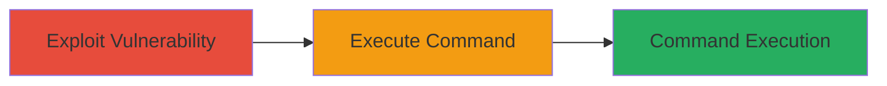

---
tags:
  - rce
  - code-injection
  - dod
  - web-vulnerability
type: attack_chain
tools:
  - '[[tools/Custom-RCE-Script]]'
tactics:
  - '[[Initial Access]]'
  - '[[Execution]]'
commands: []
platforms:
  - Web
complexity: medium
procedures:
  - '[[procedures/Exploit-RCE-with-Custom-Script]]'
step_count: 1
techniques:
  - '[[Exploit Public-Facing Application]]'
  - '[[Command-Line Interface]]'
description: >-
  A single-stage attack exploiting a code injection vulnerability in a U.S.
  Department of Defense website, allowing arbitrary remote command execution on
  the web server.
skill_level: intermediate
impact_level: high
id: 54452ca0-9626-4547-90fb-a3e683fd64c3
created_at: '2025-12-14T17:23:24.546Z'
updated_at: '2025-12-14T17:23:24.546Z'
verified: false
validated: true
submitted: true
mitre_tactics:
  - '[[Initial Access]]'
  - '[[Execution]]'
mitre_techniques:
  - '[[Exploit Public-Facing Application]]'
  - '[[Command-Line Interface]]'
---
# Remote Code Execution via Code Injection in DoD Website (CVE-2017-5638)

Multi-stage attack chain demonstrating a complete attack workflow.

## Chain Metrics Dashboard

| Metric | Value |
|--------|-------|
| Chain Status | Unverified |
| Total Steps | 1 |
| Execution Time | ~5 minutes |
| Skill Level | Intermediate |
| Complexity | Medium |
| Impact Level | High |

## Attack Flow Visualization



## Prerequisites & Requirements

### Required Tools

- [[tools/Custom-RCE-Script]]

### Target Environment

- Target OS/Platform: Web server (likely Apache Struts-based)
- Required services/ports: HTTP/HTTPS on port 80/443
- Network access requirements: Direct internet access to the DoD website

### Initial Access Requirements

- Credential requirements: None (public-facing)
- Network position: External attacker
- Prior access needed: None

## Detailed Attack Procedures

### Step 1: Exploit RCE Vulnerability
procedure: [[procedures/Exploit-RCE-with-Custom-Script]]

**Objective**: Identify and exploit the code injection weakness to execute arbitrary commands on the web server.

**Instructions**: Develop and run a custom script to send a crafted HTTP request exploiting CVE-2017-5638, targeting the Jakarta Multipart parser in Apache Struts. The script injects a payload that executes a benign command like 'id' to demonstrate RCE without causing harm.

Use the [[tools/Custom-RCE-Script]] to craft and send the request:

```bash
python rce_exploit.py --target https://dod-website.example.com --command "id"
```

Monitor the response for command output embedded in the server response.

**Expected Output**: Server response containing the output of the executed command, such as user ID details (e.g., "uid=33(www-data) gid=33(www-data)").

**Success Indicators**:
- Command output appears in the HTTP response
- No errors in script execution, confirming vulnerability presence

## Attack Chain Summary

### Key Achievements

1. Successful identification of CVE-2017-5638 in the DoD website
2. Demonstration of arbitrary command execution via code injection
3. Highlighted critical impact leading to prompt remediation by DoD

## Technique & Tactic Coverage

### MITRE ATT&CK Techniques

- [[Exploit Public-Facing Application]]
- [[Command-Line Interface]]

### MITRE ATT&CK Tactics

- [[Initial Access]]
- [[Execution]]

---

*Last updated: 2023-10-01*
