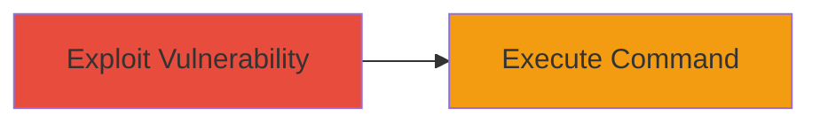

# Remote Code Execution via Code Injection in DoD Website

Multi-stage attack chain demonstrating a complete attack workflow.

## Chain Metrics Dashboard

| Metric | Value |
|--------|-------|
| Chain Status | Unverified |
| Total Steps | 1 |
| Execution Time | ~5 minutes |
| Skill Level | Intermediate |
| Complexity | Medium |
| Impact Level | High |

## Attack Flow Visualization



## Prerequisites & Requirements

### Required Tools

- [[tools/RCE-Custom-Script]]

### Target Environment

- Target OS/Platform: Web server (unspecified backend)
- Required services/ports: HTTP/HTTPS (port 80/443)
- Network access requirements: Internet access to the public-facing DoD website

### Initial Access Requirements

- Credential requirements: None (public-facing application)
- Network position: External attacker
- Prior access needed: None

## Detailed Attack Procedures

### Step 1: Exploit Code Injection for RCE
procedure: [[procedures/Demonstrate-RCE-via-Code-Injection]]

**Objective**: Identify and exploit a code injection weakness in the DoD website to execute arbitrary commands on the web server.

**Instructions**: Develop and deploy a custom script targeting the vulnerable endpoint to inject code that triggers remote command execution. The script sends a payload that causes the server to run a benign command, such as echoing a string, to demonstrate control without causing harm.

Use the [[tools/RCE-Custom-Script]] to craft and send the injection payload:

```python
# Example structure of custom script (Python-based for web requests)
import requests

target_url = 'https://dod-website.example/vulnerable-endpoint'
payload = 'benign_command_here'  # e.g., '; echo "RCE Demonstrated"'

response = requests.post(target_url, data={'input': payload})
print(response.text)
```

Monitor the response for signs of command execution, such as the echoed output in the server's reply.

**Expected Output**: Server response containing the output of the executed command, confirming RCE.

**Success Indicators**:
- Response includes benign command output (e.g., "RCE Demonstrated")
- No errors in script execution, indicating successful injection

## Attack Chain Summary

### Key Achievements

1. Identified code injection vulnerability in public-facing DoD website
2. Demonstrated RCE capability with a custom script executing a benign command
3. Highlighted critical risk of arbitrary command execution on the server

## Technique & Tactic Coverage

### MITRE ATT&CK Techniques

- [[Exploit Public-Facing Application]]
- [[Command-Line Interface]]

### MITRE ATT&CK Tactics

- [[Initial Access]]
- [[Execution]]

---
*Last updated: 2023-10-01T12:00:00Z*
