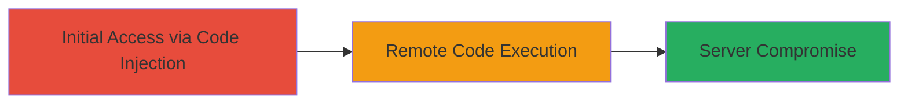

# Remote Code Execution via Code Injection on DoD Website

Multi-stage attack chain demonstrating a complete attack workflow.

## Chain Metrics Dashboard

| Metric | Value |
|--------|-------|
| Chain Status | Unverified |
| Total Steps | 1 |
| Execution Time | ~5 minutes |
| Skill Level | Intermediate |
| Complexity | Medium |
| Impact Level | High |

## Attack Flow Visualization



## Prerequisites & Requirements

### Required Tools

- None specified (uses standard HTTP client like curl)

### Target Environment

- Target OS/Platform: Web server (unspecified backend, likely Linux/Apache or similar)
- Required services/ports: HTTP/HTTPS on port 80/443
- Network access requirements: Internet access to the public DoD website

### Initial Access Requirements

- Credential requirements: None (public-facing)
- Network position: External attacker
- Prior access needed: None

## Detailed Attack Procedures

### Step 1: Exploit Code Injection for RCE
procedure: [[procedures/Exploit-Code-Injection-for-RCE]]

**Objective**: Inject malicious code into a vulnerable web parameter to execute arbitrary commands on the server, achieving full compromise.

**Instructions**: Identify the vulnerable endpoint (e.g., a search or input field on the DoD website). Use [[commands/curl-code-injection]] to send a payload that injects and executes a system command, such as listing directory contents to confirm execution.

```bash
curl -X POST 'https://dod-website.example/vulnerable-endpoint' -d 'input=; ls -la' --output response.html
```

Analyze the response for signs of command output, such as file listings embedded in the page source.

**Expected Output**: Server response containing output from the injected command (e.g., directory listing), indicating successful RCE.

**Success Indicators**:
- Command output appears in the HTTP response
- No error messages; instead, evidence of server-side execution

## Attack Chain Summary

### Key Achievements

1. Achieved remote command execution on a high-value DoD web server
2. Demonstrated potential for full server compromise without authentication
3. Highlighted risks of unvalidated input in public-facing applications

## Technique & Tactic Coverage

### MITRE ATT&CK Techniques

- [[Exploit Public-Facing Application]]
- [[Command-Line Interface]]

### MITRE ATT&CK Tactics

- [[Initial Access]]
- [[Execution]]

---
*Last updated: 2023-10-01T00:00:00Z*
