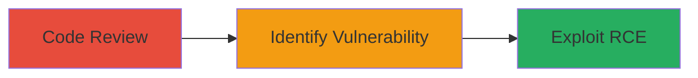

# Remote Code Execution via Command Injection in ExpressionEngine Image Library

Multi-stage attack chain demonstrating vulnerability discovery and exploitation in ExpressionEngine's Image library, where unescaped file paths in exec calls allow command injection for remote code execution.

## Chain Metrics Dashboard

| Metric | Value |
|--------|-------|
| Chain Status | Unverified |
| Total Steps | 3 |
| Execution Time | ~30 minutes |
| Skill Level | Intermediate |
| Complexity | Medium |
| Impact Level | High |

## Attack Flow Visualization

## Prerequisites & Requirements

### Required Tools

- Code editor or IDE for source review (e.g., VS Code)
- Access to ExpressionEngine installation or source code

### Target Environment

- ExpressionEngine CMS (legacy version using CodeIgniter)
- PHP environment with ImageMagick or NetPBM libraries
- Web server (e.g., Apache/Nginx on Linux)

### Initial Access Requirements

- Read access to source code (e.g., via git or file system)
- For exploitation: Ability to upload images or control filenames in image processing workflows (authenticated user or public upload feature)
- Network access to the web application

## Detailed Attack Procedures

### Step 1: Review Source Code
procedure: [[procedures/Review-ExpressionEngine-Image-Library-Source]]

**Objective**: Examine the Image library source to understand image processing functions and potential injection points.

**Instructions**: Locate and review the Image_lib.php file in the ExpressionEngine legacy directory. Focus on functions handling image manipulation with external tools like ImageMagick and NetPBM.

**Expected Output**: Annotated source code highlighting exec function usages.

**Success Indicators**:
- Source code accessed and key functions identified
- Inheritance from CodeIgniter noted

### Step 2: Identify Vulnerable Exec Calls
procedure: [[procedures/Identify-Unescaped-Exec-Calls]]

**Objective**: Pinpoint unsanitized parameters in exec calls that could allow command injection.

**Instructions**: Search for exec invocations in image_process_imagemagick and image_process_netpbm functions. Check lines 590, 604, 608, and 691 for direct usage of full_src_path and full_dst_path without escapeshellarg.

**Expected Output**: List of vulnerable lines and parameters.

**Success Indicators**:
- Exec calls without escaping confirmed
- Potential for filename-controlled injection identified

### Step 3: Exploit Command Injection
procedure: [[procedures/Exploit-Command-Injection-via-Malicious-Filename]]

**Objective**: Leverage control over image filenames to inject and execute arbitrary shell commands via the vulnerable exec calls.

**Instructions**: If able to upload or specify an image, craft a filename like "image.jpg; id #" to inject a command (e.g., 'id' for testing). Trigger image processing (e.g., resize or convert operation) to invoke the vulnerable functions. Monitor server logs or output for command execution results.

**Expected Output**: Execution of injected command, such as user ID output in logs or response.

**Success Indicators**:
- Arbitrary command runs on server
- Evidence of RCE, like file creation or network callback

## Attack Chain Summary

### Key Achievements

1. Discovered unescaped file paths in Image library exec calls
2. Confirmed lack of sanitization compared to secure CodeIgniter implementation
3. Demonstrated path to RCE via controllable image filenames

## Technique & Tactic Coverage

### MITRE ATT&CK Techniques

- [[Exploit Public-Facing Application]] Exploit Public-Facing Application
- [[Unix Shell]] Unix Shell

### MITRE ATT&CK Tactics

- [[Initial Access]] Initial Access
- [[Execution]] Execution

---
*Last updated: 2023-10-01T00:00:00Z*
