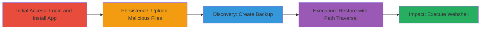

# Remote Code Execution via Deserialization and Path Traversal in OwnBackup App

Multi-stage attack chain demonstrating exploitation of the OwnBackup app in ownCloud through untrusted deserialization and path traversal to deploy a PHP webshell and achieve remote code execution. This requires administrator access to the ownCloud instance.

## Chain Metrics Dashboard

| Metric | Value |
|--------|-------|
| Chain Status | Unverified |
| Total Steps | 5 |
| Execution Time | ~15 minutes |
| Skill Level | Intermediate |
| Complexity | Medium |
| Impact Level | High |

## Attack Flow Visualization

## Prerequisites & Requirements

### Required Tools

- [[tools/Burp-Suite]]

### Target Environment

- ownCloud web application running on PHP
- Administrator credentials for ownCloud
- Network access to the ownCloud instance

### Initial Access Requirements

- Valid admin username and password
- Direct access to the web interface (no VPN or firewall restrictions)
- No prior access needed beyond authentication

## Detailed Attack Procedures

### Step 1: Login and Install OwnBackup App
procedure: [[procedures/Login-and-Install-OwnBackup-App]]

**Objective**: Gain administrative access and set up the OwnBackup app for exploitation.

**Instructions**: Authenticate to the ownCloud web interface using admin credentials. Navigate to the app store and install the OwnBackup application to enable backup and restore functionality.

**Expected Output**: Successful login and OwnBackup app installed and visible in the admin settings.

**Success Indicators**:
- Dashboard accessible after login
- OwnBackup listed under installed apps

### Step 2: Upload Malicious Backup Files
procedure: [[procedures/Upload-Malicious-Backup-Files]]

**Objective**: Introduce malicious serialized data into the ownCloud file system via crafted backup files.

**Instructions**: Use the Files section to upload `structure.xml` (defining a table like `oc_accounts`) and `data.dump` (containing serialized PHP object using `Swift_Transport_SendmailTransport` to write a webshell to `/tmp/pwned.php` with content `<?php system($_GET["exec"]); ?> // fedef@secsignal.org`).

**Expected Output**: Files uploaded successfully and visible in the Files interface.

**Success Indicators**:
- Upload confirmation in the UI
- Files listed in the directory

### Step 3: Create Malicious Backup
procedure: [[procedures/Create-Malicious-Backup]]

**Objective**: Incorporate the malicious files into a backup archive for later restoration.

**Instructions**: Navigate to admin settings > Additional > OwnBackup, and initiate a backup process that includes the uploaded files.

**Expected Output**: Backup created and listed in the OwnBackup interface.

**Success Indicators**:
- Backup completion message
- Backup entry available for selection

### Step 4: Restore Backup with Path Traversal
procedure: [[procedures/Restore-Backup-with-Path-Traversal]]

**Objective**: Trigger deserialization by restoring the backup while using path traversal to control the execution context.

**Instructions**: Select the backup, choose the table (e.g., `oc_accounts`), and click Restore tables. Intercept the request with [[tools/Burp-Suite]] and modify `tables[]=oc_accounts` to `tables[]=../../admin/files` to traverse directories and trigger the payload.

**Expected Output**: Modified POST request sent to `/owncloud/index.php/apps/ownbackup/restore-tables`, resulting in webshell creation at `/tmp/pwned.php`.

**Success Indicators**:
- Request interception and modification successful
- No errors in response; file written to filesystem

### Step 5: Execute Webshell for RCE
procedure: [[procedures/Execute-Webshell-for-RCE]]

**Objective**: Leverage the deployed webshell to run arbitrary system commands on the server.

**Instructions**: Access the webshell at `http://target/tmp/pwned.php?exec=<command>` to execute system commands, such as `id` or `whoami`.

**Expected Output**: Output of the executed command displayed in the browser.

**Success Indicators**:
- Command output visible
- Arbitrary code execution confirmed

## Attack Chain Summary

### Key Achievements

1. Successful installation and setup of OwnBackup app
2. Upload and backup of malicious serialized payload
3. Path traversal to trigger deserialization and webshell deployment
4. Remote code execution via PHP webshell

## Technique & Tactic Coverage

### MITRE ATT&CK Techniques

- [[Exploit Public-Facing Application]] Exploit Public-Facing Application
- [[Python]] PHP
- [[File and Directory Discovery]] File and Directory Discovery

### MITRE ATT&CK Tactics

- [[Initial Access]] Initial Access
- [[Execution]] Execution

---
*Last updated: 2023-10-01T00:00:00Z*
