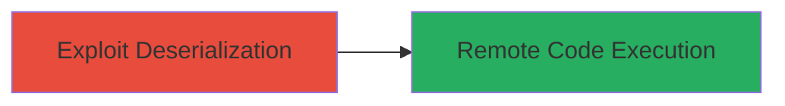

---
tags:
  - rce
  - deserialization
  - web
  - dod
type: attack_chain
tools: []
tactics:
  - '[[Execution]]'
verified: false
platforms:
  - Web
submitted: true
complexity: medium
created_at: '2023-10-01T00:00:00Z'
procedures:
  - '[[procedures/Exploit-Deserialization-for-RCE-via-POST-GET]]'
step_count: 1
techniques:
  - '[[Exploit Public-Facing Application]]'
  - '[[Exploitation of Remote Services]]'
updated_at: '2025-12-14T17:23:32.199Z'
description: >-
  Exploitation of a deserialization vulnerability in a misconfigured DoD website
  allowing remote code execution through crafted POST/GET requests containing
  untrusted data.
skill_level: intermediate
impact_level: high
id: 5ba6e93b-2d1a-4dac-a6aa-4bb4f3e8e0d3
validated: true
mitre_tactics:
  - '[[Execution]]'
mitre_techniques:
  - '[[Exploit Public-Facing Application]]'
  - '[[Exploitation of Remote Services]]'
---
# Remote Code Execution via Deserialization of Untrusted Data in DoD Website

Multi-stage attack chain demonstrating a complete attack workflow.

## Chain Metrics Dashboard

| Metric | Value |
|--------|-------|
| Chain Status | Unverified |
| Total Steps | 1 |
| Execution Time | ~5 minutes |
| Skill Level | Intermediate |
| Complexity | Medium |
| Impact Level | High |

## Attack Flow Visualization



## Prerequisites & Requirements

### Required Tools

- [[tools/curl]]

### Target Environment

- Web application (DoD website)
- Vulnerable endpoints accepting POST/GET requests
- No specific ports required (standard HTTP/HTTPS)

### Initial Access Requirements

- Network access to the public-facing website
- No prior credentials needed

## Detailed Attack Procedures

### Step 1: Exploit Deserialization Vulnerability
procedure: [[procedures/Exploit-Deserialization-for-RCE-via-POST-GET]]

**Objective**: Send crafted requests to trigger deserialization of untrusted data, leading to arbitrary code execution on the server.

**Instructions**: Identify vulnerable endpoints through testing POST/GET requests. Craft a serialized payload that, when deserialized, executes arbitrary code. Use [[commands/curl-send-deserialization-payload]] to submit the payload to the target endpoint.

```bash
curl -X POST -d 'serialized_payload_here' https://target-dod-site.com/vulnerable-endpoint
```

Validate the exploitation by checking for signs of code execution, such as server responses or logs indicating RCE.

**Expected Output**: Server executes the payload, potentially returning output from the executed command or altering behavior.

**Success Indicators**:
- Arbitrary code runs on the server
- Confirmation via triage (e.g., reverse shell or command output)

## Attack Chain Summary

### Key Achievements

1. Discovered deserialization flaw via request testing
2. Achieved remote code execution on DoD server
3. Demonstrated critical impact on misconfigured web application

## Technique & Tactic Coverage

### MITRE ATT&CK Techniques

- [[Exploit Public-Facing Application]]
- [[Exploitation of Remote Services]]

### MITRE ATT&CK Tactics

- [[Execution]]

---
*Last updated: 2023-10-01T00:00:00Z*
