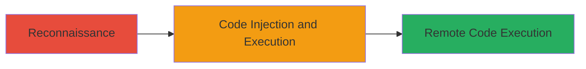

# Remote Code Execution via Exposed Groovy Console in AEM

Multi-stage attack chain demonstrating a complete attack workflow targeting a misconfigured Groovy panel in an AEM web application, enabling remote code execution.

## Chain Metrics Dashboard

| Metric | Value |
|--------|-------|
| Chain Status | Unverified |
| Total Steps | 1 |
| Execution Time | ~5 minutes |
| Skill Level | Intermediate |
| Complexity | Low |
| Impact Level | High |

## Attack Flow Visualization



## Prerequisites & Requirements

### Required Tools

- Web browser or [[Burp Suite]] for inspection

### Target Environment

- Web platform with Adobe Experience Manager (AEM)
- Exposed Groovy console endpoint
- Network access to the public-facing application

### Initial Access Requirements

- No credentials required (publicly exposed)
- Direct internet access to the target URL
- No prior access needed

## Detailed Attack Procedures

### Step 1: Reconnaissance and Discovery
procedure: [[procedures/Discover-and-Exploit-Exposed-Groovy-Console]]

**Objective**: Identify and access the misconfigured Groovy console to enable code injection for remote code execution.

**Instructions**: Begin by navigating to the target AEM application URL, such as accounts.informatica.com, and perform reconnaissance to locate the exposed Groovy panel. Use browser developer tools or a proxy like [[Burp Suite]] to inspect for administrative or development consoles. Once located, interact with the console interface to inject Groovy code snippets.

For example, access the console endpoint (inferred as /system/console/groovy or similar in AEM) and execute a simple test injection:

```groovy
println "Groovy console accessible - RCE possible"
```

If successful, escalate to arbitrary code execution, such as spawning a reverse shell or reading sensitive files.

**Expected Output**: Console executes the injected code and displays output, confirming injection capability.

**Success Indicators**:
- Console interface loads without authentication
- Injected code runs and produces output
- Ability to execute system commands via Groovy scripting

## Attack Chain Summary

### Key Achievements

1. Discovery of exposed Groovy console during reconnaissance
2. Successful code injection leading to arbitrary RCE on the server
3. Critical impact mitigated by disabling the panel post-report

## Technique & Tactic Coverage

### MITRE ATT&CK Techniques

- [[Exploit Public-Facing Application]] Exploit Public-Facing Application
- [[Command-Line Interface]] Command and Scripting Interpreter

### MITRE ATT&CK Tactics

- [[Initial Access]] Initial Access
- [[Execution]] Execution

---
*Last updated: 2023-10-01T00:00:00Z*
