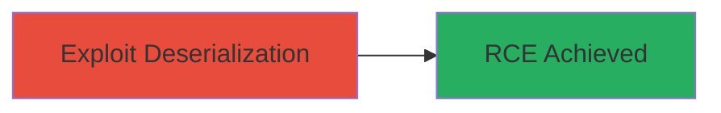

# Remote Code Execution via Insecure Deserialization in Sony WebSystem

Multi-stage attack chain demonstrating a complete attack workflow.

## Chain Metrics Dashboard

| Metric | Value |
|--------|-------|
| Chain Status | Unverified |
| Total Steps | 1 |
| Execution Time | ~5 minutes |
| Skill Level | Advanced |
| Complexity | High |
| Impact Level | Critical |

## Attack Flow Visualization

## Prerequisites & Requirements

### Required Tools

- None specific; requires a payload generation tool like ysoserial for Java-based systems (inferred for web deserialization exploits)

### Target Environment

- Web platform (Sony WebSystem)
- Vulnerable endpoint accepting serialized data
- Network access to the public-facing application

### Initial Access Requirements

- No prior credentials needed; public-facing vulnerability
- Ability to send HTTP requests to the target
- Knowledge of the serialization format (e.g., Java, PHP)

## Detailed Attack Procedures

### Step 1: Exploit Deserialization Vulnerability
procedure: [[procedures/Exploit-Insecure-Deserialization-for-RCE]]

**Objective**: Send a malicious serialized payload to the vulnerable endpoint to trigger remote code execution on the server.

**Instructions**: Identify the input point in Sony WebSystem that processes untrusted serialized data (e.g., via a POST request to a session or import feature). Craft a payload that, when deserialized, executes arbitrary commands. For example, assuming a Java-based system, generate a payload using a tool like ysoserial to invoke Runtime.exec(). Submit the payload via an HTTP request to the endpoint.

**Expected Output**: Server executes the command, potentially returning output or evidence of execution (e.g., a reverse shell connection or file creation).

**Success Indicators**:
- Arbitrary command execution confirmed (e.g., via ping to attacker-controlled server)
- No validation errors; payload deserialized successfully

## Attack Chain Summary

### Key Achievements

1. Achieved remote code execution on Sony WebSystem server
2. Demonstrated critical impact of untrusted deserialization
3. Highlighted need for input validation in web applications

## Technique & Tactic Coverage

### MITRE ATT&CK Techniques

- [[Exploit Public-Facing Application]]

### MITRE ATT&CK Tactics

- [[Execution]]

---
*Last updated: 2023-10-01T00:00:00Z*
