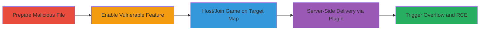

# Remote Code Execution via Malformed Detail Texture Files in GoldSrc Games

Multi-stage attack chain demonstrating exploitation of a stack overflow vulnerability in the hw.dll library of GoldSrc games, such as Counter-Strike, by crafting and delivering malformed detailed texture files (_detail.txt) to clients. The attack leverages server-side mechanisms to force clients to load and parse the malicious file, resulting in client crashes or remote code execution on vulnerable players without proper bounds checking.

## Chain Metrics Dashboard

| Metric | Value |
|--------|-------|
| Chain Status | Unverified |
| Total Steps | 5 |
| Execution Time | ~10 minutes |
| Skill Level | Intermediate |
| Complexity | Medium |
| Impact Level | High |

## Attack Flow Visualization



## Prerequisites & Requirements

### Required Tools

- [[tools/AMX-Mod-X]]
- [[tools/WinDbg]]

### Target Environment

- Windows OS
- GoldSrc Engine games (e.g., Counter-Strike 1.6)
- Required services: Counter-Strike Server, AMX Mod X
- Network access: Ability to host or join game servers

### Initial Access Requirements

- Access to game client or server (local or remote)
- No credentials needed for public servers, but admin access for dedicated server exploitation
- Prior access: Malicious _detail.txt file crafted

## Detailed Attack Procedures

### Step 1: Prepare Malicious File
procedure: [[procedures/Place-Malicious-Detail-Texture-File]]

**Objective**: Craft and position the malformed detail texture file in the maps directory to be loaded by the game engine.

**Instructions**: Create a malformed cs_assault_detail.txt file with oversized or invalid data to trigger the stack overflow in hw.dll. Copy it into the cstrike/maps folder on the client (for listen server) or server (for dedicated server).

**Expected Output**: File placed successfully in maps directory, ready for game loading.

**Success Indicators**:
- File exists in cstrike/maps/cs_assault_detail.txt
- No immediate errors on file placement

### Step 2: Enable Vulnerable Feature
procedure: [[procedures/Enable-Detail-Textures-in-Game]]

**Objective**: Activate the detail textures feature to force the game to parse the _detail.txt file during map loading.

**Instructions**: Launch Counter-Strike, open the console, and execute the command to enable detail textures using [[commands/r-detailtextures-1]]:

```bash
r_detailtextures 1
```

**Expected Output**: Console confirms activation; detail textures are now enabled for map loads.

**Success Indicators**:
- Feature enabled without errors
- Game ready to load detail files on next map

### Step 3: Load Target Map
procedure: [[procedures/Host-or-Join-Target-Map-Game]]

**Objective**: Initiate gameplay on the vulnerable map to trigger file parsing.

**Instructions**: Host a listen server game on cs_assault or join a dedicated server running it. The game engine will attempt to load maps/cs_assault_detail.txt automatically.

**Expected Output**: Map loads, and the detail texture file is parsed, potentially causing overflow if malformed.

**Success Indicators**:
- Map loads successfully
- Client or server processes the _detail.txt file

### Step 4: Server-Side Delivery
procedure: [[procedures/Implement-Server-Side-Plugin-for-Exploitation]]

**Objective**: On dedicated servers, use a plugin to precache the malicious file and force clients to enable the feature.

**Instructions**: Install AMX Mod X and write a plugin that uses [[commands/precache-generic-maps-cs-assault-detail-txt]] to preload the file and [[commands/client-cmd-r-detailtextures-1]] to execute on clients:

```bash
precache_generic "maps/cs_assault_detail.txt"
client_cmd "r_detailtextures 1"
```
Set sv_downloadurl for precache bug workaround.

**Expected Output**: Clients download the file and enable the feature remotely.

**Success Indicators**:
- Plugin loads without errors
- Clients receive and execute commands

### Step 5: Execute Exploit
procedure: [[procedures/Trigger-Client-Crash-or-RCE]]

**Objective**: Cause the client to parse the file, leading to stack overflow and potential RCE.

**Instructions**: With the map loaded and feature enabled, the hw.dll parses the malformed file, overflowing the stack. Use WinDbg to analyze crashes for RCE confirmation.

**Expected Output**: Client crashes or executes arbitrary code.

**Success Indicators**:
- Application crash observed
- Stack trace shows overflow in hw.dll
- Code execution verified via debugger

## Attack Chain Summary

### Key Achievements

1. Successful delivery of malformed file to clients via server mechanisms
2. Remote enabling of vulnerable feature without user interaction
3. Achievement of client-side RCE through stack overflow exploitation

## Technique & Tactic Coverage

### MITRE ATT&CK Techniques

- [[Exploit Public-Facing Application]]
- [[Exploitation for Client Execution]]
- [[Command-Line Interface]]

### MITRE ATT&CK Tactics

- [[Initial Access]]
- [[Execution]]

---

*Last updated: 2023-10-01T00:00:00Z*
