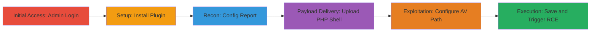

# Remote Code Execution via Misconfigured Antivirus Path in ownCloud Files_Antivirus Plugin

Multi-stage attack chain demonstrating a complete attack workflow exploiting the files_antivirus plugin in ownCloud 10.4.1.3 on a LAMP stack.

## Chain Metrics Dashboard

| Metric | Value |
|--------|-------|
| Chain Status | Unverified |
| Total Steps | 6 |
| Execution Time | ~10 minutes |
| Skill Level | Intermediate |
| Complexity | Medium |
| Impact Level | High |

## Attack Flow Visualization

## Prerequisites & Requirements

### Required Tools

- Web browser for ownCloud interface access
- Valid admin credentials for ownCloud

### Target Environment

- ownCloud 10.4.1.3 on LAMP stack (Linux, Apache, MySQL, PHP)
- Required services: Web server (Apache), ClamAV integration
- Network access: Direct access to ownCloud web interface (typically port 80/443)

### Initial Access Requirements

- Administrator credentials
- Network position: Internal or authenticated access to ownCloud instance
- Prior access: None, but admin privileges required

## Detailed Attack Procedures

### Step 1: Administrator Login
procedure: [[procedures/Login-to-ownCloud-as-Administrator]]

**Objective**: Gain authenticated access to administrative features in ownCloud.

**Instructions**: Use the ownCloud login interface to authenticate with admin credentials. This grants access to the dashboard and settings.

**Expected Output**: Successful login redirect to the ownCloud dashboard.

**Success Indicators**:
- Dashboard loads with admin menu visible
- Access to Files and Settings sections confirmed

### Step 2: Install Files_Antivirus Plugin
procedure: [[procedures/Install-Files-Antivirus-Plugin]]

**Objective**: Enable the vulnerable files_antivirus plugin for subsequent configuration exploitation.

**Instructions**: Navigate to the Apps section in ownCloud, search for and install the files_antivirus plugin from the marketplace.

**Expected Output**: Plugin listed as enabled in the Apps menu.

**Success Indicators**:
- Plugin installation completes without errors
- Protection settings become available in the admin interface

### Step 3: Download and Analyze Config Report
procedure: [[procedures/Download-and-Analyze-ownCloud-Config-Report]]

**Objective**: Extract sensitive server paths, including datadirectory and PHP interpreter location, for payload placement and execution.

**Instructions**: From the admin settings, access the general menu and download the config report. Review the file to note the datadirectory path and PHP binary location from the environment section.

**Expected Output**: Config report file downloaded, containing paths like /var/www/owncloud/data for datadirectory and /usr/bin/php for interpreter.

**Success Indicators**:
- Key paths identified (e.g., datadirectory and PHP path)
- No access restrictions on config report

### Step 4: Upload Malicious PHP File
procedure: [[procedures/Upload-Malicious-PHP-File-to-ownCloud]]

**Objective**: Deliver the malicious PHP payload to the server filesystem via the Files interface.

**Instructions**: In the Files section, upload a file containing PHP code (e.g., a simple shell like <?php system($_GET['cmd']); ?>). The file extension is irrelevant; note the full path by combining datadirectory with the uploaded filename.

**Expected Output**: File appears in the Files list; full path like /var/www/owncloud/data/files/shell.php confirmed.

**Success Indicators**:
- Upload succeeds without AV blocking (plugin not yet scanning)
- File path matches expected datadirectory structure

### Step 5: Configure Antivirus Path
procedure: [[procedures/Configure-Antivirus-Path-for-RCE]]

**Objective**: Set the AV binary path to chain the PHP interpreter with the uploaded malicious file path, bypassing validation.

**Instructions**: Go to Protection settings, locate the clamscan AV path field, and enter a value like /usr/bin/php /var/www/owncloud/data/files/shell.php. The escapeshellarg function does not block this as no argument injection is involved.

**Expected Output**: Configuration field accepts the input without validation errors.

**Success Indicators**:
- Custom path saved temporarily
- No immediate rejection of PHP interpreter path

### Step 6: Trigger Execution
procedure: [[procedures/Trigger-RCE-by-Saving-Configuration]]

**Objective**: Save the configuration to invoke the plugin's scanning mechanism, executing the chained PHP command for RCE.

**Instructions**: Save the Protection settings. The plugin attempts to execute the AV path during scan validation, running the PHP file and achieving code execution.

**Expected Output**: PHP code executes; if shell, a command prompt or output from the payload (e.g., system info via cmd parameter).

**Success Indicators**:
- Arbitrary code runs on server (e.g., ls or id command output)
- Potential scan errors ignored, but execution succeeds
- Lateral movement or data exfil possible post-RCE

## Attack Chain Summary

### Key Achievements

1. Authenticated access to admin features
2. Deployment of malicious PHP payload via file upload
3. RCE through unvalidated AV path configuration, enabling server compromise

## Technique & Tactic Coverage

### MITRE ATT&CK Techniques

- [[Unix Shell]]
- [[Remote File Copy]]

### MITRE ATT&CK Tactics

- [[Execution]]

---
*Last updated: 2023-10-01T12:00:00Z*
