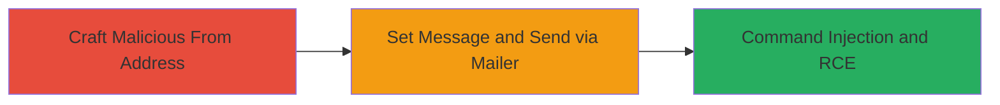

# Remote Code Execution via SwiftMailer From Address Command Injection

Multi-stage attack chain demonstrating exploitation of the SwiftMailer library vulnerability for remote code execution through crafted email 'From' addresses, as reported in Nextcloud's HackerOne report. This allows injection of sendmail options to write and execute arbitrary PHP code, though limited in Nextcloud core due to input controls.

## Chain Metrics Dashboard

| Metric | Value |
|--------|-------|
| Chain Status | Unverified |
| Total Steps | 2 |
| Execution Time | ~5 minutes |
| Skill Level | Intermediate |
| Complexity | Medium |
| Impact Level | High |

## Attack Flow Visualization



## Prerequisites & Requirements

### Required Tools

- None (exploits built-in PHP/SwiftMailer functionality)

### Target Environment

- PHP-based web application using SwiftMailer with sendmail transport
- Vulnerable versions of SwiftMailer (pre-update)
- Server-side access to mailer API or third-party apps allowing user-controlled 'From' input
- Linux/Unix environment with sendmail

### Initial Access Requirements

- Access to a public API or app endpoint that calls setFrom with untrusted input
- No credentials needed if API is public; otherwise, authenticated user session
- Network access to the mailer service

## Detailed Attack Procedures

### Step 1: Craft Malicious Email From Address
procedure: [[procedures/Craft-Malicious-Email-From-Address]]

**Objective**: Create a SwiftMailer message object and inject sendmail command-line options into the 'From' address to enable arbitrary file writes and code execution.

**Instructions**: Initialize a new mail message using the application's mailer service, then set a crafted 'From' address array containing escaped strings with sendmail flags like -X (to append PHP code to a file) and -oQ (to specify a queue directory for execution).

Use [[commands/create-swiftmailer-message-with-injection]] to demonstrate:

```php
$message = \OC::$server->getMailer()->createMessage();
$message->setFrom(['"Attacker@test.com\" -X/var/www/test_swiftmailer/phpcode.php -oQ/tmp test"@test.com']);
```

**Expected Output**: Message object created with the malicious 'From' header embedded, ready for further configuration.

**Success Indicators**:
- No parsing errors on setFrom call
- Inspection of $message->getFrom() reveals injected flags

### Step 2: Trigger Sendmail Injection via Mailer
procedure: [[procedures/Trigger-Sendmail-Injection-via-Mailer]]

**Objective**: Configure the message with recipient and body, then send it to trigger the sendmail transport, executing the injected commands for RCE.

**Instructions**: Set the 'To' address and message body, then invoke the send method on the mailer service to process the message via sendmail, activating the injection.

Complete the setup and send using [[commands/send-swiftmailer-message]]:

```php
$message->setTo(['lukas@cloud.wtf']);
$message->setBody('foo', 'text/plain');
\OC::$server->getMailer()->send($message);
```

**Expected Output**: Email sent successfully, with side effects: PHP code written to /var/www/test_swiftmailer/phpcode.php and queued in /tmp for execution, potentially allowing shell access.

**Success Indicators**:
- Send operation completes without errors
- File created at specified path with injected PHP code
- Code executable via web request to the file

## Attack Chain Summary

### Key Achievements

1. Successful injection of sendmail options via crafted 'From' address
2. Arbitrary PHP file write and execution on the server
3. Potential RCE in contexts where 'From' is user-controlled, such as public APIs

## Technique & Tactic Coverage

### MITRE ATT&CK Techniques

- [[Unix Shell]]
- [[Exploit Public-Facing Application]]

### MITRE ATT&CK Tactics

- [[Execution]]

---
*Last updated: 2023-10-01T00:00:00Z*
