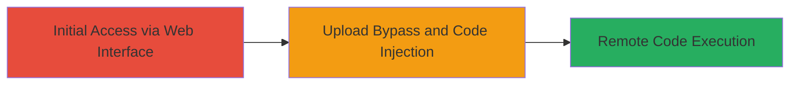

---
tags:
  - rce
  - upload-bypass
  - tinymce
  - cve-2011-4906
  - code-injection
type: attack_chain
tools: []
tactics:
  - '[[Execution]]'
verified: false
platforms:
  - Web
submitted: true
complexity: medium
created_at: '2023-10-01T00:00:00Z'
procedures:
  - '[[procedures/Exploit-TinyMCE-Upload-Bypass-for-RCE]]'
step_count: 1
techniques:
  - '[[Exploit Public-Facing Application]]'
updated_at: '2025-12-14T05:32:13.089Z'
description: >-
  A multi-stage attack exploiting an outdated TinyMCE implementation in a
  third-party marketing site to bypass file upload restrictions and achieve
  remote code execution on the server.
skill_level: intermediate
impact_level: high
id: ef373d67-daec-473b-8f72-e21e0749b186
validated: true
mitre_tactics:
  - '[[Execution]]'
mitre_techniques:
  - '[[Exploit Public-Facing Application]]'
---
# Remote Code Execution via TinyMCE Upload Bypass in Third-Party Marketing Site

Multi-stage attack chain demonstrating a complete attack workflow exploiting CVE-2011-4906 in an outdated TinyMCE version on a third-party marketing site, leading to remote code execution through file upload bypass and code injection.

## Chain Metrics Dashboard

| Metric | Value |
|--------|-------|
| Chain Status | Unverified |
| Total Steps | 1 |
| Execution Time | ~10 minutes |
| Skill Level | Intermediate |
| Complexity | Medium |
| Impact Level | High |

## Attack Flow Visualization



## Prerequisites & Requirements

### Required Tools

- Web browser (e.g., Firefox or Chrome with developer tools)
- [[tools/curl]] (for automated upload testing)

### Target Environment

- Web platform with TinyMCE integration (outdated version vulnerable to CVE-2011-4906)
- Accessible marketing site with file upload functionality via TinyMCE editor
- No specific ports required beyond standard HTTP/HTTPS (80/443)

### Initial Access Requirements

- Public access to the third-party marketing site
- No credentials needed for unauthenticated upload endpoints
- Network access to the target web application

## Detailed Attack Procedures

### Step 1: Exploit Upload Bypass for RCE
procedure: [[procedures/Exploit-TinyMCE-Upload-Bypass-for-RCE]]

**Objective**: Bypass file upload validation in the TinyMCE editor to inject and execute malicious code on the server.

**Instructions**: Identify the TinyMCE-powered upload interface on the marketing site. Use developer tools to inspect the upload form and bypass restrictions by modifying the request to upload a webshell (e.g., PHP file). Test execution by accessing the uploaded file via a crafted URL.

For manual testing, open the site's editor page and attempt to upload a file with executable content. For automation, use [[commands/curl-upload-bypass]] to send a malicious payload:

```bash
curl -X POST -F "file=@shell.php" -H "Content-Type: multipart/form-data" http://target-marketing-site.com/tinymce/upload
```

Monitor the response for successful upload, then access the file at the returned path to trigger execution.

**Expected Output**: Server response indicating upload success, followed by code execution (e.g., command output or shell access).

**Success Indicators**:
- File uploaded without validation errors
- Uploaded file accessible and executable on the server
- Remote commands executed, confirming RCE

## Attack Chain Summary

### Key Achievements

1. Bypassed TinyMCE upload restrictions using CVE-2011-4906
2. Injected and executed arbitrary code on the target server
3. Achieved full remote code execution, compromising the third-party marketing site

## Technique & Tactic Coverage

### MITRE ATT&CK Techniques

- [[Exploit Public-Facing Application]]

### MITRE ATT&CK Tactics

- [[Execution]]

---
*Last updated: 2023-10-01T00:00:00Z*
