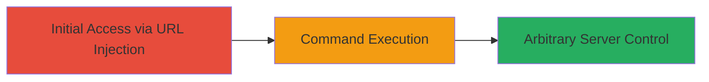

# Remote Code Execution via URL Code Injection on DoD Webserver

Multi-stage attack chain demonstrating a complete attack workflow.

## Chain Metrics Dashboard

| Metric | Value |
|--------|-------|
| Chain Status | Unverified |
| Total Steps | 1 |
| Execution Time | ~5 minutes |
| Skill Level | Intermediate |
| Complexity | Medium |
| Impact Level | High |

## Attack Flow Visualization



## Prerequisites & Requirements

### Required Tools

- [[tools/curl]]

### Target Environment

- Target OS/Platform: Webserver (likely Linux-based)
- Required services/ports: HTTP/HTTPS on port 80/443
- Network access requirements: Direct internet access to the target website

### Initial Access Requirements

- Credential requirements: None (public-facing)
- Network position: External attacker
- Prior access needed: None

## Detailed Attack Procedures

### Step 1: Exploit RCE via URL Injection
procedure: [[procedures/Exploit-RCE-via-URL-Code-Injection]]

**Objective**: Gain remote code execution on the target webserver by injecting shell commands into a specially formatted URL parameter, leveraging the misconfiguration to execute arbitrary commands.

**Instructions**: Identify a vulnerable URL endpoint on the DoD website that processes user input insecurely, such as a search or parameter field that allows code injection. Craft a malicious URL that injects a shell command, for example, using a parameter like ?cmd= to execute system commands. Use [[commands/curl-inject-rce]] to send the request and observe the output for command execution confirmation:

```bash
curl "https://target-dod-site.com/vulnerable-endpoint?cmd=whoami" -v
```

If successful, escalate by injecting more complex commands, such as reading files or establishing persistence, using the same pattern:

```bash
curl "https://target-dod-site.com/vulnerable-endpoint?cmd=cat /etc/passwd" -v
```

**Expected Output**: Server response includes the output of the injected command, such as the current user or file contents, indicating successful RCE.

**Success Indicators**:
- Command output appears in the HTTP response body
- No error messages; instead, legitimate execution results
- Ability to run multiple commands without server crashes

## Attack Chain Summary

### Key Achievements

1. Achieved remote code execution on a high-value DoD webserver without authentication.
2. Demonstrated arbitrary command execution, potentially allowing data exfiltration or further compromise.
3. Highlighted critical misconfiguration in public-facing infrastructure.

## Technique & Tactic Coverage

### MITRE ATT&CK Techniques

- [[Exploit Public-Facing Application]]
- [[Command-Line Interface]]

### MITRE ATT&CK Tactics

- [[Initial Access]]
- [[Execution]]

---
*Last updated: 2023-10-01T12:00:00Z*
