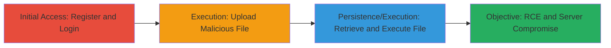

# Remote Code Execution via Unrestricted File Upload on MTN Careers Website

Multi-stage attack chain demonstrating a complete attack workflow exploiting an unvalidated file upload on the MTN Group careers website to upload and execute malicious PHP code, resulting in remote code execution (RCE).

## Chain Metrics Dashboard

| Metric | Value |
|--------|-------|
| Chain Status | Unverified |
| Total Steps | 3 |
| Execution Time | ~10 minutes |
| Skill Level | Intermediate |
| Complexity | Medium |
| Impact Level | High |

## Attack Flow Visualization

## Prerequisites & Requirements

### Required Tools

- Web browser (e.g., Chrome or Firefox with developer tools)

### Target Environment

- Web platform
- PHP-based web application
- Accessible registration and profile update features on https://careers.mtn.cm/

### Initial Access Requirements

- Internet access to the target website
- No prior credentials needed (registration is open)
- Basic knowledge of web interactions and HTML inspection

## Detailed Attack Procedures

### Step 1: Initial Access
procedure: [[procedures/Register-and-Login-to-MTN-Careers]]

**Objective**: Gain authenticated access to the profile update section of the MTN Careers website.

**Instructions**: Follow the procedure to create an account and log in, navigating to the user profile area.

**Expected Output**: Successful login with access to profile editing features.

**Success Indicators**:
- Account creation confirmation
- Profile update page loaded

### Step 2: Execution
procedure: [[procedures/Upload-Malicious-PHP-File-as-Profile-Photo]]

**Objective**: Upload a malicious PHP file disguised as a profile photo to a web-accessible directory.

**Instructions**: Prepare a simple PHP payload file (e.g., payload.php with `<?php system($_GET['cmd']); ?>`) and upload it via the profile photo field.

**Expected Output**: Upload success message or updated profile without errors.

**Success Indicators**:
- File upload completes without rejection
- Profile photo appears updated (though it may not display correctly)

### Step 3: Privilege Escalation
procedure: [[procedures/Retrieve-and-Execute-Uploaded-File]]

**Objective**: Extract the direct path to the uploaded file from the page source and access it to trigger code execution.

**Instructions**: Inspect the HTML source after upload to find the file path, then navigate to it in the browser to execute the PHP code.

**Expected Output**: Execution of the PHP payload, such as command output if a system command is invoked.

**Success Indicators**:
- Direct file path found in HTML (e.g., /en/user/images/users/-13-04-2021-20-15-16-payload.php)
- Browser loads the file and executes the code (e.g., PHP info or command result displayed)

## Attack Chain Summary

### Key Achievements

1. Authenticated access to vulnerable upload feature
2. Successful upload of executable PHP file without validation
3. Remote code execution confirming server compromise potential

## Technique & Tactic Coverage

### MITRE ATT&CK Techniques

- [[Exploit Public-Facing Application]]
- [[Remote File Copy]]

### MITRE ATT&CK Tactics

- [[Initial Access]]
- [[Execution]]

---
*Last updated: 2023-10-01T12:00:00Z*
