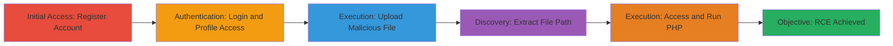

---
tags:
  - unrestricted-file-upload
  - rce
  - php
  - web-vulnerability
type: attack_chain
tools: []
tactics:
  - '[[Initial Access]]'
  - '[[Execution]]'
verified: false
platforms:
  - Web
submitted: true
complexity: low
created_at: '2023-10-01T00:00:00Z'
procedures:
  - '[[procedures/Register-New-User-Account-on-MTN-Careers]]'
  - '[[procedures/Login-and-Access-Profile-Update-on-MTN-Careers]]'
  - '[[procedures/Upload-Malicious-PHP-File-as-Profile-Photo]]'
  - '[[procedures/Extract-Uploaded-File-URL-from-Page-Source]]'
  - '[[procedures/Copy-Uploaded-File-Path]]'
  - '[[procedures/Access-and-Execute-Uploaded-PHP-File]]'
step_count: 6
techniques:
  - '[[Exploit Public-Facing Application]]'
updated_at: '2025-12-14T17:23:27.958Z'
description: >-
  Multi-stage attack exploiting improper input validation in the profile picture
  upload feature on the MTN Group careers website, allowing arbitrary PHP file
  uploads leading to remote code execution.
skill_level: beginner
impact_level: high
id: 8dcb959a-84a0-4381-b70d-8de4f6b06706
validated: true
mitre_tactics:
  - '[[Initial Access]]'
  - '[[Execution]]'
mitre_techniques:
  - '[[Exploit Public-Facing Application]]'
---
# Remote Code Execution via Unrestricted File Upload on MTN Careers Website

Multi-stage attack chain demonstrating exploitation of an unrestricted file upload vulnerability in the profile picture feature on https://careers.mtn.cm/, enabling remote code execution through PHP file uploads.

## Chain Metrics Dashboard

| Metric | Value |
|--------|-------|
| Chain Status | Unverified |
| Total Steps | 6 |
| Execution Time | ~5 minutes |
| Skill Level | Beginner |
| Complexity | Low |
| Impact Level | High |

## Attack Flow Visualization

## Prerequisites & Requirements

### Required Tools

- Web browser (e.g., Chrome, Firefox)
- Text editor for creating PHP payload

### Target Environment

- Web platform
- PHP-based web application
- Publicly accessible website: https://careers.mtn.cm/

### Initial Access Requirements

- Internet access
- No prior credentials needed (starts with registration)
- No special network position required

## Detailed Attack Procedures

### Step 1: Register New User Account
procedure: [[procedures/Register-New-User-Account-on-MTN-Careers]]

**Objective**: Create a new account to gain access to the profile update feature.

**Instructions**: Navigate to the registration page and provide required details such as name, email, and password.

**Expected Output**: Confirmation of account creation and option to login.

**Success Indicators**:
- Registration success message
- Ability to proceed to login

### Step 2: Login and Access Profile Update
procedure: [[procedures/Login-and-Access-Profile-Update-on-MTN-Careers]]

**Objective**: Authenticate and navigate to the section where profile photo can be updated.

**Instructions**: Enter credentials on the login page, then locate and click on the profile update or edit section.

**Expected Output**: Logged-in dashboard with profile editing options visible.

**Success Indicators**:
- Successful login
- Profile photo upload field available

### Step 3: Upload Malicious PHP File as Profile Photo
procedure: [[procedures/Upload-Malicious-PHP-File-as-Profile-Photo]]

**Objective**: Exploit the lack of file validation to upload a PHP script that can execute code on the server.

**Instructions**: In the profile photo upload area, select a crafted PHP file (e.g., containing <?php system($_GET['cmd']); ?>) and submit the upload form.

**Expected Output**: Upload success message, with the file stored in a web-accessible directory.

**Success Indicators**:
- File upload accepted without error
- Profile photo updated (though it may not display correctly)

### Step 4: Extract Uploaded File URL from Page Source
procedure: [[procedures/Extract-Uploaded-File-URL-from-Page-Source]]

**Objective**: Identify the server path where the uploaded file is stored to enable direct access.

**Instructions**: Right-click on the page after upload, select 'View Page Source', and search for the image or file reference to find the full URL path.

**Expected Output**: URL like https://careers.mtn.cm/uploads/malicious.php visible in the HTML source.

**Success Indicators**:
- Full URL path to uploaded file found in source code
- Path confirms web-accessible location

### Step 5: Copy Uploaded File Path
procedure: [[procedures/Copy-Uploaded-File-Path]]

**Objective**: Prepare the exact URL for execution by copying it accurately.

**Instructions**: Highlight and copy the complete URL from the page source, ensuring no truncation or errors.

**Expected Output**: Copied URL ready for browser input.

**Success Indicators**:
- URL copied to clipboard
- No missing characters in the path

### Step 6: Access and Execute Uploaded PHP File
procedure: [[procedures/Access-and-Execute-Uploaded-PHP-File]]

**Objective**: Trigger remote code execution by directly accessing the uploaded PHP file via the browser.

**Instructions**: Paste the copied URL into the browser address bar and press enter; append parameters if the payload requires them (e.g., ?cmd=whoami).

**Expected Output**: PHP code executes, displaying output such as command results or server compromise indicators.

**Success Indicators**:
- Server processes the PHP file
- Malicious code runs, confirming RCE

## Attack Chain Summary

### Key Achievements

1. Successful account registration and login to access upload feature
2. Upload of arbitrary PHP file without validation
3. Extraction and direct execution of uploaded script for RCE

## Technique & Tactic Coverage

### MITRE ATT&CK Techniques

- [[Exploit Public-Facing Application]]

### MITRE ATT&CK Tactics

- [[Initial Access]]
- [[Execution]]

---
*Last updated: 2023-10-01T00:00:00Z*
