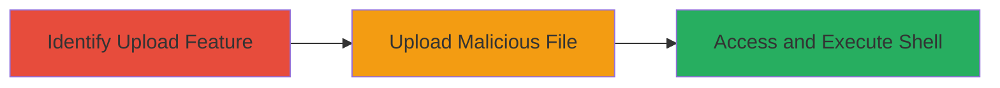

---
tags:
  - rce
  - file-upload
  - webshell
  - unrestricted-upload
type: attack_chain
tools: []
tactics:
  - '[[Execution]]'
verified: false
platforms:
  - Web
submitted: true
complexity: medium
created_at: '2023-10-01T00:00:00Z'
procedures:
  - '[[procedures/Identify-Unrestricted-File-Upload-Vulnerability]]'
  - '[[procedures/Upload-Malicious-Webshell-for-RCE]]'
  - '[[procedures/Trigger-RCE-by-Accessing-Uploaded-File]]'
step_count: 3
techniques:
  - '[[Remote File Copy]]'
  - '[[Exploit Public-Facing Application]]'
updated_at: '2025-12-14T17:23:54.450Z'
description: >-
  A multi-stage attack exploiting an unrestricted file upload vulnerability to
  achieve remote code execution by uploading and accessing a malicious webshell
  on a web server.
skill_level: intermediate
impact_level: high
id: 439e4857-ad27-4c35-ac04-4c034e748b78
validated: true
mitre_tactics:
  - '[[Execution]]'
mitre_techniques:
  - '[[Remote File Copy]]'
  - '[[Exploit Public-Facing Application]]'
---
# Remote Code Execution via Unrestricted File Upload

Multi-stage attack chain demonstrating a complete attack workflow exploiting an unrestricted file upload feature in a web application to upload a malicious webshell and achieve remote code execution on the server.

## Chain Metrics Dashboard

| Metric | Value |
|--------|-------|
| Chain Status | Unverified |
| Total Steps | 3 |
| Execution Time | ~5 minutes |
| Skill Level | Intermediate |
| Complexity | Medium |
| Impact Level | High |

## Attack Flow Visualization



## Prerequisites & Requirements

### Required Tools

- Browser (Firefox recommended for execution)
- [[commands/curl-file-upload]]

### Target Environment

- Web application with file upload functionality
- Server supporting script execution (e.g., PHP-enabled web server)
- No authentication required for upload endpoint

### Initial Access Requirements

- Direct network access to the web application
- No prior credentials needed
- Ability to interact with the upload form or endpoint

## Detailed Attack Procedures

### Step 1: Identify Unrestricted File Upload
procedure: [[procedures/Identify-Unrestricted-File-Upload-Vulnerability]]

**Objective**: Locate and test the file upload feature to confirm it lacks validation, allowing arbitrary file types.

**Instructions**: Inspect the web application for upload forms or endpoints. Test by attempting to upload non-image files like text or script files to verify acceptance without filtering.

**Expected Output**: Successful upload of a test file (e.g., .txt or .php) without errors, confirming the vulnerability.

**Success Indicators**:
- Upload succeeds for restricted file types
- Uploaded file is stored on the server

### Step 2: Upload Malicious Webshell
procedure: [[procedures/Upload-Malicious-Webshell-for-RCE]]

**Objective**: Upload a malicious script (e.g., PHP webshell) to the server via the unrestricted endpoint.

**Instructions**: Create a simple webshell file, such as a PHP file with `<?php system($_GET['cmd']); ?>`, and upload it using the form or a POST request. Use [[commands/curl-file-upload]] for automated testing:

```bash
curl -F "file=@shell.php" http://target.com/upload
```

Locate the storage path through response headers, error messages, or directory traversal tests.

**Expected Output**: HTTP response indicating successful upload, possibly with the file path.

**Success Indicators**:
- File uploaded without rejection
- Path to uploaded file identifiable

### Step 3: Trigger RCE by Accessing Uploaded File
procedure: [[procedures/Trigger-RCE-by-Accessing-Uploaded-File]]

**Objective**: Access the uploaded webshell in a browser to execute arbitrary commands on the server.

**Instructions**: Navigate to the uploaded file's URL in Firefox (e.g., http://target.com/uploads/shell.php?cmd=whoami). In Chrome, it may render as plain text; use Firefox for execution.

**Expected Output**: Command output displayed in the browser (e.g., server details from `whoami` or `id`).

**Success Indicators**:
- Code executes, showing server response
- Arbitrary commands run remotely

## Attack Chain Summary

### Key Achievements

1. Confirmed unrestricted file upload vulnerability
2. Successfully uploaded and stored a malicious webshell
3. Achieved remote code execution on the target server

## Technique & Tactic Coverage

### MITRE ATT&CK Techniques

- [[Remote File Copy]]
- [[Exploit Public-Facing Application]]

### MITRE ATT&CK Tactics

- [[Execution]]

---
*Last updated: 2023-10-01T00:00:00Z*
