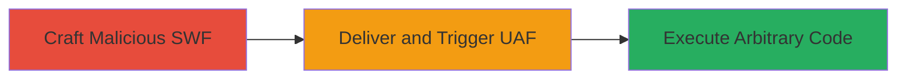

# Remote Code Execution via Use After Free in Adobe Flash Player PCRE Engine

Multi-stage attack chain demonstrating a complete attack workflow exploiting a Use After Free (UAF) vulnerability in the PCRE engine integrated into Adobe Flash Player. The attack involves crafting a malicious SWF file that triggers the UAF during regular expression processing, leading to arbitrary code execution on the victim's machine when the Flash content is loaded in a browser or standalone player. This affects Adobe Flash Player versions from 11.5.502.135 to 20.0.0.286.

## Chain Metrics Dashboard

| Metric | Value |
|--------|-------|
| Chain Status | Unverified |
| Total Steps | 2 |
| Execution Time | ~5 minutes |
| Skill Level | Intermediate |
| Complexity | Medium |
| Impact Level | High |

## Attack Flow Visualization

## Prerequisites & Requirements

### Required Tools

- SWF development tools (e.g., Adobe Flash Professional or open-source alternatives like Ming library)

### Target Environment

- Adobe Flash Player versions 11.5.502.135 to 20.0.0.286 installed on Desktop or Browser platforms
- Victim must load Flash content via browser (e.g., Chrome, Firefox with Flash enabled) or standalone player

### Initial Access Requirements

- No credentials required; relies on social engineering or drive-by download to induce victim to load the SWF
- Network access to host or embed the malicious SWF file

## Detailed Attack Procedures

### Step 1: Craft Malicious SWF File
procedure: [[procedures/Exploit-UAF-in-Flash-PCRE-Engine]]

**Objective**: Create a specially crafted SWF file that embeds a regular expression pattern triggering the UAF in the PCRE engine during compilation or execution.

**Instructions**: Use SWF authoring tools to embed ActionScript code that invokes PCRE regex processing with a payload designed to free memory and then access it, causing heap corruption. For example, construct a regex pattern that leads to improper memory management in PCRE versions used by Flash.

**Expected Output**: A valid SWF file (e.g., malicious.swf) that compiles without errors but triggers UAF on execution.

**Success Indicators**:
- SWF file loads in Flash Player without immediate crash
- Memory analysis tools (e.g., debugger) show freed memory access during regex handling

### Step 2: Deliver and Execute Malicious SWF
procedure: [[procedures/Exploit-UAF-in-Flash-PCRE-Engine]]

**Objective**: Deliver the SWF to the victim and trigger the UAF to achieve remote code execution.

**Instructions**: Host the SWF on a web server or embed it in a webpage. Induce the victim to visit the page or open the file in a browser/standalone Flash Player. Upon loading, the regex processing in the SWF triggers the UAF, allowing arbitrary code execution via heap spray or ROP chain.

**Expected Output**: Victim's Flash Player crashes or executes shellcode, potentially opening a reverse shell or downloading further payloads.

**Success Indicators**:
- Arbitrary code execution confirmed (e.g., calc.exe pops on Windows or shell access)
- No authentication barriers; exploits client-side rendering

## Attack Chain Summary

### Key Achievements

1. Successful UAF trigger in PCRE engine without authentication
2. Remote code execution on victim systems running vulnerable Flash versions
3. Bypass of sandbox via heap corruption leading to system-level access

## Technique & Tactic Coverage

### MITRE ATT&CK Techniques

- [[Exploitation for Client Execution]] Exploitation for Client Execution
- [[Drive-by Compromise]] Drive-by Compromise

### MITRE ATT&CK Tactics

- [[Execution]] Execution
- [[Initial Access]] Initial Access

---
*Last updated: 2023-10-01T00:00:00Z*
