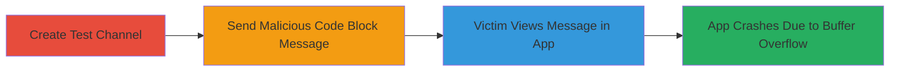

---
tags:
  - buffer-overflow
  - dos
  - android
  - rocket-chat
  - react-native
type: attack_chain
tools: []
tactics:
  - '[[Privilege Escalation]]'
verified: false
platforms:
  - Android
  - Mobile
submitted: true
complexity: medium
created_at: '2023-10-01T00:00:00Z'
procedures:
  - '[[procedures/Trigger-Buffer-Overflow-in-Rocket-Chat-Android-App]]'
step_count: 4
techniques:
  - '[[Endpoint Denial of Service]]'
  - '[[Exploitation for Client Execution]]'
updated_at: '2025-12-14T17:24:39.386Z'
description: >-
  A multi-step attack exploiting a buffer overflow vulnerability in the
  Rocket.Chat Android app to cause remote denial-of-service by crashing the
  victim's app instance when viewing a malicious code block message.
skill_level: intermediate
impact_level: high
id: d61409f0-4ce8-4256-831d-9d36f05db8c3
validated: true
mitre_tactics:
  - '[[Privilege Escalation]]'
mitre_techniques:
  - '[[Endpoint Denial of Service]]'
  - '[[Exploitation for Client Execution]]'
---
# Remote DoS via Buffer Overflow in Rocket.Chat Android App Message Rendering

Multi-stage attack chain demonstrating a complete denial-of-service workflow against the Rocket.Chat Android app by exploiting a buffer overflow in message rendering.

## Chain Metrics Dashboard

| Metric | Value |
|--------|-------|
| Chain Status | Unverified |
| Total Steps | 4 |
| Execution Time | ~5 minutes |
| Skill Level | Intermediate |
| Complexity | Medium |
| Impact Level | High |

## Attack Flow Visualization



## Prerequisites & Requirements

### Required Tools

- None (uses built-in Rocket.Chat app or web interface)

### Target Environment

- Rocket.Chat server with Android client app (version affected by CVE or similar, pre-patch)
- Access to a user account on the Rocket.Chat instance
- Victim using vulnerable Android app version

### Initial Access Requirements

- Valid user credentials for sending messages
- Network access to the Rocket.Chat server
- No prior privileged access needed; works in channels or private messages

## Detailed Attack Procedures

### Step 1: Create a New Test Channel
procedure: [[procedures/Trigger-Buffer-Overflow-in-Rocket-Chat-Android-App]]

**Objective**: Establish a controlled environment to send the malicious message without disrupting production channels.

**Instructions**: Use the Rocket.Chat web interface or another client to create a new channel. Navigate to the channels section and select 'Create Channel', naming it '#test' or similar.

**Expected Output**: Confirmation of channel creation, visible in the channel list.

**Success Indicators**:
- New channel appears in the user's channel list
- Channel is empty and ready for messaging

### Step 2: Send the POC Crafted Code as a Message in the Channel
procedure: [[procedures/Trigger-Buffer-Overflow-in-Rocket-Chat-Android-App]]

**Objective**: Deliver the malicious payload disguised as a code block to trigger the buffer overflow upon rendering.

**Instructions**: In the '#test' channel, compose a new message and paste the malicious code from the provided Pastebin link (https://pastebin.com/raw/JEDcC5Yr). Format it as a code block using triple backticks (```) to ensure it renders as code in the app. Send the message.

**Expected Output**: Message posts successfully in the channel, appearing as a formatted code block.

**Success Indicators**:
- Message is visible in the channel without crashing the sender's client
- Code block renders correctly in web or iOS clients but is poised to crash Android

### Step 3: Victim Opens the Mobile App and Views the Channel
procedure: [[procedures/Trigger-Buffer-Overflow-in-Rocket-Chat-Android-App]]

**Objective**: Lure or wait for the victim to interact with the malicious message, initiating the rendering process.

**Instructions**: Instruct or entice the victim to open the Rocket.Chat Android app and navigate to the '#test' channel or receive the message in a private chat. The app will load the message list automatically upon opening the channel.

**Expected Output**: Victim's app loads the channel, but rendering fails on the malicious message.

**Success Indicators**:
- Victim reports or demonstrates app instability upon viewing
- No crash on iOS or web clients confirms Android-specific impact

### Step 4: App Crashes
procedure: [[procedures/Trigger-Buffer-Overflow-in-Rocket-Chat-Android-App]]

**Objective**: Confirm the denial-of-service effect, forcing repeated app restarts.

**Instructions**: Upon the victim attempting to render the message, the app processes the crafted code block, leading to overflow. The app terminates unexpectedly. To reproduce, have the victim reopen the app and view the message again.

**Expected Output**: Android app force-closes with a crash report or ANR (Application Not Responding).

**Success Indicators**:
- App crashes every time the message is viewed
- Usability impaired until message deletion, app update, or restart

## Attack Chain Summary

### Key Achievements

1. Successful delivery of malicious payload via standard messaging
2. Remote crashing of target Android app instances without authentication bypass
3. Persistent DoS requiring app restarts or patches to mitigate

## Technique & Tactic Coverage

### MITRE ATT&CK Techniques

- [[Endpoint Denial of Service]] Endpoint Denial of Service
- [[Exploitation for Client Execution]] Exploitation for Client Execution

### MITRE ATT&CK Tactics

- [[Privilege Escalation]] Impact

---

*Last updated: 2023-10-01T00:00:00Z*
