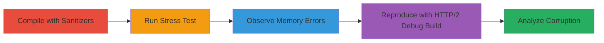

# Reproducing libcurl Race Condition for Use-After-Free and Double-Free Exploitation

Multi-stage attack chain demonstrating the reproduction of a race condition vulnerability in libcurl's connection sharing mechanism, which allows multiple threads to access and free the same connection pointer, resulting in use-after-free (UAF) and double-free errors. This chain uses AddressSanitizer-enabled builds to detect memory corruption in multi-threaded HTTP/2 request scenarios, highlighting potential for crashes or exploitation.

## Chain Metrics Dashboard

| Metric | Value |
|--------|-------|
| Chain Status | Unverified |
| Total Steps | 4 |
| Execution Time | ~30 minutes |
| Skill Level | Advanced |
| Complexity | High |
| Impact Level | Medium |

## Attack Flow Visualization



## Prerequisites & Requirements

### Required Tools

- [[tools/clang]]
- [[tools/AddressSanitizer]]
- [[tools/libcurl]]

### Target Environment

- Linux OS
- libcurl source from GitHub master branch
- HTTP/2 enabled endpoints for testing (e.g., local server or public HTTP/2 site)

### Initial Access Requirements

- Source code access to libcurl
- Clang compiler installed
- No network credentials needed; local reproduction

## Detailed Attack Procedures

### Step 1: Compile libcurl with Sanitizers
procedure: [[procedures/Compile-libcurl-with-AddressSanitizer]]

**Objective**: Build libcurl from source with AddressSanitizer to enable detection of memory errors like UAF and double-free during multi-threaded execution.

**Instructions**: Clone libcurl source and compile using [[commands/clang-compile-libcurl-asan]] with ASAN flags.

```bash
./configure --enable-debug --with-nghttp2
make clean
make
```

Follow with ASAN-enabled build for test code using [[commands/clang-compile-curl-cpp-asan]]:

```bash
clang++ -g -fsanitize=address -fsanitize=undefined curl.cpp -o curl_test -lcurl
```

**Expected Output**: Successful compilation without errors, producing executable binaries with sanitizer instrumentation.

**Success Indicators**:
- libcurl library built with debug symbols
- Test executable (curl_test) linked against sanitized libcurl

### Step 2: Run Multi-Threaded Stress Test
procedure: [[procedures/Run-Multi-Threaded-Stress-Test-with-curl-cpp]]

**Objective**: Execute a C++ stress test to force connection reuse across multiple threads, triggering the race in CURL_LOCK_DATA_CONNECT.

**Instructions**: Run the compiled test binary against an HTTP/2 endpoint using [[commands/run-curl-cpp-stress-test]] to simulate concurrent easy handles.

```bash
./curl_test https://http2.example.com 100  # 100 threads, 100 requests each
```

**Expected Output**: Program execution with potential intermittent crashes or sanitizer warnings.

**Success Indicators**:
- Multiple threads performing HTTP requests
- Connection reuse observed in logs

### Step 3: Observe ASAN Errors
procedure: [[procedures/Observe-ASAN-Errors-for-UAF-and-Double-Free]]

**Objective**: Monitor runtime output for AddressSanitizer detections of UAF and double-free on shared connection buffers.

**Instructions**: During stress test execution, capture ASAN logs using [[commands/run-with-asan-log]] and analyze errors in functions like multi_done.

```bash
ASAN_OPTIONS=abort_on_error=1 ./curl_test https://http2.example.com 50
```

Modify url.c line 1372 with a random sleep for consistency if needed.

**Expected Output**: ASAN error reports, e.g., "ERROR: AddressSanitizer: heap-use-after-free on address 0x604000459250" with stack traces from threads T18/T22.

**Success Indicators**:
- UAF detected in reuse_conn or Curl_attach_connection
- Double-free on HTTP/2 add buffers

### Step 4: Reproduce with HTTP/2 Debug Build
procedure: [[procedures/Reproduce-Double-Free-UAF-with-Debug-Build-and-HTTP2]]

**Objective**: Use a modified debug build to consistently trigger double-free and UAF specifically with HTTP/2 connections.

**Instructions**: Compile and run debugit.cpp in multi-threaded mode targeting HTTP/2 using [[commands/clang-compile-debugit-asan]] and [[commands/run-debugit-http2]]:

```bash
clang++ -g -fsanitize=address debugit.cpp -o debugit_test -lcurl
./debugit_test https://http2.example.com
```

**Expected Output**: Targeted ASAN errors in http2.c and multi.c, confirming HTTP/2 specificity.

**Success Indicators**:
- Errors in Curl_http2_done or Curl_add_buffer_free
- No triggers with HTTP/1.1 for comparison

## Attack Chain Summary

### Key Achievements

1. Successful compilation of sanitized libcurl for error detection
2. Triggered race condition via multi-threaded connection sharing
3. Observed UAF and double-free in HTTP/2 handling
4. Validated inconsistency and reproduction challenges

## Technique & Tactic Coverage

### MITRE ATT&CK Techniques

- [[Exploitation for Client Execution]] Exploitation for Client Execution

### MITRE ATT&CK Tactics

- [[Execution]] Execution

*Last updated: 2023-10-01T00:00:00Z*
