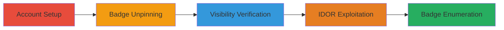

---
tags:
  - idor
  - reddit
  - enumeration
  - confidentiality-breach
  - user-discovery
type: attack_chain
tools: []
tactics:
  - '[[Discovery]]'
  - '[[Initial Access]]'
verified: false
platforms:
  - Web
submitted: true
complexity: medium
created_at: '2024-01-01T00:00:00Z'
procedures:
  - '[[procedures/Create-and-Configure-Reddit-Accounts]]'
  - '[[procedures/Unlock-and-Hide-New-Share-Badge]]'
  - '[[procedures/Verify-Badge-Visibility-on-Profile]]'
  - '[[procedures/Exploit-IDOR-in-Share-Preview-Endpoint]]'
  - '[[procedures/Enumerate-User-Achievement-Badges]]'
step_count: 5
techniques:
  - '[[Account Discovery]]'
  - '[[Exploit Public-Facing Application]]'
updated_at: '2025-12-14T17:25:33.860Z'
description: >-
  Multi-stage attack exploiting an IDOR vulnerability in Reddit's achievement
  badges system to enumerate and reveal unpinned (hidden) badges for any user,
  breaching confidentiality of user activities like community participation and
  engagement patterns.
skill_level: intermediate
impact_level: high
id: 5449292b-c107-426b-aa10-565b3a93b892
validated: true
mitre_tactics:
  - '[[Discovery]]'
  - '[[Initial Access]]'
mitre_techniques:
  - '[[Account Discovery]]'
  - '[[Exploit Public-Facing Application]]'
---
# Reveal Hidden Reddit Achievement Badges via IDOR

Multi-stage attack chain demonstrating exploitation of an Insecure Direct Object Reference (IDOR) in Reddit's Achievement Badges feature. By crafting URLs to the share.redd.it preview endpoint, attackers can reveal unpinned badges that users intended to hide, exposing personal activities such as community joins, upvote ratios, and engagement patterns. This breaches user confidentiality without requiring authentication beyond public usernames and incremental badge IDs (1-2 digits).

## Chain Metrics Dashboard

| Metric | Value |
|--------|-------|
| Chain Status | Unverified |
| Total Steps | 5 |
| Execution Time | ~15 minutes |
| Skill Level | Intermediate |
| Complexity | Medium |
| Impact Level | High |

## Attack Flow Visualization

## Prerequisites & Requirements

### Required Tools

- Web browser (e.g., Chrome or Firefox)
- Optional: [[commands/curl-reddit-badge-preview]] for automated requests

### Target Environment

- Reddit web platform (reddit.com)
- No specific ports or services beyond standard HTTPS (443)
- Public internet access

### Initial Access Requirements

- No prior credentials needed for enumeration (uses public usernames)
- Ability to create free Reddit accounts (email or mobile verification)
- Network position: External attacker with internet access

## Detailed Attack Procedures

### Step 1: Account Setup
procedure: [[procedures/Create-and-Configure-Reddit-Accounts]]

**Objective**: Establish test accounts to unlock and hide a sample badge, simulating a target user's hidden state.

**Instructions**: Create a primary Reddit account via registration at reddit.com. Then, create a secondary account using mobile verification for observation. Log in to the primary account to perform actions.

**Expected Output**: Two functional Reddit accounts, one ready for badge unlocking.

**Success Indicators**:
- Accounts created and verified
- Primary account logged in successfully

### Step 2: Unlock and Hide New Share Badge
procedure: [[procedures/Unlock-and-Hide-New-Share-Badge]]

**Objective**: Trigger the 'New Share' badge (ID 10) and unpin it to make it hidden from public view.

**Instructions**: Navigate to any user's post, use the Share -> Embed feature to generate an embed link. Visit your profile's achievements section to confirm the badge unlocks. Click the badge and unpin it. Reference Reddit's support article at https://support.reddithelp.com/hc/en-us/articles/27063106698004-What-are-achievements to confirm unpinning hides the badge.

**Expected Output**: 'New Share' badge appears in achievements, then disappears after unpinning.

**Success Indicators**:
- Badge unlocked upon embedding a post
- Badge hidden after unpinning

### Step 3: Verify Badge Visibility
procedure: [[procedures/Verify-Badge-Visibility-on-Profile]]

**Objective**: Confirm the unpinned badge is not visible on the profile from an external account.

**Instructions**: Log in to the secondary account. Navigate to the primary user's achievements page using https://www.reddit.com/user/<username>/achievements/. Observe that the 'New Share' badge is not displayed.

**Expected Output**: Achievements page shows no 'New Share' badge.

**Success Indicators**:
- Badge absent from public profile view
- Normal pinned badges visible

### Step 4: IDOR Exploitation
procedure: [[procedures/Exploit-IDOR-in-Share-Preview-Endpoint]]

**Objective**: Use the share.redd.it preview endpoint to bypass pinning controls and reveal the hidden badge.

**Instructions**: From the secondary account or incognito mode, request the preview URL: https://share.redd.it/preview/user/<username>/achievement/10?show-user-info=true. An image response indicates the badge exists (even if hidden). Test with invalid IDs like 11 or 9 to confirm 'Not Found' for non-existent badges.

**Expected Output**: Image for valid badge ID 10; 'Not Found' message for others.

**Success Indicators**:
- Image returned for hidden badge
- 'Not Found' for invalid IDs, confirming response differentiation

### Step 5: Badge Enumeration
procedure: [[procedures/Enumerate-User-Achievement-Badges]]

**Objective**: Systematically reveal all hidden badges for a target user by iterating over possible IDs.

**Instructions**: For a target username, loop over badge IDs 1-99 (1-2 digits) using the preview URL pattern: https://share.redd.it/preview/user/<target>/achievement/<id>?show-user-info=true. Collect IDs that return images to map hidden achievements.

**Expected Output**: List of badge IDs with images, revealing hidden user activities.

**Success Indicators**:
- Multiple hidden badges enumerated
- Exposure of user engagement data

## Attack Chain Summary

### Key Achievements

1. Successful hiding of a badge on profile
2. Bypass of pinning via IDOR endpoint
3. Enumeration of all user badges, including hidden ones

## Technique & Tactic Coverage

### MITRE ATT&CK Techniques

- [[Account Discovery]] Account Discovery
- [[Exploit Public-Facing Application]] Exploit Public-Facing Application

### MITRE ATT&CK Tactics

- [[Discovery]] Discovery
- [[Initial Access]] Initial Access

---

*Last updated: 2024-01-01T00:00:00Z*
