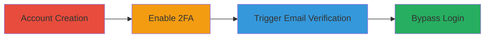

---
tags:
  - 2fa-bypass
  - auth-bypass
  - email-verification
  - rocket-chat
type: attack_chain
tools: []
tactics:
  - '[[Initial Access]]'
commands: []
platforms:
  - Web
complexity: low
procedures:
  - '[[procedures/Sign-Up-for-Rocket.Chat-Account]]'
  - '[[procedures/Enable-2FA-on-Rocket.Chat-Account]]'
  - '[[procedures/Initiate-Email-Change-in-Rocket.Chat]]'
  - '[[procedures/Bypass-2FA-with-Email-Verification-Link]]'
step_count: 4
techniques:
  - '[[Valid Accounts]]'
description: >-
  Multi-stage attack exploiting improper authentication in Rocket.Chat's email
  verification to bypass 2FA and gain unauthorized account access.
skill_level: intermediate
impact_level: high
id: b34eaf35-b4ec-4d47-848f-730fe3d34bb5
created_at: '2025-12-14T17:24:47.917Z'
updated_at: '2025-12-14T17:24:47.917Z'
verified: false
validated: true
submitted: true
mitre_tactics:
  - '[[Initial Access]]'
mitre_techniques:
  - '[[Valid Accounts]]'
---
# Rocket.Chat 2FA Bypass via Email Verification Link

Multi-stage attack chain demonstrating a complete attack workflow exploiting an authentication flaw in Rocket.Chat's email verification process to bypass two-factor authentication (2FA).

## Chain Metrics Dashboard

| Metric | Value |
|--------|-------|
| Chain Status | Unverified |
| Total Steps | 4 |
| Execution Time | ~5 minutes |
| Skill Level | Intermediate |
| Complexity | Low |
| Impact Level | High |

## Attack Flow Visualization

## Prerequisites & Requirements

### Required Tools

- Web browser (e.g., Chrome or Firefox)

### Target Environment

- Rocket.Chat instance (e.g., open.rocket.chat)
- Access to victim's email account

### Initial Access Requirements

- No prior credentials needed; attacker creates a test account or targets an existing one via email control
- Internet access to the Rocket.Chat web interface

## Detailed Attack Procedures

### Step 1: Account Creation
procedure: [[procedures/Sign-Up-for-Rocket.Chat-Account]]

**Objective**: Establish a baseline account to demonstrate the vulnerability setup.

**Instructions**: Navigate to the Rocket.Chat signup page and create a new account using a controlled email address. This simulates the victim's account creation.

**Expected Output**: Confirmation email sent and account dashboard accessible.

**Success Indicators**:
- Account registered successfully
- Login prompt appears post-signup

### Step 2: Enable 2FA
procedure: [[procedures/Enable-2FA-on-Rocket.Chat-Account]]

**Objective**: Activate two-factor authentication to set up the protection that will be bypassed.

**Instructions**: Log in to the account, go to user settings, and enable 2FA by scanning the QR code with an authenticator app (e.g., Google Authenticator). Verify by entering the generated code.

**Expected Output**: 2FA enabled status shown in settings; subsequent logins require code.

**Success Indicators**:
- 2FA setup complete
- Test login requires OTP

### Step 3: Initiate Email Change
procedure: [[procedures/Initiate-Email-Change-in-Rocket.Chat]]

**Objective**: Trigger the email verification process to generate a bypass link.

**Instructions**: In account settings, attempt to change the email address to a new one (attacker's controlled email). This sends a verification link to the original (victim's) email.

**Expected Output**: Verification email received in the victim's inbox with a clickable link.

**Success Indicators**:
- Email change request processed
- Verification link delivered

### Step 4: Bypass Login with Verification Link
procedure: [[procedures/Bypass-2FA-with-Email-Verification-Link]]

**Objective**: Use the verification link to access the account without entering the 2FA code.

**Instructions**: Click the verification link from the email. This logs the user in directly to the Rocket.Chat dashboard without prompting for 2FA.

**Expected Output**: Full account access granted; dashboard loads without OTP requirement.

**Success Indicators**:
- Login successful via link
- No 2FA prompt appears
- Account actions (e.g., view messages) available

## Attack Chain Summary

### Key Achievements

1. Demonstrated 2FA bypass allowing email-based account takeover
2. Highlighted flaw in email verification not enforcing 2FA
3. Enabled unauthorized access with minimal effort if email is compromised

## Technique & Tactic Coverage

### MITRE ATT&CK Techniques

- [[Valid Accounts]]

### MITRE ATT&CK Tactics

- [[Initial Access]]

---
*Last updated: 2023-10-01*
