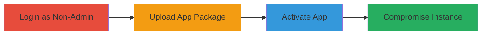

---
tags:
  - broken-access-control
  - rocket-chat
  - app-installation
  - privilege-escalation
type: attack_chain
tools: []
tactics:
  - '[[Initial Access]]'
verified: false
platforms:
  - Web
submitted: true
complexity: medium
created_at: '2023-10-01T00:00:00Z'
procedures:
  - '[[procedures/Login-to-Rocket.Chat-as-Non-Admin-User]]'
  - '[[procedures/Upload-Malicious-App-Package-via-Admin-Endpoint]]'
  - '[[procedures/Activate-Installed-App-via-API]]'
step_count: 3
techniques:
  - '[[Valid Accounts]]'
  - '[[Exploit Public-Facing Application]]'
updated_at: '2025-12-14T17:29:09.760Z'
description: >-
  Multi-stage attack exploiting broken access control in Rocket.Chat to allow
  non-admin users to upload install and activate arbitrary apps potentially
  leading to full instance compromise
skill_level: intermediate
impact_level: high
id: 953eb3e7-d1ac-4da0-a6f7-b950e21ba76d
validated: true
mitre_tactics:
  - '[[Initial Access]]'
mitre_techniques:
  - '[[Valid Accounts]]'
  - '[[Exploit Public-Facing Application]]'
---
# Rocket.Chat Broken Access Control Allowing Non-Admin App Upload Installation and Activation

Multi-stage attack chain demonstrating a complete attack workflow exploiting broken access control in Rocket.Chat to enable non-administrative users to upload install and activate arbitrary applications potentially compromising the entire chat instance.

## Chain Metrics Dashboard

| Metric | Value |
|--------|-------|
| Chain Status | Unverified |
| Total Steps | 3 |
| Execution Time | ~5 minutes |
| Skill Level | Intermediate |
| Complexity | Medium |
| Impact Level | High |

## Attack Flow Visualization



## Prerequisites & Requirements

### Required Tools

- Web browser or [[tools/curl]]
- Malicious app package (e.g., ZIP with app.json)

### Target Environment

- Rocket.Chat web application
- Required services/ports: HTTP/HTTPS on standard ports (80/443)
- Network access requirements: Direct access to the Rocket.Chat instance

### Initial Access Requirements

- Valid non-admin user credentials
- Network position: External or internal user
- Prior access needed: None beyond login

## Detailed Attack Procedures

### Step 1: Login as Non-Admin User
procedure: [[procedures/Login-to-Rocket.Chat-as-Non-Admin-User]]

**Objective**: Authenticate into the Rocket.Chat instance as a regular user without administrative privileges to establish a session for subsequent unauthorized actions.

**Instructions**: Use a web browser or API to log in with non-admin credentials. This establishes a valid session cookie or token required for accessing protected endpoints.

**Expected Output**: Successful login redirect to the user dashboard with a session established.

**Success Indicators**:
- User dashboard loads without admin panels visible
- Session cookie or auth token is present in browser dev tools

### Step 2: Upload Malicious App Package
procedure: [[procedures/Upload-Malicious-App-Package-via-Admin-Endpoint]]

**Objective**: Bypass access controls to upload an arbitrary app package to the admin installation endpoint exploiting the lack of privilege checks.

**Instructions**: Navigate to the app installation page at `http://<rocket-chat-url>/admin/app/install` and use the file upload form to submit a malicious app package (e.g., a ZIP file containing app.json with a controlled app ID). No admin privileges are required due to the vulnerability.

**Expected Output**: The app package is uploaded and installed successfully returning an app ID from the response or app.json.

**Success Indicators**:
- Upload form accepts the file without errors
- App ID is returned or visible in the response (e.g., from app.json)

### Step 3: Activate Installed App
procedure: [[procedures/Activate-Installed-App-via-API]]

**Objective**: Activate the uploaded app by sending an unauthorized API request to set its status to enabled leading to potential execution of malicious code.

**Instructions**: Use [[commands/activate-rocket-chat-app-via-api]] to send a POST request to `/api/apps/<app-id>/status` with the JSON body `{"status":"manually_enabled"}` where `<app-id>` is from the uploaded app's app.json.

```bash
curl -X POST http://<rocket-chat-url>/api/apps/<app-id>/status -H "Content-Type: application/json" -d '{"status":"manually_enabled"}'
```

**Expected Output**: Success response (e.g., 200 OK with confirmation that the app is enabled).

**Success Indicators**:
- API response indicates app activation
- App appears as enabled in the instance (if accessible)

## Attack Chain Summary

### Key Achievements

1. Bypassed admin-only restrictions for app management
2. Installed arbitrary app without privileges
3. Activated malicious app potentially enabling RCE or data exfiltration

## Technique & Tactic Coverage

### MITRE ATT&CK Techniques

- [[Valid Accounts]]
- [[Exploit Public-Facing Application]]

### MITRE ATT&CK Tactics

- [[Initial Access]]

---

*Last updated: 2023-10-01T00:00:00Z*
