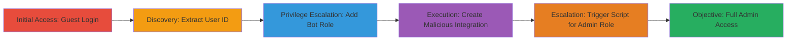

---

# Rocket.Chat Guest Privilege Escalation to Admin via Bot Role and Malicious Integration

Multi-stage attack chain demonstrating a complete privilege escalation workflow in Rocket.Chat, exploiting improper access controls to allow guests to become admins.

## Chain Metrics Dashboard

| Metric | Value |
|--------|-------|
| Chain Status | Unverified |
| Total Steps | 5 |
| Execution Time | ~5 minutes |
| Skill Level | Intermediate |
| Complexity | Medium |
| Impact Level | High |

## Attack Flow Visualization



## Prerequisites & Requirements

### Required Tools

- Browser Developer Tools (for network inspection and WebSocket interaction)

### Target Environment

- Rocket.Chat instance (Node.js/Meteor-based web application)
- Guest access enabled
- No additional services/ports required beyond standard web access (typically port 3000)

### Initial Access Requirements

- Valid guest login (no credentials needed if guest mode is enabled)
- Network access to the Rocket.Chat web interface
- Browser with WebSocket support for DDP communication

## Detailed Attack Procedures

### Step 1: Login as Guest User

procedure: [[procedures/Login-as-Guest-in-Rocket.Chat]]

**Objective**: Gain initial access as a guest user to the Rocket.Chat application, establishing a foothold for escalation.

**Instructions**: Navigate to the Rocket.Chat login page and select the guest login option. No credentials are required if guest access is permitted.

**Expected Output**: Successful authentication as a guest user, with access to the chat interface.

**Success Indicators**:
- User is logged in with 'guest' role visible in user profile or API responses
- WebSocket connection established via DDP for further interactions

### Step 2: Determine Own User's _id from Browser Traffic

procedure: [[procedures/Extract-User-ID-from-Browser-Traffic]]

**Objective**: Identify the authenticated guest user's internal _id for targeting in subsequent privilege modifications.

**Instructions**: Open browser developer tools, navigate to the Network tab, and inspect API calls or WebSocket messages during interactions (e.g., sending a message). Look for user objects containing the _id field.

**Expected Output**: Extraction of the user's _id, such as "9HN4Brdmo2Qc2wsiX".

**Success Indicators**:
- _id value captured from JSON payloads in network traffic
- Confirmation via console logging or API response inspection

### Step 3: Escalate to Bot Group

procedure: [[procedures/Escalate-Guest-to-Bot-Role-via-insertOrUpdateUser]]

**Objective**: Exploit improper ACLs in the insertOrUpdateUser method to add the 'bot' role to the guest user, gaining manage-own-integrations permission.

**Instructions**: Use the browser's WebSocket console or a DDP client to send a method call. Execute [[commands/insertOrUpdateUser-DDP-Message]] with the extracted _id:

```json
{"msg":"method","method":"insertOrUpdateUser","params":[{"_id": "<USER_ID>", "roles": ["user", "bot"]}], "id":"17"}
```

Replace <USER_ID> with the actual _id from Step 2.

**Expected Output**: Server response confirming user update, with 'bot' role added.

**Success Indicators**:
- API or WebSocket response indicates success (e.g., no error, updated roles array)
- User now has 'bot' permissions, verifiable by attempting integration creation

### Step 4: Create Malicious Integration Script

procedure: [[procedures/Create-Malicious-Integration-Script]]

**Objective**: Leverage the new 'bot' role to create a custom integration with a script that escalates the user to 'admin' when triggered.

**Instructions**: In the Rocket.Chat admin panel (now accessible via bot permissions), navigate to Integrations > New. Define a custom integration script including [[commands/addUserRoles-JS-Script]] and [[commands/basic-integration-class-script]]:

```javascript
this.Roles.addUserRoles("<USER_ID>", "admin");

classScript {
  process_incoming_request({ request }) {};
}
```

Replace <USER_ID> with the actual _id. Save and enable the integration.

**Expected Output**: Integration created successfully, with script ready for execution.

**Success Indicators**:
- Integration listed in the dashboard without errors
- Script validation passes on creation

### Step 5: Trigger Integration

procedure: [[procedures/Trigger-Integration-for-Admin-Escalation]]

**Objective**: Execute the malicious integration to run the script, adding the 'admin' role and completing the escalation.

**Instructions**: Trigger the integration via its configured endpoint (e.g., send a request to the integration URL or use an incoming webhook). Monitor for script execution.

**Expected Output**: Script runs, adding 'admin' role to the user.

**Success Indicators**:
- User profile or API shows 'admin' role
- Full admin privileges granted, such as access to server settings

## Attack Chain Summary

### Key Achievements

1. Guest user gains 'bot' role via ACL bypass in user update method
2. Creation of arbitrary code-executing integration using elevated permissions
3. Full admin access achieved through triggered script, compromising the entire server

## Technique & Tactic Coverage

### MITRE ATT&CK Techniques

- [[Exploitation for Privilege Escalation]] Exploitation for Privilege Escalation
- [[Exploit Public-Facing Application]] Exploit Public-Facing Application

### MITRE ATT&CK Tactics

- [[Initial Access]] Initial Access
- [[Privilege Escalation]] Privilege Escalation

---

*Last updated: 2023-10-01T00:00:00Z*
